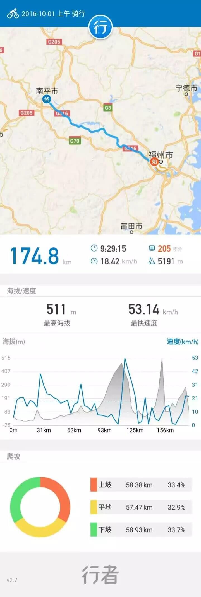
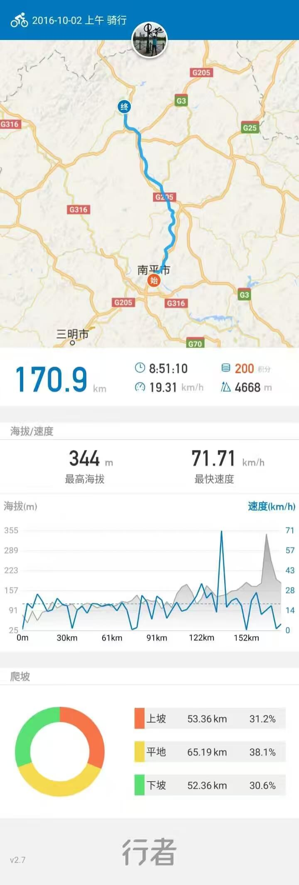
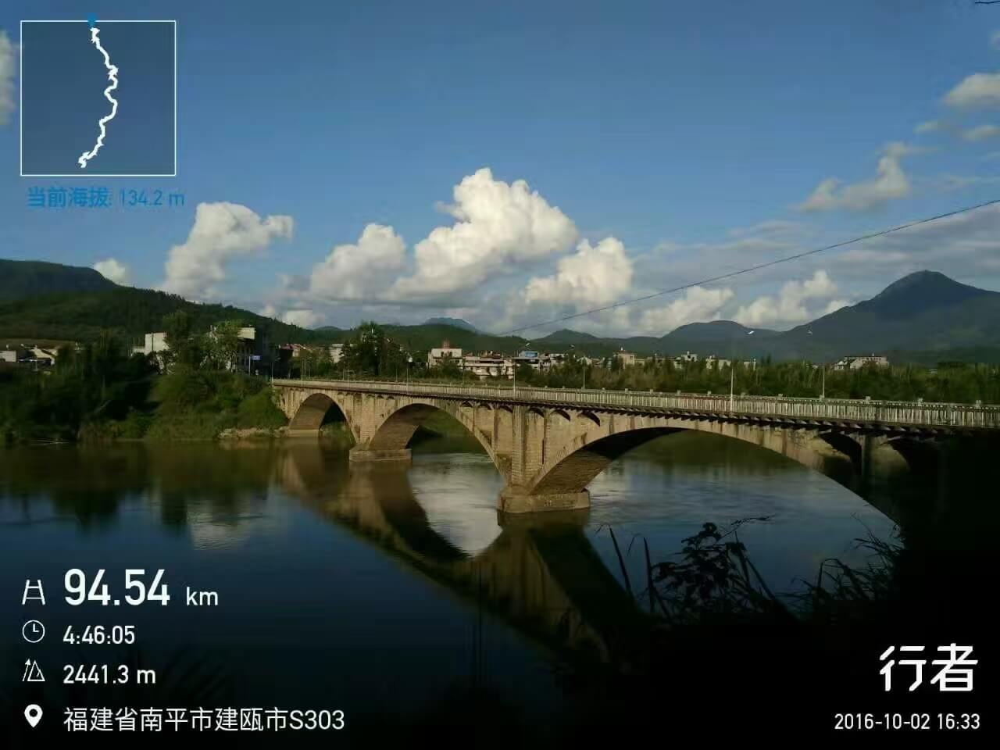
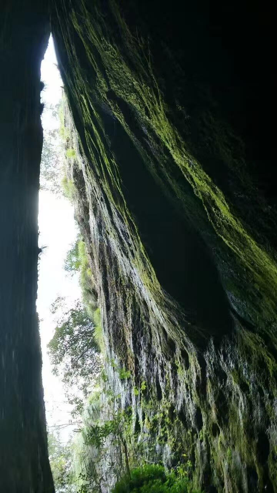
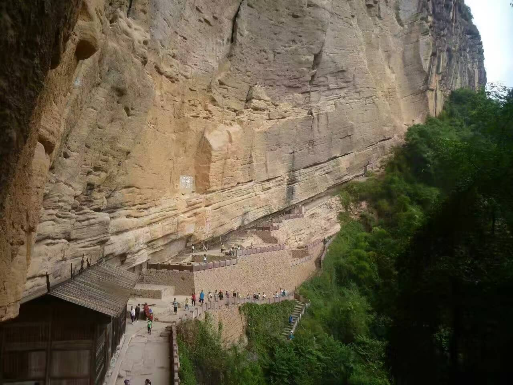
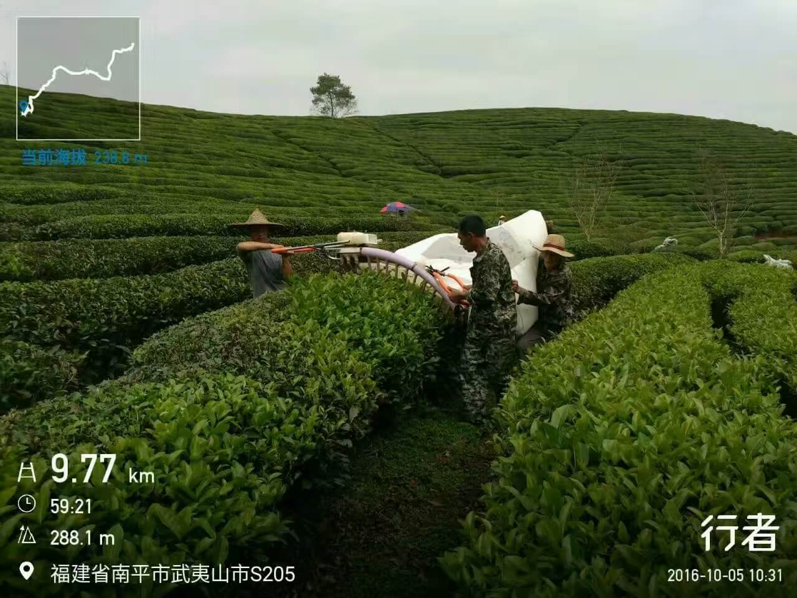
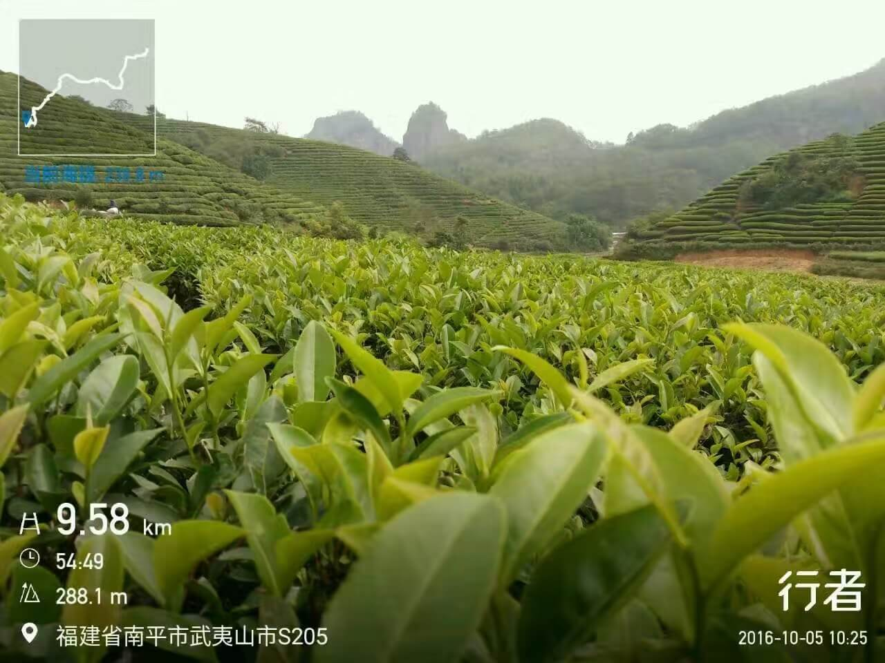
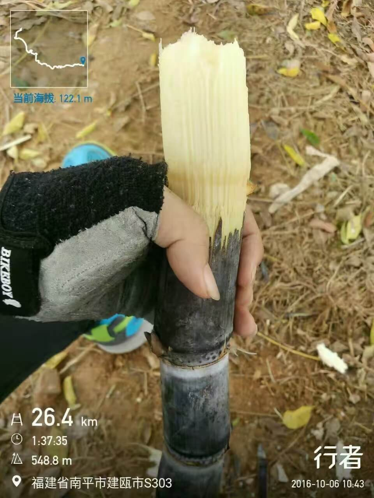
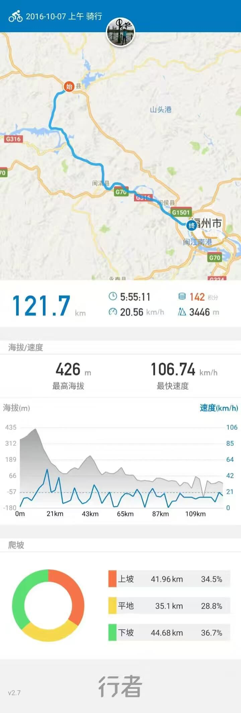
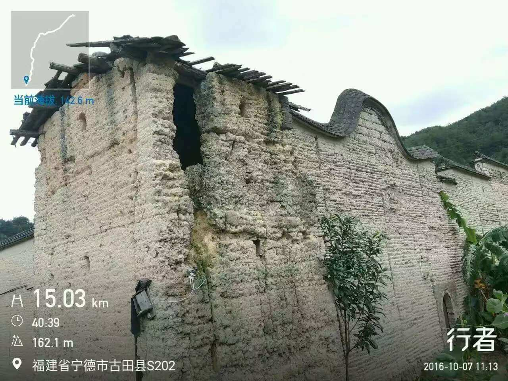

利用国庆假期单车骑行福州到武夷山往返~

### 【2016-10-01】
第一天目标：福州-南平。骑行起点：福州洪塘大桥，早上 7:30 开始骑行，走走停停，骑骑玩玩，辗转 晚上8:20 到达南平～

  

  

### 【2016-10-02】
第二天目标：南平-武夷山。今天出发稍微，出发时间早上 9:30，路上状况频出，连续两次被扎胎，也是醉了～ 晚上10:00 才到武夷山景区北门附近，明天就休闲游徒步逛景区了～

  

  

### 【2016-10-03，2016-10-04】
在武夷山景区内徒步爬山~

  

  

### 【2016-10-05】
返程，骑行：武夷山—建瓯。早上 9:00 出发，晚上 7:30 左右到；休闲一点，把两天的行程返程用三天完成，今晚在建瓯留宿～

  

  

### 【2016-10-06】
返程，骑行：建瓯—古田。早上 8:30 出发，晚上 9:00 左右到；路过一块甘蔗田，一老伯正在田里扒甘蔗的枯叶，我们就顺口问了句甘蔗熟了没，老乡随手就砍了根送我们吃，真的太感谢了。
 
本想绕过南平400多米海拔的爬坡而走古田线，却翻了一座1300多米海拔的大山，从玉山镇出来就开始了16公里的连续上坡，其中还有5公里的碎石烂路，跌跌撞撞晚上九点多才到古田～

  

  

### 【2016-10-07】
返程，骑行：古田—福州。早上 10:20 出发，晚上 7:00 左右到；最后一天，终于到家，在闽清经历大雨，轮子甩一脸的泥点子，假期圆满结束~

  

  

