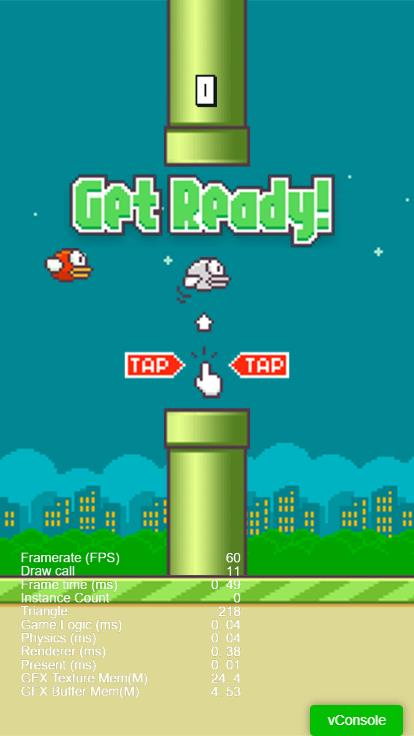

## 游戏介绍
- 《Flappy Bird》是一款由越南开发者 Dong Nguyen 创作并在2013年发布且暴红的像素游戏。
- 游戏玩法：玩家控制一个小鸟，通过点击屏幕使其飞行。游戏的核心目标是穿过一系列竖直排列的绿色管道，同时避免碰撞管道以及天花板和地面，一旦碰撞即意味着游戏结束。
- COCOS CREATOR 版本：`Cocos Creator 3.8`。

## 游戏效果
- DEMO试玩：[https://www.itdn.top/game/FlappyBird/](https://www.itdn.top/game/FlappyBird/)



## 实现步骤
将使用 `TypeScript` 和 `Cocos Creator 3.8` 的 API 来实现基本的 Flappy Bird 游戏功能，其中涉及到场景的创建、精灵的控制、碰撞检测和得分统计等多个方面。

### 1. 创建游戏场景
首先，在 Cocos Creator 中创建一个新项目，设计尺寸为 `720*1280`，并添加一个场景用于 Flappy Bird 游戏。


### 2. 添加背景和地面
- 在 `Canvas` 节点下创建一个主画面节点 `Main`（尺寸大小为`720*1280`），为其添加`Sprite`（精灵）组件作为游戏的背景元素。
- 在 `Main` 节点下创建地面节点 `Ground`放在画面最底部，为其添加 `BoxCollider2D`（2D碰撞）组件和 `Rigidbody2D`（2D刚体）组件并设置刚体类型（Type）：`静态刚体(STATIC)`。

### 3. 添加小鸟精灵
- 在 `Main` 节点下创建节点 `Player`（尺寸为全屏，及`720*1280`），通过点击 `Player` 节点控制小鸟飞行。
- 在 `Player` 节点下创建小鸟节点 `Bird2D`并为其添加`BoxCollider2D`（2D碰撞）组件和 `Rigidbody2D`（2D刚体）组件并设置刚体类型（Type）：`动力学刚体(DYNAMIC)`，以便后续的重力和碰撞检测。

### 4. 控制小鸟飞行
在 `Player` 节点下添加脚本 `Player.ts`:
```typescript
/**
 * 游戏状态
 */
enum BirdState{
    Ready,   //准备状态
    Flying,  //小鸟飞行中
    FreeFall,//小鸟自由落体中
    Dead,    //小鸟已阵亡
};
@ccclass('Player')
export class Player extends Component {
    // 带重力和碰撞体的小鸟
    private _bird2D: Node = null;
    // 2D刚体
    private _rigidBody2D: RigidBody2D = null;
    // 2D碰撞体
    private _collider2D: BoxCollider2D = null;
    // 游戏状态
    private _state = BirdState.Ready;
    /** 初始化 */
    start() {
        this._bird2D = this.node.getChildByName("Bird2D");
        // 获取2D钢体
        this._rigidBody2D = this._bird2D.getComponent(RigidBody2D);
        // 获取2D碰撞体
        this._collider2D = this._bird2D.getComponent(BoxCollider2D);
        // 注册2D碰撞事件(碰撞开始时触发)
        this._collider2D.on(Contact2DType.BEGIN_CONTACT, this.onBeginContact, this);
        // 绑定全屏触摸事件
        this.node.on(Node.EventType.TOUCH_START, this.onTouchStart, this);
    }
    /** TOUCH事件回调 */
    onTouchStart() {
        // 重置 重力缩放比例（默认0无重力）
        this._rigidBody2D.gravityScale = 1;
        // 清空重力加速度
        this._rigidBody2D.linearVelocity = v2();
        // 给小鸟（2D刚体）添加一个 上抛 的作用力
        this._rigidBody2D.applyLinearImpulseToCenter(v2(0, this._throwForce), true);
        // 设置游戏状态
        this._state = BirdState.Flying;
    }
    // todo
    onBeginContact(){}
}
```

### 5. 添加管道障碍物
- 在 `Main` 节点下创建节点 `PipeLayer`（尺寸为全屏减去地面的高度），在此节点下定时生成管道障碍物，同时处理管道的移动和回收。
- 创建预制体 `PipeGroup` 并为其添加上下两个管道的`Sprite`（精灵）组件，为`Sprite`组件添加 `BoxCollider2D`（2D碰撞）组件和 `Rigidbody2D`（2D刚体）组件并设置刚体类型（Type）：`静态刚体(STATIC)`。
- 在 `PipeLayer` 节点下添加脚本 `PipeLayer.ts`:
```typescript
@ccclass('PipeLayer')
export class PipeLayer extends Component {
    // 管道节点预制资源
    @property(Prefab)
    pipePrefab: Prefab = null;
    // pipe对象池
    private _pipePool: NodePool;
    // pipe节点集合
    private _pipeList: Node[] = [];
    // 管道是否移动中
    private _pipeIsRunning = false;
    // 管道移动速度，单位px/s 
    private _pipeMoveSpeed = -400;
    // 每对管道之间的间距，单位px
    private _pipeSpacing = 500;
    // 管道回收X轴位置
    private _recylceX = 0;
    /** 初始化 */
    start() {
        // 创建管道障碍物对象池
        this._pipePool = new NodePool();
        for (let i = 0; i < 3; ++i) {
            // 实例化节点
            let pipe = instantiate(this.pipePrefab);
            // 放入对象池
            this._pipePool.put(pipe);
        };
    }
    /** 每一帧渲染前执行：管道移动 */
    update(deltaTime: number) {
        if (!this._pipeIsRunning) return;
        // 实时更新管道位置
        for (let i = 0; i < this.node.children.length; i++) {
            let posX = this.node.children[i].getPosition().x + this._pipeMoveSpeed * deltaTime;
            let posY = this.node.children[i].getPosition().y;
            this.node.children[i].setPosition(posX, posY);
            // 超出屏幕显示范围了，回收此管道
            if (posX < this._recylceX) {
                this.recyclePipe(this.node.children[i])
            }
        }
    }
    /** 定时生成管道，并开始移动 */
    startSpawn() {
        // 初始化管道根节点
        this.node.removeAllChildren();
        // 生成一组管道
        this.spawnPipe();
        // 定时生成管道
        let spawnInterval = Math.abs(this._pipeSpacing / this._pipeMoveSpeed);
        this.schedule(this.spawnPipe, spawnInterval);
        // 开始移动
        this._pipeIsRunning = true;
    }
    /** 生成管道 */
    spawnPipe() {
        let pipeGroup: Node = null;
        if (this._pipePool.size() > 0) {
            pipeGroup = this._pipePool.get();
        } else {
            pipeGroup = instantiate(this.pipePrefab);
        };
        this.node.addChild(pipeGroup);
        this.initPosition(pipeGroup);
        pipeGroup.active = true;
        this._pipeList.push(pipeGroup);
        log("_pipeList:",this._pipeList.length)
    }
    /** 生成管道时 初始化管道位置 */
    initPosition(pipeGroup: Node) {
        const visibleSize = this.node.getComponent(UITransform);
        const pipeSize = pipeGroup.getComponent(UITransform);
        // 设置管道节点初始位置
        let posX = (visibleSize.width / 2) + this._pipeSpacing;
        let posY = this.generateRandom(-visibleSize.height / 4, visibleSize.height / 4);
        pipeGroup.setPosition(posX, posY);
        // 管道超出屏幕X轴显示，回收范围
        this._recylceX = - (visibleSize.width / 2) - pipeSize.width;
    }
    /** 生成范围随机数 */
    generateRandom(min:number, max:number):number {
        let Range = max - min;
        let Rand = Math.random();
        return (min + Math.round(Rand * Range));
    }
    /** 回收管道 */
    recyclePipe(pipeGroup: Node) {
        pipeGroup.active = false;
        this._pipePool.put(pipeGroup);
    }
    /** 重置 */
    reset() {
        // 定时生成管道
        this.unschedule(this.spawnPipe);
        this._pipeList = [];
        this._pipeIsRunning = false;
    }
}
```

### 6. 碰撞检测
- 使用物理引擎来处理小鸟与管道的碰撞检测，以及小鸟与地面的碰撞检测。
- 找到【项目设置】 --> 【物理】 --> 【碰撞矩阵】，添加 `Player` 和`Obstacles` 并勾选为相互碰撞。
- 修改 `Player` 节点的`BoxCollider2D`和 `Rigidbody2D`的分组 `Group` 为  `Player`，而地面与管道障碍节点的该组件的分组 `Group` 为`Obstacles`。
- 修改脚本 `Player.ts`:
```typescript
/** 碰撞检测  */
onBeginContact(selfCollider:Collider2D, otherCollider:Collider2D, contact:IPhysics2DContact | null) {
    // 碰撞情况
    log("self:", selfCollider.node.name, "other:", otherCollider.node.name, "contact:", contact)
    // 碰撞后小鸟死亡
    this._state = BirdState.Dead;
    // 解除触摸事件绑定
    this.node.off(Node.EventType.TOUCH_START, this.onTouchStart, this);
    // todo 游戏结束
}
```

### 7. 得分统计
根据小鸟通过管道的情况来计算得分，并实时更新游戏界面的分数显示。
- 修改脚本 `PipeLayer.ts`，添加方法:
```typescript
/** 获取下个未通过的水管 */
public getNextPipe() {
    return this._pipeList.shift();
}
```

- 修改脚本 `Player.ts`,添加代码:
```typescript
@ccclass('Player')
export class Player extends Component {
    // 分数Label
    @property(Label)
    scoreLabel: Label = null;
    // 管道控制器
    @property({ type: PipeLayer })
    pipeLayer: PipeLayer | null = null;
    // 下个未通过的水管
    private _nextPipe: Node;
    /** 初始化 */
    start() {
        // 获取下个未通过的水管
        this._nextPipe = this.pipeLayer.getNextPipe();
    }
    /** 每一帧渲染前执行 */
    update(deltaTime: number) {
        if (this._state === BirdState.Ready || this._state === BirdState.Dead) return;
        if (this._state === BirdState.Flying || this._state === BirdState.FreeFall) {
            // 记录得分
            let birdLeft = this._bird2D.getPosition().x;
            let pipeRight = this._nextPipe.getPosition().x + this._nextPipe.getComponent(UITransform).width;
            if (birdLeft > pipeRight) {
                // 得分 +1
                this._score++;
                this.scoreLabel.string = this._score.toString();
                // 获取下个未通过的水管
                this._nextPipe = this.pipeLayer.getNextPipe();
            }
        }
    }
}
```

## 完整代码示例
完整代码示例：[https://gitee.com/chaoo/cocos-flappy-bird.git](https://gitee.com/chaoo/cocos-flappy-bird)。
