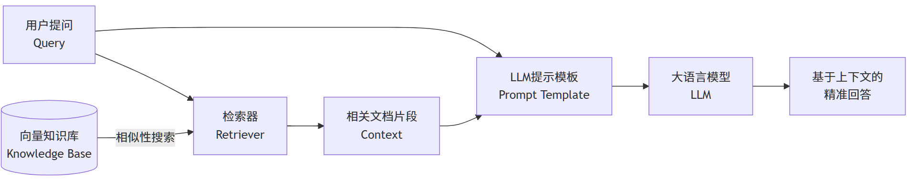

## 1. 基础概念
RAG（Retrieval-Augmented Generation，检索增强生成）是一种结合了信息检索与文本生成的人工智能技术。通过从外部知识库中检索相关信息，并将其作为提示（Prompt）输入给大语言模型（LLM），以增强模型处理知识密集型任务的能力，如问答、文本摘要、内容生成等。

其核心流程为： `用户提问 → 检索相关文档 → 将检索结果与问题融合 → 生成最终答案`。

1. 大语言模型（LLM）的固有缺陷：
   - **知识滞后性（Knowledge Cutoff）:** 模型的训练数据有截止日期（如GPT-4是2023年10月），无法获取世界的新知识。
   - **幻觉问题（Hallucination）:** 模型可能会生成看似合理但事实上不准确或完全错误的信息。
   - **缺乏溯源能力（Lack of Provenance）:** 无法提供生成答案的依据或来源，可信度低。
   - **处理私有/领域知识能力有限:** 模型没有接触过公司内部的文档、数据库等非公开信息。
2. RAG的解决方案：**“站在巨人的肩膀上，而非仅凭记忆”**
   - RAG通过**外部知识库**来增强LLM。在回答问题时，先从一个外部知识源（如文档、数据库、网页）中检索相关信息，然后将这些信息作为上下文提供给LLM，让LLM基于这些**可靠的证据**来生成答案。
3. **RAG的核心价值：**
    - **提高准确性**：提供事实依据，减少幻觉。
    - **动态知识更新**：无需重新训练模型，只需更新知识库即可让模型获取最新信息。
    - **增强可信度**：提供引用来源，答案可追溯、可验证。
    - **专业领域适配**：支持医疗、法律等垂直领域私有知识库。
    - **降低成本**：比为了学习新知识而微调（Fine-tuning）整个大模型要便宜得多。


## 2. RAG核心架构与工作流程
RAG Pipeline通常分为两个主要阶段：**检索（Retrieval）** 和 **增强生成（Augmented Generation）**。


完整的RAG应用流程主要包含两个阶段：
- 数据准备（准备阶段）：数据提取 ——> 文本分割 ——> 向量化（embedding）——> 数据入库
- 应用阶段（运行时）：用户提问 ——> 数据检索（召回）——> 注入Prompt ——> LLM生成答案

### 2.1 数据索引（Data Indexing） - 准备阶段
- **目的**：构建一个可供高效检索的外部知识库。
- **步骤**：
    1. **加载（Loading）**：从各种来源（PDFs, Word, Web, DBs）加载原始数据。
    2. **切分（Chunking）**：使用文本分割器（Text Splitter）将长文档切分成较小的 chunk（片段）。这是关键步骤，chunk的大小和质量直接影响检索效果。
    3. **嵌入（Embedding）**：即向量化，使用**嵌入模型（Embedding Model）**将每个文本chunk转换为一个**高维向量（Vector）**。这个向量代表了文本的语义信息。
    4. **存储（Storing）**：将向量和对应的原始文本存储到**向量数据库（Vector Database）**（如FAISS、Milvus、Pinecone）中。

### 2.2 检索（Retrieval） - 运行时
- **目的**：针对用户查询，从知识库中找到最相关的信息。
- **步骤**：
    1. 用户输入一个**查询（Query）**。
    2. 使用**相同的嵌入模型**将Query转换为一个向量。
    3. 在向量数据库中进行**相似性搜索（Similarity Search）**，找出与查询向量最接近的K个向量（即最相关的文本chunk）。常用**余弦相似度（Cosine Similarity）** 衡量。

### 2.3 增强生成（Augmented Generation） - 运行时
- **目的**：将检索到的信息作为上下文，指导LLM生成高质量答案。
- **步骤**：
    1.  **提示工程（Prompt Engineering）**：将检索到的上下文（Context）和用户查询（Query）组合成一个精心设计的提示（Prompt）。
        - **模板示例**：
            ```
            请根据以下提供的背景信息来回答问题。如果背景信息中没有答案，请直接说"根据提供的资料，我无法回答这个问题"。
            # 背景信息： {检索到的相关上下文}
            # 问题： {用户查询}
            # 答案：
            ```
    2.  **LLM生成**：将组装好的Prompt发送给LLM，LLM基于给定的上下文生成最终答案。

## 3. RAG典型应用场景
| 场景         | 案例                                | 技术要点                              |  
|------------------|----------------------------------------|------------------------------------------|  
| 智能问答      | 企业知识库客服、政策查询                | 结构化提示+多路召回 |  
| AI搜索        | Kimi/DeepSeek的“联网搜索”功能            | 实时网页检索+摘要生成 |  
| 代码辅助      | RepoCoder代码生成                      | 迭代检索-生成（Iter-RetGen） |  
| 多模态应用    | 图像/音频语义检索                      | 跨模态向量对齐    |  

### 3.1 RAG实践难点与解决方案
1. 检索精度问题
   - 问题：切分粒度影响召回（过粗含噪声，过细丢失上下文）。
   - 方案：
       - Small2Big策略：短句索引→召回后扩展上下文。
       - 句子窗口检索：以关键句为中心扩展上下文块。
2. 生成质量控制
   - 问题：冗余信息干扰或上下文溢出。
   - 方案：
       - 上下文压缩：基于BM25的句子级筛选。
       - 自适应检索：模型置信度低时触发检索（如Self-RAG）。
3. 知识库更新
   - 实时同步：监听数据源变更，自动触发切分→向量化→索引更新。
   - 版本管理：保留历史索引支持回溯（如Milvus的Time Travel功能）。


## 4. RAG优化方向
1. **检索优化**
   - **更好的Chunk策略**：不仅按长度分割，还可按语义、章节分割，或使用重叠滑动窗口。
   - **混合搜索（Hybrid Search）**：结合**关键词搜索**（稀疏检索，如BM25）和**向量搜索**（稠密检索），兼顾精确匹配和语义匹配。
   - **重排序（Re-Ranking）**：使用更精细的交叉编码器（Cross-Encoder）模型对检索出的Top K个结果进行二次排序，选出最相关的前N个（如Top 3），提升上下文质量。
   - **元数据过滤**：在检索时利用元数据（如日期、作者、类别）进行过滤，提高精准度。
2. **生成优化**
   - **提示工程（Prompt Engineering）**：设计更高效的提示模板，明确要求LLM“根据上下文”回答，并限制其胡编乱造。
   - **引用溯源（Citation）**：要求LLM在生成答案时注明引用的具体文档和段落。
3. **评估（Evaluation）**：评估一个RAG系统是复杂的，通常从多个维度衡量

| 维度         | 指标                     | 说明                                  |  
|------------------|-----------------------------|------------------------------------------|  
| 检索质量      | 上下文相关性（Context Relevance） | 检索结果与问题的相关性评分                |  
| 生成质量      | 答案忠实度（Faithfulness）      | 答案是否基于检索内容，避免幻觉            |  
| 综合性能      | 响应延迟（Latency）           | 端到端处理时间（目标<2秒）                |

### 4.1 延伸方向
- 多模态RAG：检索图片、表格、音频等信息来生成答案（如Donut模型）。
- 安全增强：检索结果过滤敏感信息（如PII识别）。
- 更智能的检索：端到端训练检索器，使其更懂LLM需要什么上下文。
- 自省与自我修正：LLM可以判断检索到的信息质量，并迭代检索。

