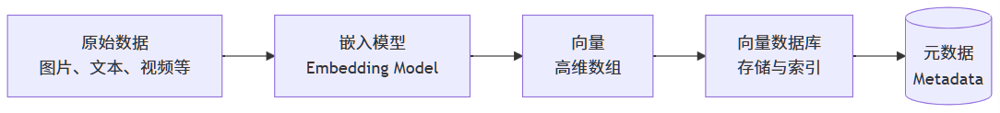

## 1. 基础概念
- **传统数据库的局限性**：传统关系型数据库（如MySQL）或NoSQL数据库（如MongoDB）擅长进行**精确匹配**和**范围查询**。但它们无法有效处理基于“相似性”的查询，例如：“找出所有与这张图片相似的图片”。
- **向量数据库（Vector Database）**：一种专门为存储、索引和检索**高维向量**而设计的数据库。其核心能力是进行**近似最近邻搜索**，快速找到与查询向量最相似的向量集合。能够高效地处理**非结构化数据**（如文本、图像、音视频等）。利用**嵌入模型**将非结构化数据转换为数值数组（即向量），存储在专门设计的存储结构中，并利用索引技术加速查询过程。
  1. 向量与嵌入
      - **向量（Vector）** 是多维空间中某点的数学表示（如`{12, 13, 19, 8, 9}`表示5维空间坐标），通过几何方式表达数据的语义特征。
      - **嵌入（Embedding）** 是机器学习生成的向量，将文本、图像等非结构化数据映射到向量空间，使语义相近的数据点在空间中距离更近。
  2. 运作机制
      - 存储数据点（文档、图像、音视频等）的嵌入向量，并建立向量到原始数据的映射关系。
      - 通过相似性搜索（如计算余弦相似度、欧氏距离）快速检索最接近的向量，支持语义级查询。

## 2. 工作流程
向量数据库的核心工作流程分为**写入**和**查询**两部分。
### 2.1 写入 (Ingestion) 流程

- **向量化 (Vectorization)**：使用嵌入模型将原始数据转换为向量。
- **存储与索引 (Storage & Indexing)**：将向量和与之关联的**元数据**（如原始文本、图片ID、创建时间等）一并存储。并为其创建专门的**索引**以加速后续查询。

### 2.2 查询 (Query) 流程

- **向量化查询**：将用户的查询输入（如一段文字）同样转换为向量（查询向量）。
- **相似性搜索 (Similarity Search)**：在数据库中快速找到与查询向量最相似的K个向量。
- **返回结果**：返回这些相似向量对应的原始数据（或元数据），如最相关的文档段落。

## 3. 核心原理
### 3.1 向量嵌入（Vector Embedding）
简单来说，向量嵌入是一段信息（如文本、图片、用户）的数字表示，它被编码为一个高维空间中的点（即一个向量）。
- 包含两个关键点：
  + **数字表示**：它将非数值数据（如文字）或复杂关系转化为计算机能够理解和处理的数值形式。
  + **高维空间**：这些向量通常有几十、几百甚至几千个维度。在这个空间里，每个维度都代表了数据的某种潜在特征或属性。
- 数学本质：本质是高维空间中的坐标点，使用嵌入模型（如 BERT、CLIP、ResNet）将非结构化数据（文本/图像等）映射到向量空间。
- 语义关联：语义相似的数据在向量空间中距离更近（如“猫”与“猫咪”的向量距离小于“猫”与“汽车”）。
- 降维表达：将复杂数据（如百万像素图像）压缩为低维向量（如512维），保留核心语义特征。

#### 3.1.1 向量嵌入的生成
嵌入不是人为设计的，而是**神经网络模型**在完成特定任务的过程中**自动学习**得到的副产品。
- **词的嵌入（Word2Vec）**：一个词的含义可以由它周围经常出现的词（上下文）来定义。
- **图像嵌入**：使用卷积神经网络（CNN，如 ResNet）处理图像，网络的最后一层隐藏层的输出就可以作为该图像的嵌入。相似的图片会得到相似的嵌入。
- **图嵌入**：将图中的节点（如社交网络中的用户）表示为向量，使得图中相连的、结构相似的节点在嵌入空间中也更接近。
- **协同过滤嵌入**：在推荐系统中，为用户和物品分别学习一个嵌入。如果用户喜欢某个物品，那么他们的嵌入在空间中就应该是接近的。

#### 3.1.2 向量嵌入的核心特性
- **相似性可度量**：通过计算向量之间的距离（如余弦相似度、欧氏距离），可以量化两个实体的相似程度。
- **关系可推理**：语义关系可以通过向量运算来捕捉（如：国王 - 男人 + 女人 ≈ 王后）。
- **作为通用接口**：任何数据（文本、图像、音频）一旦被转化为向量嵌入，就可以使用统一的相似性搜索方法进行处理。这正是向量数据库工作的基础。

### 3.2 相似性度量（Similarity Measurement）
通过距离函数计算向量间的相似度。比如，它要判断两个向量是“方向一致”（用余弦相似度），还是“在空间里挨得近”（用欧氏距离）。
- **余弦相似度（Cosine Similarity）** 只关注方向，不关注长度；
  - 向量夹角**余弦值**（`cos(θ)`）范围在`[-1, 1]`之间：
    + `1`：完全相似，**夹角为0°**，两个向量方向完全相同。
    + `0`：不相关，**夹角为90°**，正交，两个向量垂直，表示无关。
    + `-1`：完全负相关（相反），**夹角为180°**，两个向量方向完全相反。
  - 数学公式：\( \frac{A \cdot B}{\|A\| \|B\|} = \frac{\sum_{i=1}^{n} A_i B_i}{\sqrt{\sum_{i=1}^{n} A_i^2} \cdot \sqrt{\sum_{i=1}^{n} B_i^2}} \) ，其中：\( A \cdot B \) 是向量A和B的**点积**；\( \|A\| \) 和 \( \|B\| \) 分别是向量A和B的**欧几里得范数（即向量的长度）**。
- **欧几里得距离（Eucidean Distance）**，也称为**欧氏距离**，计算空间中向量的**绝对距离**。
  - 空间直线距离，范围`[0, +∞)`，**数值越小**表示两点越相似。
  - 数学公式：\( d(A,B) = \sqrt{\sum_{i=1}^{n} (a_i - b_i)^2} \) ，表示`n`维空间中的两个点`A(a₁,a₂,...,aₙ)`、`B(b₁,b₂,...,bₙ)`的欧氏距离。
- **点积相似度（Dot-Product Similarity）**：同时受向量方向和幅度（长度）影响，。
  - 值越大表示越相似,范围`(−∞,+∞)`：
    + `点积值大`：方向相同且幅度大。
    + `点积值为0`：方向垂直。
    + `点积值为负`：方向相反。
  - 数学公式：\( A \cdot B = \sum_{i=1}^{n} (a_i b_i) \) ，对两个向量对应分量相乘再求和，反映向量间的投影关系。
- **汉明距离（Hamming Distance）**：两个等长字符串在相同位置上不同字符的个数。
    - 数学公式：\( d_H(A,B) = \sum_{i=1}^{n} \mathbf{1}_{(a_i \neq b_i)} \) ，其中 \( \mathbf{1}_{(a_i \neq b_i)} \) 是指示函数，当 \(a_i \neq b_i\) 时为 1，否则为 0。

| 度量方式       | 计算原理     | 适用场景                     | 局限性                |
|--------------------|----------|----------------------------------|--------------------|
| 余弦相似度     | 向量夹角余弦值  | 文本语义匹配（如问答系统）       | 忽略向量长度差异           |
| 欧氏距离       | 空间直线距离   | 图像特征匹配（如人脸识别）       | 高维空间失效（维度灾难）       |
| 点积相似度     | 向量投影强度   | 推荐系统排序（如广告点击率预测） | 需向量归一化             |
| 汉明距离       | 二进制位差异数量 | 指纹识别、编码纠错               | 仅适用于等长序列，高维下区分能力弱  |

- 文本用余弦，地理位置用欧氏。
- 大于100维时欧氏距离失效，需降维（PCA）或改用改用余弦或专用ANN算法。
- 百亿向量规模下，需结合近似算法（如HNSW、LSH）加速。
- 跨模态检索（图文互搜）需对齐不同嵌入空间，常用对比学习（Contrastive Learning）优化。

### 3.3 近似最近邻搜索（Approximate Nearest Neighbors, ANN）
在一个庞大的数据集中，快速找到与给定查询项最相似的几个项（Top-K）或所有在某个相似度范围内的项（范围查询）。
- **近似最近邻搜索（ANN）** 就是为了在高维向量世界里，用**极小的精度损失换取巨大的性能提升**。
- 快速找到与其最相似的k个向量（近似最近邻），而并非精确解。
- 加速机制：
  - **牺牲精度**：允许返回次优解（如相似度95%的向量），换取100～1000倍速度提升。
  - **减少计算**：通过索引结构（如图、哈希表）避免全量距离计算。
- 技术价值：使亿级向量库的毫秒级检索成为可能，支撑实时推荐、语义搜索等场景。

#### 3.3.1 经典索引结构与算法
1. 低维数据索引（通常维度 d<20，例如，2D地理坐标，3D图形），基于空间划分的**树形结构**非常有效。
   - **KD-Tree**：将多维空间递归地沿数据方差最大的维度划分为二叉树。在低维空间中非常高效，高维空间性能急剧下降，称为“维度灾难”。
   - **R-Tree**：用最小边界矩形来概括和分组空间中的对象，形成一个平衡树。适合存储和查询空间对象（如多边形、线段），结构相对复杂，在高维空间同样会面临性能问题。
2. 高维数据索引（例如，文本嵌入，图像特征），高维空间中的数据分布非常稀疏，传统的树形结构效率低下。**近似最近邻搜索**通过牺牲少量精度来换取巨大的速度提升。
   - 基于哈希的索引：**LSH**（**局部敏感哈希**，Locality-Sensitive Hashing）。
       + 通过哈希函数将相似向量映射至同一个哈希桶，只搜索与它在 **同一个桶（或邻近桶）** 里的点，缩小了搜索范围。
       + 理论坚实，对某些问题高效，动态更新困难。
   - 基于图的索引：**HNSW**（**分层可导航小世界图**，Hierarchical Navigable Small World）。
       + 构建一个分层的图结构，从顶层开始，找到一个入口点，通过贪心搜索找到局部最近邻作为下一层入口，直到最底层。
       + 它结合了可导航小世界图和跳表的思想，在精度和速度上取得了很好的平衡，支持动态插入和删除，但内存占用高。
   - 基于量化的索引：**IVF-PQ**（**倒排文件-乘积量化**，Inverted File with Product Quantization）。
      + **IVF**：先对数据集进行**聚类**（把相似的数据自动归成几组(这些组叫“簇”)，如K-Means算法）；为每个簇建立一个“倒排列表”，记录属于该簇的所有向量。
      + **PQ**：**向量压缩**。将高维向量切分成多个子向量，对每个子空间分别进行聚类。这样，一个原始向量就可以用其子向量对应的聚类中心ID（码本索引）来表示，极大减少了存储占用。
      + IVF缩小了搜索范围，PQ加速了距离计算。内存效率极高（PQ压缩可以将向量大小减少10-50倍）但索引构建成本高（K-Means聚类和PQ码本训练都需要时间），PQ压缩会带来精度损失。
   - 基于“森林”的索引：**ANNOY**（**近似最近邻**，Approximate Nearest Neighbors Oh Yeah）。
       + 通过构建一个“森林”（多棵二叉树）来分割空间。每棵树通过随机超平面递归地将空间一分为二。
       + 索引结构非常紧凑，内存友好，但索引构建时间较长，构建完成后难以动态添加新点。

- 算法性能对比：

| 算法类型   | 比喻                     | 查询速度 | 精度 | 内存占用 | 适用场景               | 案例                   |
|--------|------------------------|--------------|----------|--------------|----------------------------|----------------------|
| HNSW   | 一个多层的、有高速通道的社交网络       | ⚡️⚡️⚡️⚡️ | 🎯🎯🎯🎯   | 高           | 高精度大规模检索（亿级）   | 法律条款智能匹配（HNSW+余弦相似度） | 
| ANNOY  | 一个由许多“是/否”问题构成的决策森林    | ⚡️⚡️⚡️ | 🎯🎯🎯     | 中           | 中小规模实时系统（百万级） | 实时商品推荐（ANNOY+内积）     | 
| LSH    | 一个精心设计的“物以类聚”分拣系统      | ⚡️⚡️   | 🎯🎯       | 低           | 超大规模粗筛（十亿级）      | 社交媒体海量图片清理（LSH+汉明距离） |  
| IVF-PQ | “分地区管理”+“信息压缩存储”的超级图书馆 | ⚡️⚡️⚡️ | 🎯🎯🎯     | 极低         | 内存受限设备（移动端）      | 外卖平台混合检索（IVF-PQ粗筛+GPU加速）  |

- **追求最佳精度和速度**：首选 **HNSW**。如果你的数据量在百万到数亿级别，并且内存充足，HNSW通常是默认的最佳选择。
- **内存极度紧张或需要进程共享**：考虑 **ANNOY**。
- **处理十亿级以上数据，且内存是首要瓶颈**：**IVF-PQ** 是你的不二之选。通常会在GPU上使用FAISS实现。
- **特定理论需求或场景**：**LSH** 仍然在某些特定领域（如密码学、重复检测）发挥作用，但在通用向量搜索中已不那么流行。

## 4. 主流产品

| 产品名 | 公司/社区 | 主要特点                                          | 适用场景 |
| :--- | :--- |:----------------------------------------------| :--- |
| **Milvus** | Zilliz | 开源/托管，**功能丰富**，集群能力强，支持多种索引（HNSW、IVF-PQ）和混合查询 | 超大规模、复杂的向量检索场景 |
| **Pinecone** | Pinecone | **全托管SaaS服务**，易用性极高，性能稳定                      | 追求快速上线、不想运维基础设施的团队 |
| **Chroma** | 开源社区 | 轻量级，**专注于AI原生**，开发体验好                         | 原型开发、研究、中小项目 |
| **Weaviate** | Weaviate | 开源/托管，**功能全面**，支持GraphQL，混合搜索强                | 需要复杂查询和过滤的生产级应用 |
| **Qdrant** | Qdrant | 开源/托管，Rust编写，**性能优异**                         | 对性能和资源控制有高要求的场景 |
| **Redis** | Redis | 作为模块支持向量搜索，**生态成熟**                           | 已在使用Redis，需要增加向量功能的场景 |
| **PGVector** | 开源 | PostgreSQL的扩展，**复用现有PG生态**                    | 技术栈已基于PostgreSQL的项目 |

