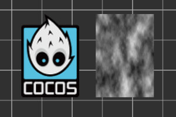
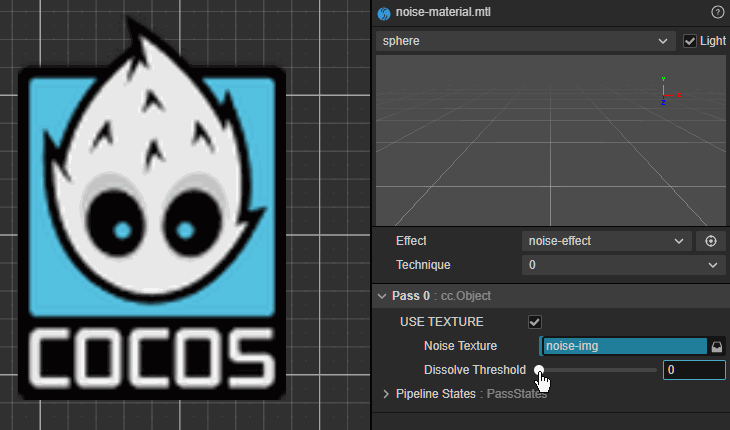

## 1. Cocos Creator 图形渲染
### 1.1 渲染管线
- **渲染管线**：定义了从3D场景数据（网格、材质、灯光等）转换为2D屏幕图像的一系列步骤。
- **Cocos管线**：采用了**可定制渲染管线**(CRP - Customizable Render Pipeline)，内置了前向渲染（`forward`）和 延迟渲染（`deferred`）管线，并支持**自定义渲染管线**。
  - 内置管线：
    + 前向渲染管线：对每个物体，遍历所有光源计算其光照贡献。支持半透明、多光源逐像素处理简单。不过光源数量多时性能下降快。
    + 延迟渲染管线：先将材质属性渲染到多个纹理中，然后利用纹理中的信息，通过屏幕空间计算每个像素的光照。光照计算与场景复杂度解耦，大量光源下性能极佳，但是半透明处理困难，对带宽和内存要求高。
  - 自定义渲染管线：允许开发者完全控制渲染流程（渲染阶段和顺序、后处理等），通过继承`Pipeline`类，并重写`render`等方法来实现。

### 1.2 光照与阴影
- **光源**：平行光(方向光)，球面光(点光源)，聚光灯，环境光(漫射环境光)。
- **光照模式**：
  - **实时光照**：每帧动态计算，光影可变化，性能开销大。
  - **烘焙光照**：预先计算并将光照信息“烘焙”到光照贴图中，运行时无开销，用于静态场景。推荐使用GPU光照烘焙，比CPU烘焙速度快。
  - **混合光照**：结合两者，静态物体用烘焙光，动态物体用实时光。
- **阴影**：从光源视角渲染一张深度贴图（Shadow Map），然后在主相机渲染时比较深度来判断是否在阴影中。
  - **设置**：在Light组件和MeshRenderer组件上均可开启/接收阴影。
  - **优化**：阴影是性能杀手。优化手段包括：调整阴影距离、分辨率、平行光使用CSM（级联阴影映射）。
  - **级联阴影映射**：用于平行光，将视锥体分割为多个层级，近处使用高分辨率阴影图，远处使用低分辨率，以平衡质量和性能。

### 1.3 网格
网格（Mesh）一般用于绘制 3D 图像。网格资源包含顶点数组（顶点缓冲区）和索引（索引缓冲区），顶点数据包含位置、法线、切线、颜色、纹理坐标等属性。
- **MeshRenderer**（网格渲染器）组件，用于显示一个静态的3D模型。
- **SkinnedMeshRenderer**（蒙皮网格渲染器）组件，用于角色动画。
- **SkinnedMeshBatchRenderer**（批量蒙皮网格渲染器）组件，用于将同一个骨骼动画组件控制的所有子蒙皮模型网格合并渲染。

**合批**：减少`DrawCall`，提升性能。
- **静态合批**：构建时合并静态物体的网格，减少顶点数，但增加内存和下载量。
- **动态合批**：运行时自动将使用同一材质、模型的小型动态物体合并到一个DrawCall中。
- **GPU Instancing**：对大量相同网格和材质的物体，在一个DrawCall中渲染所有实例，性能最佳。
- 最佳实践：
  - 使用优先级为：静态合批 > instancing 合批。
  - 确保材质统一前提下，如果确定某些模型在游戏周期内完全静止不会变化，就可以使用静态合批。如果存在大量相同的模型重复绘制，相互间只有相对可控的小差异，就可以使用 instancing 合批。

### 1.4 纹理
纹理（Textures）是一张可显示的图像，或一段用于计算的中间数据，通过 UV 坐标映射到渲染物体表面，使之效果更为丰富精彩且真实。
- 纹理类型：
  - **2D纹理**（Texture2D）：最常用，用于漫反射贴图、法线贴图、高光贴图等。
  - **立方体贴图**（TextureCube）：用于天空盒、环境反射。
  - **渲染纹理**（RenderTexture）：运行时生成的纹理（在GPU上的纹理），用于镜子、安全摄像头、阴影图等。
- 纹理压缩：大幅减少GPU内存占用和带宽。

### 1.5 材质
Cocos Creator 通过**材质**（Material）来描述物体外观，物体在光照情况下所呈现出来的明暗、光点、光反射、光散射等效果，都是通过**着色器**来实现的。
- 材质（`Material`）可以看成是着色器资源（`EffectAsset`）在场景中的资源实例。通常是被渲染器组件使用，所有继承自 `RenderableComponent` 的组件都是渲染器组件，例如 `MeshRenderer`、`Sprite` 等。
  + **EffectAsset**：是**蓝图**，定义了可用的着色器、渲染状态和属性。
  + **Material**：是**实例**，负责 EffectAsset 声明的 Uniform、宏数据存储以及 Shader 使用和管理，这些信息都会以材质资源的可视化属性的形式展示在**属性检查器**面板中。


### 1.6 Cocos Shader
Shader（着色器）是用GLSL（OpenGL Shading Language, 着色器语言）基于顶点（Vertex）和片元（Fragment）的代码片段，Cocos Creator 基于 GLSL 封装了一套着色器 — Cocos Shader。
- 创建着色器：在**资源管理器**面板中点击左上角的`+`号按钮（或者在**Assets**目录下点击右键），在弹出菜单中选择**着色器（Effect,简单的无光照着色器）**或者**表面着色器（Surface Shader,基于物理光照的着色器）**，便可创建新的着色器资源。

## 2. Cocos Shader 着色器语法
`Cocos Shader`着色器文件扩展名为`*.effect`，是一种基于`YAML`和`GLSL`的单源码嵌入式领域特定语言，YAML部分声明流程控制清单，GLSL部分声明实际的Shader片段，这两部分内容相互补充，共同构成了一个完整的渲染流程描述。
- Cocos Creator的Effect系统通过**CCEffect(逻辑配置)**和**CCProgram(代码实现)**的分离，以及强大的**宏预处理**和**头文件机制**，构建了一个灵活、强大且跨平台的着色器开发环境。

### 2.1 Effect文件结构
一个标准的Effect文件（`.effect`）由两个主要部分组成：
+ `CCEffect`：用于声明渲染技术（Technique）、渲染过程（Pass）、渲染状态、材质参数等属性。
+ `CCProgram`：用于声明**顶点着色器**（`Vertex Shader`）和**片元着色器**（`Fragment Shader`）代码片段。

```glsl
CCEffect %{
  techniques: // 渲染技术
  - passes: // 渲染通道（多个按顺序执行）
    - vert: vs // 顶点着色器入口函数名
      frag: fs // 片元着色器入口函数名
      <optional: render state> // 渲染状态
}%

CCProgram vs %{
  // 顶点着色器代码
}%

CCProgram fs %{
  // 片元着色器代码
}%
```

### 2.2 CCEffect
- **渲染技术**(techniques)：一个`Effect`可以包含多个`techniques`,引擎按顺序尝试使用这些技术，**第一个被支持**的将被选用，常用于兼容不同平台（例如，为 WebGL 1.0 和 2.0 提供不同实现）。
- **渲染通道**(passes)：每个`pass`定义了一次完整的几何体绘制过程（多Pass渲染按顺序执行）。
  + `vert`：指定顶点着色器使用的 `CCProgram` 名。
  + `frag`：指定片元着色器使用的 `CCProgram` 名。
  + **渲染状态**(Render States)：控制`GPU`的固定功能管线。
    - `properties`: 定义 `uniforms`，连接编辑器与脚本（用于在编辑器面板中暴露可调节的参数，并与着色器代码中的`uniform`变量绑定）。
    - `blendState`: 混合状态。
    - `rasterizerState`: 光栅化状态（剔除、多边形模式等）。
    - `depthStencilState`: 深度和模板测试状态。
    - `dynamics`: 定义动态修改的状态（如 `stencilRef`）。

### 2.3 CCProgram
`CCProgram`里面编写实际的着色器代码，Cocos使用一种宏预处理的方式来实现跨平台兼容。
1. **头文件引入**：
   + 使用`#include <cc-local>`引入Cocos内置的Shader头文件（如`cc-global`）；
   + 这些头文件提供了统一的变量、函数和宏，以屏蔽不同平台和图形API的差异。
2. **宏语法**(`#define`)：Cocos的预处理器会在编译时根据目标平台，将宏展开为正确的GLSL代码。
   + 格式：`#define <macro> <optional: value>`
   + 常见内置宏：
     - `CC_PROGRAM_vert` / `CC_PROGRAM_frag`：帮助区分当前编译的是顶点还是片元着色器。
     - `CC_GLES3` / `CC_GLES2`：标识目标图形 API 版本。
     - `attribute`->`in`(vertex), `varying`->`out`(vertex) / `in`(fragment) 等，用于处理不同版本间的变量声明。
3. **程序入口**： 必须提供一个`main`函数作为着色器的入口点。
   + 在`main`函数中通常会调用`CCVertInput`/`CCFragInput`等工具函数来简化输入处理。
4. 着色器输入/输出:
   + **顶点着色器输入**：通过 `CCVertInput` 标准函数获取模型空间坐标、法线、纹理坐标等。
   + **顶点着色器输出 & 片元着色器输入**：通过一个结构体（通常命名为 `VertexOut` 或 `vfXX`）传递。必须包含 `vec4 gl_Position`。
   + **片元着色器输出**：通常是 `vec4 gl_FragColor` (GLES2) 或 `layout(location = 0) out vec4 cc_fragColor` (GLES3)。

## 3. Cocos Shader 实例分析
打开`Cocos Creator资源管理器`面板中`internal/effects/for2d`目录下的`builtin-sprite.effect`文件，可以看到主要内容如下：
- `CCEffect %{}%`：定义渲染技术和通道配置
```yaml
  techniques:
  - passes:
    - vert: sprite-vs:vert # 指定顶点着色器程序和使用的方法
      frag: sprite-fs:frag # 指定片元着色器程序和使用的方法
      # 深度和模板状态配置（禁用深度测试和写入，适用于2D精灵渲染）
      depthStencilState: 
        depthTest: false # 关闭深度测试
        depthWrite: false # 关闭深度写入（不更新深度缓冲区）
      # 混合状态配置（开启颜色混合，实现透明效果）
      blendState:    
        targets:
        - blend: true  # 开启
          # 混合因子配置：实现标准的Alpha混合
          blendSrc: src_alpha                # 源因子 = 源Alpha值
          blendDst: one_minus_src_alpha      # 目标因子 = 1 - 源Alpha值
          blendDstAlpha: one_minus_src_alpha # Alpha通道目标因子 = 1 - 源Alpha值
      # 光栅化状态配置
      rasterizerState:
        cullMode: none  # 禁用背面剔除，显示双面精灵
      # 属性配置
      properties:
        alphaThreshold: { value: 0.5 } # 设置Alpha阈值，默认值为0.5，用于Alpha测试
```

- `CCProgram sprite-vs %{}%`：顶点着色器程序
```glsl
  precision highp float;  // 声明高精度浮点数，提供更好的数值精度
  // 引入Cocos内置全局uniform变量（如变换矩阵、时间等）
  #include <builtin/uniforms/cc-global>
  // 条件编译：如果定义了USE_LOCAL宏，则引入本地uniform变量
  #if USE_LOCAL
    #include <builtin/uniforms/cc-local>
  #endif
  // 条件编译：如果定义了SAMPLE_FROM_RT宏，则引入常用定义
  #if SAMPLE_FROM_RT
    #include <common/common-define>
  #endif
  // 输入属性：从顶点缓冲区读取的数据
  in vec3 a_position;  // 顶点位置坐标
  in vec2 a_texCoord;  // 纹理坐标
  in vec4 a_color;     // 顶点颜色
  // 输出变量：传递到片元着色器的数据
  out vec4 color;      // 顶点颜色
  out vec2 uv0;        // 处理后的纹理坐标
  // 顶点着色器-主函数
  vec4 vert () {
    // 将顶点位置转换为四维齐次坐标
    vec4 pos = vec4(a_position, 1);
    // 条件编译：如果定义了USE_LOCAL宏，则应用模型世界矩阵
    #if USE_LOCAL
      pos = cc_matWorld * pos; // 应用模型世界矩阵
    #endif
    // 条件编译：如果定义了USE_PIXEL_ALIGNMENT宏，则进行像素对齐
    #if USE_PIXEL_ALIGNMENT
      pos = cc_matView * pos;     // 应用视图矩阵
      pos.xyz = floor(pos.xyz);   // 对齐到像素中心
      pos = cc_matProj * pos;     // 应用投影矩阵
    #else
      pos = cc_matViewProj * pos; // 应用视图投影矩阵
    #endif
    // 传递纹理坐标
    uv0 = a_texCoord;
    // 条件编译：如果定义了SAMPLE_FROM_RT宏，则处理纹理坐标翻转
    #if SAMPLE_FROM_RT
      CC_HANDLE_RT_SAMPLE_FLIP(uv0); // 翻转Y轴（因为Cocos与OpenGL的纹理坐标系不同）
    #endif
    // 传递顶点颜色
    color = a_color;
    // 返回变换后的顶点位置
    return pos;
  }
```

- `CCProgram sprite-fs %{}%`：片元着色器程序
```glsl
precision highp float;  // 声明高精度浮点数
  // 引入内置的Alpha分离采样和Alpha测试
  #include <builtin/internal/embedded-alpha>
  #include <builtin/internal/alpha-test>
  // 输入变量：从顶点着色器传递过来的插值数据
  in vec4 color;  // 顶点颜色
  // 条件编译：如果定义了USE_TEXTURE宏，则进行纹理采样
  #if USE_TEXTURE
    in vec2 uv0;  // 纹理坐标
    #pragma builtin(local) // 告诉编译器cc_spriteTexture是内置的本地uniform
    layout(set = 2, binding = 12) uniform sampler2D cc_spriteTexture;  // 声明纹理采样器是精灵纹理
  #endif
  // 片元着色器-主函数
  vec4 frag () {
    // 初始化输出颜色为白色不透明
    vec4 o = vec4(1, 1, 1, 1);
    // 条件编译：如果定义了USE_TEXTURE宏，则进行纹理采样
    #if USE_TEXTURE
      o *= CCSampleWithAlphaSeparated(cc_spriteTexture, uv0); // 从纹理中采样颜色，并与基础颜色相乘
      // 条件编译：如果定义了IS_GRAY宏，则将颜色转换为灰度
      #if IS_GRAY
        float gray  = 0.2126 * o.r + 0.7152 * o.g + 0.0722 * o.b;
        o.r = o.g = o.b = gray;
      #endif
    #endif
    // 与顶点颜色相乘
    o *= color;
    // 进行Alpha测试，丢弃低于阈值的片段
    ALPHA_TEST(o);
    // 返回最终片元颜色
    return o;
  }
```
这个Effect主要用于2D精灵渲染，支持透明效果、纹理采样和Alpha测试等功能，适用于UI元素、Sprite等2D对象的渲染。


## 4. Cocos Shader 实践：贴图溶解效果
实现一个溶解效果，需要标记哪些像素要显示，哪些像素要抛弃。比较好的办法是用一张噪声图（黑白灰）来给每一个像素做标记，可以利用黑透、白不透、灰半透的原理实现不规则溶解效果。



实现步骤：
- 创建**Sprite组件**添加贴图
- 资源管理器中创建一个自定义材质（noise-material.mtl）用于Sprite的**CustomMaterial**属性。
- 资源管理器中创建一个着色器文件（noise-effect.effect）用于自定义材质的**Effect**属性。
- 拷贝 `资源管理器->intenal -> effects/for2d`内的`builtin-sprite.effect`着色器的内容到`noise-effect.effect`内，然后改造：
    + 通过原材质UV映射来采样噪声图上对应位置的像素，通过判断该像素的明度是否小于指定阈值，来决定是否抛弃原材质像素。
```glsl
// 定义渲染技术和通道配置
CCEffect %{
  techniques:
  - passes:
    - vert: sprite-vs:vert
      frag: sprite-fs:frag
      depthStencilState:
        depthTest: false
        depthWrite: false
      blendState:
        targets:
        - blend: true
          blendSrc: src_alpha
          blendDst: one_minus_src_alpha
          blendDstAlpha: one_minus_src_alpha
      rasterizerState:
        cullMode: none
      properties:
        noiseTexture: { value: grey, editor: { tooltip: '噪声贴图' } }
        dissolveThreshold: { value: 0.0, editor: { range:[0.0, 1.0, 0.01], slide: true, tooltip: '溶解阈值' } }
}%
// 顶点着色器程序
CCProgram sprite-vs %{
  precision highp float;
  #include <builtin/uniforms/cc-global>
  in vec3 a_position;
  in vec2 a_texCoord;
  in vec4 a_color;
  out vec4 color;
  out vec2 uv0;
  vec4 vert () {
    vec4 pos = vec4(a_position, 1);
    pos = cc_matViewProj * pos;
    uv0 = a_texCoord;
    color = a_color;
    return pos;
  }
}%
// 片元着色器程序
CCProgram sprite-fs %{
  precision highp float;
  in vec4 color;
  #if USE_TEXTURE
    in vec2 uv0;
    #pragma builtin(local)
    layout(set = 2, binding = 12) uniform sampler2D cc_spriteTexture;
    uniform sampler2D noiseTexture; // 声明同名uniform(噪声贴图)
    uniform Dissolve { // 非sampler的uniform需要在block中声明
      float dissolveThreshold; // 声明 溶解阈值
    };
  #endif
  vec4 frag () {
    vec4 o = vec4(1, 1, 1, 1);
    float noiseValue = 1.0;
    #if USE_TEXTURE
      vec4 dissolveMap = texture(noiseTexture, uv0);  // 对噪声材质采样
      noiseValue *= dissolveMap.r; // 采样到的噪声像素 R 通道的分量值（任意选一个通道即可），用于表示明度
      if (noiseValue < dissolveThreshold) {
        discard;  // 将小于阈值的片段丢弃，形成溶解
      }
      o *= texture(cc_spriteTexture, uv0); // 原纹理采样;
    #endif
    o *= color;
    if (noiseValue < dissolveThreshold + 0.05) { //设置边缘过渡色
      o = vec4(0.9, 0.6, 0.3, 1.0);
    }
    return o;
  }
}%
```

效果展示：通过动态修改阈值（例如从原本的 0.0 逐步加大到 1.0），原材质就会有越来越多的像素被抛弃，最终使得所有像素从画面中消失。


