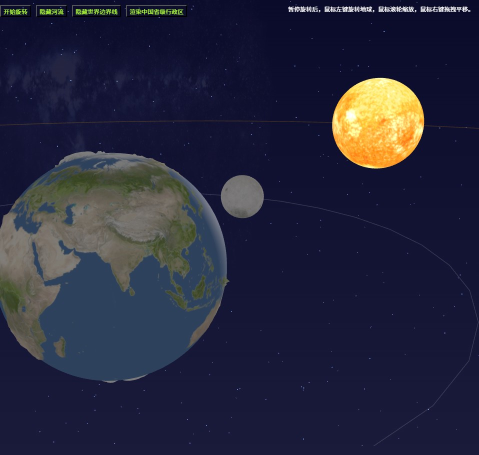

## 🌍 项目概述
基于 Vue 3 + TypeScript + Three.js 模拟3D地球自转、公转以及相对于太阳、月球的运动轨迹，并通过合理的光照和背景构建沉浸式体验。
1.  **视图层 (Vue Template):** 提供 canvas 容器和控制按钮。
2.  **逻辑层 (TypeScript):** 负责场景初始化、资源加载、动画循环以及交互逻辑。
3.  **数据层:** 使用了 GeoJSON 格式的地图数据（世界边界、河流、中国行政区）和高精度纹理贴图。

## 🧩 第一部分：场景初始化与资源管理
1. 响应式状态绑定。
   - 利用 Vue 3 的 ref 创建了响应式状态，用于控制地球的行为：
      - rotateStatus: 控制地球是否自动旋转。
      - worldRiverStatus / worldBorderStatus: 控制是否显示河流和国界线。
2. 异步纹理加载。
   - 为了保证页面流畅，纹理（如地球表面、云层、星空）和 GeoJSON 数据采用了异步加载机制。
   - 使用 Promise.all 并发加载基础贴图，可以有效减少阻塞时间。
```typescript
async function loadTextureData() {
const loader = new THREE.TextureLoader();
// 并发加载底图和高度图
const [baseTexture, heightTexture] = await Promise.all([
loader.loadAsync(earth8k),
loader.loadAsync(heightmap)
]);
// ...处理地理数据
}
```

## 🗺️ 第二部分：地理数据的动态叠加
动态合成的方式，让用户可以通过点击按钮实时切换“渲染河流”或“渲染国家边界”。
1. 动态纹理合成：通过 createMapTexture 工具函数将 Three.js 的纹理对象与 GeoJSON 的矢量数据结合。
   ```typescript
   // 根据用户勾选状态，动态决定加载哪些地理数据
   let borderJson = [];
   if (worldBorderStatus.value) borderJson.push(worldJson);
   if (chinaBorderStatus.value) borderJson.push(chinaJson);
   // 动态生成 CanvasTexture
   let mapTexture = createMapTexture(baseTexture.image, {
   borders: borderJson,
   borderColor: "#ffffff",
   rivers: riverJson,
   riverColor: "#036299"
   });
   ```
2. 视觉参数配置
   - **国界线:** 白色 (#ffffff)，宽度 1 像素。
   - **河流:** 湖蓝色 (#036299)，具有基础宽度和乘数，以适应不同缩放级别。


## ⛰️ 第三部分：地形起伏与材质表现
1. 置换贴图：除了常规的颜色贴图 (map)，代码还加载了 heightmap（高度图）。让地球表面的山脉和海沟产生了真实的凹凸感，极大地增强了立体视觉效果。
   ```typescript
   const material = new THREE.MeshPhysicalMaterial({
   map: mapTexture,
   displacementMap: heightTexture, // 高度图
   displacementScale: 0.1, // 控制地形起伏的强度
   displacementBias: 0,
   // ...其他材质属性
   });
   ```
2. 高精度几何体：为了配合置换效果，球体的细分段数设置更高的细分数量（128x128）确保了地形在拉近时依然平滑，不会出现锯齿。
   ```typescript
   const geometry = new THREE.SphereGeometry(EARTH_RADIUS, 128, 128);
   ```


## 🌌 第四部分：宇宙环境与光照系统
1. 太阳与光照
   - **太阳:** 使用 MeshBasicMaterial（不受光照影响，自发光）并跟随一个 PointLight（点光源）。
   - **公转模拟:** 代码巧妙地让“太阳”绕着“地球”转，以此模拟地球的公转带来的季节变化和昼夜交替。
2. 相机控制器
   - **自动旋转:** 默认开启（禁用OrbitControls），吸引用户注意力。
   - **交互控制:** 暂停旋转后（启用OrbitControls），用户可以通过鼠标进行**旋转**、**缩放**和**平移**。


## ⚙️ 第五部分：动画循环与性能优化
智能动画循环：使用 requestAnimationFrame 维护主循环，但根据 rotateStatus 的值智能切换逻辑：
```typescript
function animate() {
requestAnimationFrame(animate);
if (rotateStatus.value) {
// 自动模式：根据时间计算地球自转和公转位置
const elapsedTime = clock.getElapsedTime();
setRotatePos(elapsedTime);
} else {
// 手动模式：更新 OrbitControls，允许用户交互
controls.update();
}
renderer.render(scene, camera);
}
```

## 🔮 项目资源
- 源代码：[Three.js 3D 地球项目](https://gitee.com/chaoo/threejs-3d-earth/tags)
- 太阳系各大行星3D展开贴图资源：[https://www.solarsystemscope.com/textures/](https://www.solarsystemscope.com/textures/)
- 在线演示：[3D 地球演示](https://www.itdn.top/demo/EarthSunMoon/)


