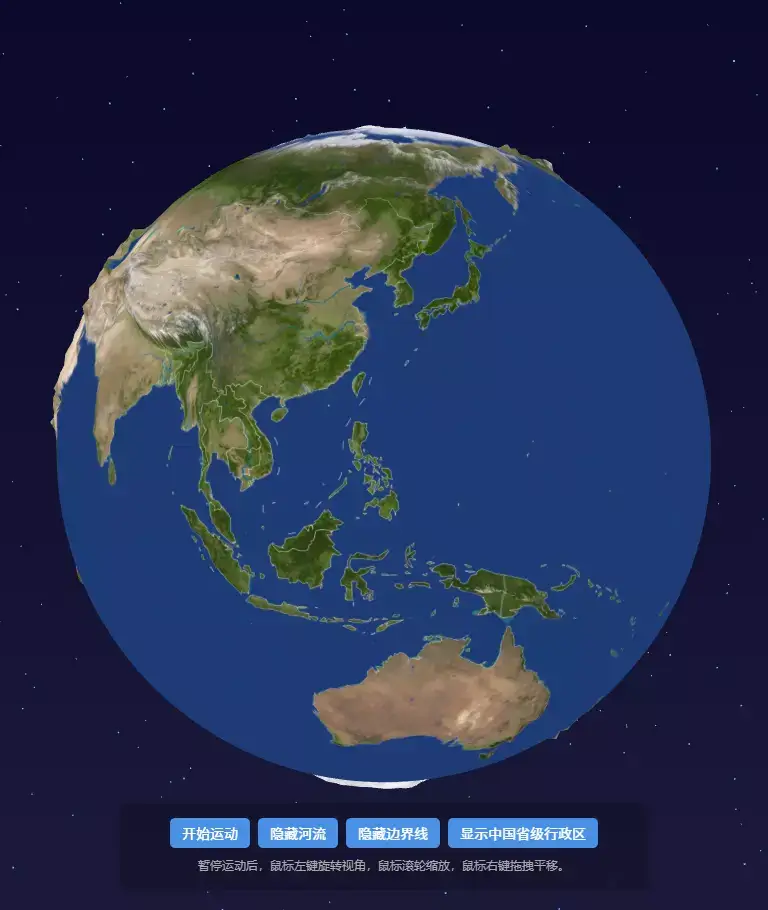

## 项目概述
通过Three.js的强大渲染能力、Vue的响应式数据管理和Canvas的动态纹理合成构建交互式3D地球可视化项目。
- 使用一张 8K 高清地球纹理 作为底图。
- 从 GeoJSON 数据 中分别解析边界信息和河流信息。
- 在 Canvas 上绘制边界线和河流线，并与底图合成一张新纹理。
- 将合成后的纹理映射到球体几何体上。
- 既保留了高清地球纹理的细节，又叠加了清晰的地理边界和河流。



## 核心功能实现
### 1. 地球渲染与地形高度
地球的渲染采用了基于着色器的高度图：
```typescript
// 自定义着色器材质
const material = new THREE.ShaderMaterial({
    uniforms: {
        earthTexture: { value: mapTexture },
        heightTexture: { value: heightTexture },
        displacementScale: { value: 0.1 }
    },
    // 接收高度图、位移强度、声明vUv变量，用于把纹理坐标传给片元着色器
    // 从高度图中采样；计算新位置:原始位置+(法线方向*高度值*强度系数)；投影变换:将计算好的新位置转换为屏幕坐标
    vertexShader: `
      uniform sampler2D heightTexture;
      uniform float displacementScale;
      varying vec2 vUv;
      void main() {
        vUv = uv;
        float height = texture2D(heightTexture, uv).r;
        vec3 newPosition = position + normal * height * displacementScale;
        gl_Position = projectionMatrix * modelViewMatrix * vec4(newPosition, 1.0);
      }
    `,
    // 接收地球纹理、纹理坐标(来自顶点着色器)
    // 根据纹理坐标从地球纹理中采样颜色；输出最终颜色
    fragmentShader: `
      uniform sampler2D earthTexture;
      varying vec2 vUv;
      void main() {
        vec3 color = texture2D(earthTexture, vUv).rgb;
        gl_FragColor = vec4(color.r, color.g, color.b, 1.0);
      }
    `
});
```

**技术要点：**
- 顶点着色器从高度图采样，沿法线方向位移实现地形起伏
- 片元着色器应用纹理贴图
- 使用128x128的高细分球体确保平滑渲染


### 2. 动态纹理合成
`createMapTexture`函数实现了地理数据的动态叠加：
```typescript
// 纹理合成流程
export function createMapTexture(
  baseImage: HTMLImageElement,
  options?: {
    borders?: (Feature | FeatureCollection)[];
    rivers?: FeatureCollection[];
    // ... 其他配置
  }
): THREE.CanvasTexture {
  // 1. 创建Canvas
  const canvas = document.createElement("canvas");
  const ctx = canvas.getContext("2d");
  // 2. 绘制底图
  ctx.drawImage(baseImage, 0, 0, canvas.width, canvas.height);
  // 3. 经纬度转像素坐标（等距圆柱投影）
  const project = (lon: number, lat: number): [number, number] => {
    const x = ((180 + lon) / 360) * canvas.width;
    const y = ((90 - lat) / 180) * canvas.height;
    return [x, y];
  };
  // 4. 分别绘制河流和边界
  if (options?.rivers) drawRivers();
  if (options?.borders) drawBorders();
  return new THREE.CanvasTexture(canvas);
}
```

**投影转换：** 使用简单的等距圆柱投影将经纬度坐标转换为画布像素坐标，适合全球范围的可视化。


### 3. 星空背景系统
`StarField`类创建了逼真的星空效果：
```typescript
export class StarField {
  private createStarGeometry(starCount: number, fieldSize: number, innerRadius: number): THREE.BufferGeometry {
    // 在空心球体表面分布星星
    for (let i = 0; i < starCount; i++) {
      // 球面坐标生成
      const radius = Math.random() * (fieldSize - innerRadius) + innerRadius;
      const theta = Math.random() * Math.PI * 2;
      const phi = Math.acos(2 * Math.random() - 1);
      // 转换为笛卡尔坐标
      positions[i * 3] = radius * Math.sin(phi) * Math.cos(theta);
      positions[i * 3 + 1] = radius * Math.sin(phi) * Math.sin(theta);
      positions[i * 3 + 2] = radius * Math.cos(phi);
    }
    return geometry;
  }
}
```

**特性：**
- 支持空心球体分布，避免星星与地球重叠
- 距离衰减效果，远处星星更小
- 加法混合模式，增强视觉效果

### 4. 交互控制系统
完整的OrbitControls配置：
```typescript
function initControls() {
  controls = new OrbitControls(camera, renderer.domElement);
  controls.enableDamping = true; // 平滑运动
  controls.dampingFactor = 0.25;
  controls.minDistance = 1.5;    // 缩放限制
  controls.maxDistance = 30;
  controls.rotateSpeed = 1.0;    // 旋转速度
  controls.panSpeed = 1;         // 平移速度
}
```

### 5. 动态数据切换
通过响应式状态控制不同地理图层的显示：
```vue
<input type="button" :value="`${worldRiverStatus?'隐藏':'渲染'}河流`" 
       @click="() => { worldRiverStatus = !worldRiverStatus; reloadScene(); }">
```

**技术实现：**
- 使用Vue的响应式系统管理图层状态
- `reloadScene()`函数重新加载纹理和场景
- 避免内存泄漏：每次重建前清理旧渲染器


## 部署与使用
1. **安装依赖**
```bash
npm install three
npm install --save-dev @types/three
npm install --save-dev @types/geojson
```

2. **数据准备**
- 准备8K地球纹理和对应的高度图
- 收集需要的GeoJSON数据（边界、河流等）

3. **运行项目**
```bash
npm run dev
```

## 项目资源
- 源代码：[Three.js 3D 地球项目](https://gitee.com/chaoo/threejs-3d-earth/tags)
- 在线演示：[3D 地球演示](https://www.itdn.top/demo/Earth3DTerrain/)
