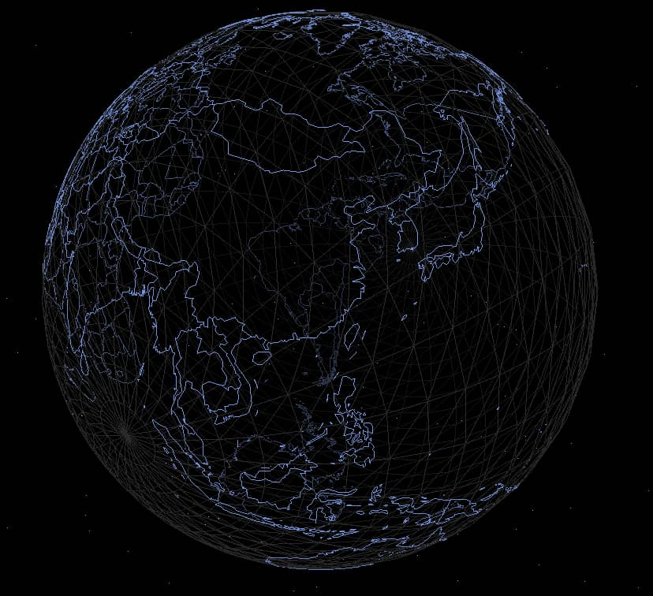

这是一篇使用 Three.js 和 GeoJSON 实现 3D 地球的学习笔记。结合了现代前端技术栈（Vue 3 + TypeScript + Vite）和地理数据可视化技术，旨在创建一个交互式的 3D 地球模型。

## 项目初始化
首先，使用`Vite`创建一个`Vue`项目：
```bash
npm create vite@latest threejs-vue
# 选择框架：Vue
# 选择：TypeScript
  cd threejs-vue
  npm install
  npm run dev
```

进入项目目录后，安装`Three.js`及其类型定义：
```bash
npm install three
npm install --save-dev @types/three
```

## 组件创建与场景初始化
在`src\components`下创建一个`Earth3D.vue`组件，在`App.vue`里引入:
```html
<script setup lang="ts">
import Earth3D from './components/Earth3D.vue'
</script>
<template>
  <Earth3D />
</template>
```

在`Earth3D`组件中，导入`Three.js`并初始化场景：
```html
<template>
    <div class="earth" ref="domRef"></div>
</template>
<script setup lang="ts">
import { onMounted, ref } from 'vue'
import * as THREE from 'three'

const domRef = ref<HTMLElement | null>(null);

const getScene = () => {
    const scene = new THREE.Scene();
    // 场景配置代码...
}

onMounted(() => {
    getScene()
})
</script>
```
## GeoJSON 数据集成
- 下载`GeoJSON`数据:
    - 在地理信息系统（GIS）、数据可视化和地图服务开发中，`GeoJSON`是一种常用的地理数据格式，能够以结构化的`JSON`表达地理要素及其属性。
    - 在开源项目[world-geo-json-zh](https://gitee.com/gaochao_web/world-geo-json-zh)中下载`JSON`数据文件，这个项目提供了包含中文名称和南海十段线的全球地图数据（JSON文件）。
- 安装`GeoJSON`类型定义：
    ```bash
    npm install --save-dev @types/geojson
    ```

完整组件代码如下：
```html
<template>
  <div class="earth" ref="domRef"></div>
</template>
<script setup lang="ts">
  import { onMounted, ref } from 'vue'
  import * as THREE from 'three';
  import { TrackballControls } from 'three/examples/jsm/Addons.js';
  import type { Feature, FeatureCollection } from 'geojson';
  import geoJson from '../utils/world.zh.json';
  import { drawThreeGeo, hasSupportedGeometry } from '../utils/drawGeo';
  import { StarField } from '../utils/starfield';

  const domRef = ref<HTMLElement | null>(null);

  const getScene = () => {
    // 场景、相机、渲染器初始化
    const scene = new THREE.Scene();
    scene.fog = new THREE.FogExp2(0x000000, 0.035);// 添加雾效，它可以在相机附近提供清晰的视野
    
    const camera = new THREE.PerspectiveCamera(75, window.innerWidth / window.innerHeight, 0.5, 1000);
    camera.position.set(0, 0, 20); // 设置相机位置
    camera.lookAt(0, 0, 0); // 设置相机看向原点
    
    const renderer = new THREE.WebGLRenderer();// 创建渲染器
    renderer.setSize(window.innerWidth, window.innerHeight);
    
    const earthNode = domRef.value;// 获取元素节点
    if (earthNode) {// 将渲染器的dom元素添加到目标元素
      earthNode.appendChild(renderer.domElement);
    }

    // 地球创建
    const planet = new THREE.Object3D(); // 创建一个三维空间
    const geometry = new THREE.SphereGeometry(10, 32, 32); // 球体
    const material = new THREE.MeshBasicMaterial({ // 基础材质
      color: 0x333333,
      wireframe: true,
      transparent: true
    });
    const sphere = new THREE.Mesh(geometry, material); //网格模型:组合几何体和材质
    planet.add(sphere); // 添加到三维空间

    // GeoJSON 数据处理
    const worldData = geoJson as (Feature | FeatureCollection);
    if (hasSupportedGeometry(worldData)){
      drawThreeGeo(worldData, 10, 'sphere', {
        color: 0x88aaff
      }, planet);
    }
    // 加入场景
    scene.add(planet);

    // 星空背景
    const starField = new StarField({
      starCount: 1000, // 星星数量
      fieldSize: 100,  // 星空尺寸
      innerRadius: 60, // 在半径60到100之间分布星星
      size: 0.05,      // 单颗星星尺寸
      color: 0x88aaff  // 星星颜色，淡蓝色:88aaff
    });
    starField.addToScene(scene);

    // 相机控制
    const controls = new TrackballControls(camera, renderer.domElement);
    controls.staticMoving = false; // 启用惯性移动。
    controls.dynamicDampingFactor = 0.05; // 动态阻尼因子，默认为 0.2
    controls.noRotate = false; // 启用旋转
    controls.rotateSpeed = 1.0; // 控制旋转速度
    controls.noZoom = false; // 启用缩放
    controls.zoomSpeed = 1.2; // 控制缩放速度
    controls.noPan = false; // 启用平移
    controls.panSpeed = 0.3; // 控制平移速度
    controls.minDistance = 0 // 相机到目标点的最小距离，默认为 0
    controls.maxDistance = 100 // 相机到目标点的最大距离，默认为 Infinity

    // 渲染场景和动画
    const animate = () => {
      controls.update();
      requestAnimationFrame(animate);
      renderer.render(scene, camera);
    }

    // 调用动画函数
    animate();
  }

  onMounted(() => {
    getScene();
  })
</script>
```
## 技术亮点
- 地理数据处理：使用[world-geo-json-zh](https://gitee.com/gaochao_web/world-geo-json-zh)提供的精确地理边界数据。
- 3D 渲染优化：通过雾效（`FogExp2`）增强空间感，线框材质（wireframe）展示地球结构。
- 交互控制：`TrackballControls` 实现流畅的旋转、缩放和平移操作。
- 星空背景：自定义 `StarField` 类创建沉浸式宇宙环境。

项目资源
- 源代码：[Three.js 3D 地球项目](https://gitee.com/chaoo/threejs-3d-earth.git)
- 在线演示：[3D 地球演示](https://www.itdn.top/demo/Earth3D/)


