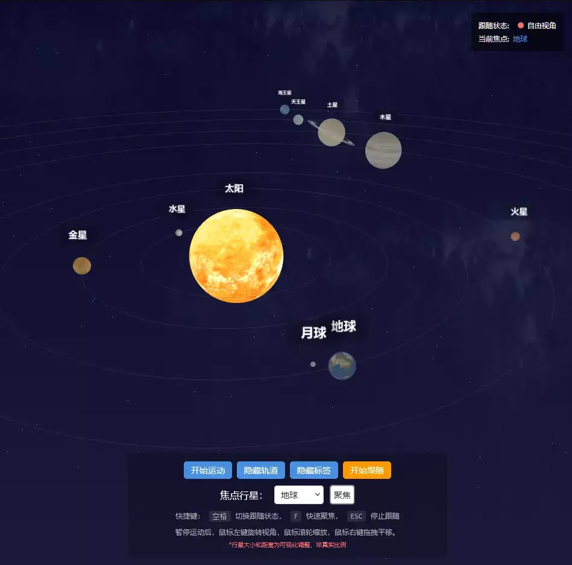

## 项目概述
基于 Vue 3 + TypeScript + Three.js 的 3D 天文可视化项目，从零开始构建一个功能完整的3D太阳系应用，涵盖行星运动、卫星系统、星空背景等核心功能，并深入探讨如何解决实际开发中的技术挑战。



采用模块化设计，主要包含以下几个核心组件：
- **SolarSystem**: 负责行星系统的逻辑管理
- **StarField**: 处理星空和星云背景
- **Vue 3 组件**: 管理Three.js核心对象和用户交互


## 行星系统设计与实现
### 1. 行星配置数据结构
首先，需要定义行星的配置接口：
```typescript
interface PlanetConfig {
  name: string;
  label: string;
  radius: number;
  orbitRadius: number;
  yearPeriod: number;
  rotationSpeed: number;
  texture: string;
  axialTilt?: number; // 轴向倾斜角度
  isMoon?: boolean;   // 是否为卫星
  parent?: string;    // 父级行星（用于卫星）
  followDistance?: number; // 跟随距离
  followHeight?: number;   // 跟随高度
}
```

### 2. 行星创建与材质处理
不同类型的天体需要不同的材质处理：
```typescript
private async createPlanet(config: PlanetConfig): Promise<void> {
  const group = new THREE.Group();
  const texture = await this.loader.loadAsync(config.texture);
  // 设置轴向倾斜
  if (config.axialTilt !== undefined) {
    group.rotation.x = config.axialTilt;
  }
  let geometry: THREE.BufferGeometry;
  let material: THREE.Material;
  if (config.name === 'sun') {
    // 太阳使用基础材质并添加光源
    geometry = new THREE.SphereGeometry(config.radius, 64, 64);
    material = new THREE.MeshBasicMaterial({
      map: texture,
      color: new THREE.Color(1.5, 1.2, 1.0)
    });
    // 添加太阳光源
    const sunLight = new THREE.PointLight(0xffeddc, 100, 5000);
    group.add(sunLight);
  } else if (config.name === 'earth') {
    // 地球使用物理材质获得更真实的效果
    geometry = new THREE.SphereGeometry(config.radius, 128, 128);
    material = new THREE.MeshPhysicalMaterial({
      map: texture,
      metalness: 0.1,
      roughness: 0.8,
    });
  } else {
    // 其他行星使用Phong材质
    geometry = new THREE.SphereGeometry(config.radius, 64, 64);
    material = new THREE.MeshPhongMaterial({
      map: texture,
      shininess: 10,
    });
  }
  const mesh = new THREE.Mesh(geometry, material);
  group.add(mesh);
  // 添加到场景或父级行星
  if (config.isMoon && config.parent) {
    const parentPlanet = this.planets.get(config.parent);
    if (parentPlanet) {
      parentPlanet.group.add(group);
    }
  } else {
    this.scene.add(group);
  }
}
```

### 3. 卫星系统实现（月球运动）
卫星系统关键在于理解**局部坐标系 vs 世界坐标系**的概念：
- 卫星应该围绕其父级行星运动
- 卫星的位置应该是相对于父级行星的局部坐标
- 当父级行星移动时，卫星应该跟随移动

```typescript
private updateMoonPosition(planetGroup: PlanetGroup, elapsedTime: number): void {
  const { config, group, mesh, parentName } = planetGroup;
  if (!parentName) return;
  const parentPlanet = this.planets.get(parentName);
  if (!parentPlanet) return;
  // 自转
  if (mesh && config.rotationSpeed !== 0) {
    mesh.rotation.y += config.rotationSpeed;
  }
  // 公转 - 使用局部坐标
  if (config.yearPeriod > 0 && config.orbitRadius > 0) {
    const angle = (elapsedTime * 2 * Math.PI) / config.yearPeriod;
    // 计算相对于父级行星的局部位置
    const relativePosition = new THREE.Vector3(
      Math.cos(angle) * config.orbitRadius,
      0,
      Math.sin(angle) * config.orbitRadius
    );
    // 设置局部位置（不是世界位置！）
    group.position.copy(relativePosition);
    // 潮汐锁定：月球总是面向地球
    if (mesh && config.name === 'moon') {
      const direction = new THREE.Vector3(0, 0, 0).sub(relativePosition).normalize();
      const targetQuaternion = new THREE.Quaternion();
      targetQuaternion.setFromUnitVectors(
        new THREE.Vector3(0, 0, 1),
        direction
      );
      mesh.quaternion.slerp(targetQuaternion, 0.1);
    }
  }
}
```
关键点：
1. **局部坐标设置**：`group.position.copy(relativePosition)` 设置的是相对于父级的局部位置
2. **潮汐锁定**：通过四元数插值实现月球始终面向地球的效果
3. **更新顺序**：先更新父级行星，再更新卫星

## 标签显示问题修复
### 问题描述
当行星设置了 `axialTilt`（轴向倾斜）后，标签的位置会出现偏移，这是因为标签作为行星组的子对象，继承了父级的旋转。

### 解决方案
将标签直接添加到场景中，并在每帧更新时重新计算其世界位置：
```typescript
interface PlanetLabelInfo {
  sprite: THREE.Sprite;
  planetName: string;
  offset: number;
}
private createPlanetLabel(config: PlanetConfig, parent: THREE.Group): void {
  // 创建标签精灵
  const canvas = document.createElement('canvas');
  // ... 绘制标签内容 ...
  const sprite = new THREE.Sprite(material);
  sprite.scale.set(3, 1.5, 1);
  // 关键：直接添加到场景，而不是行星组
  this.scene.add(sprite);
  this.planetLabels.push({
    sprite,
    planetName: config.name,
    offset: config.radius + 2
  });
}
// 每帧更新标签位置
updateLabels(): void {
  this.planetLabels.forEach(labelInfo => {
    const planet = this.planets.get(labelInfo.planetName);
    if (planet) {
      // 获取行星的世界位置
      const worldPosition = new THREE.Vector3();
      planet.group.getWorldPosition(worldPosition);
      // 设置标签位置（在行星正上方）
      labelInfo.sprite.position.copy(worldPosition);
      labelInfo.sprite.position.y += labelInfo.offset;
    }
  });
}
```

## 星空背景系统
为了增强视觉效果，实现了可配置的星空背景系统：
```typescript
// StarField.ts
export class StarField {
  constructor(options: StarFieldOptions = {}) {
    // 星星场配置
    if (options.starCount) {
      this.createStarField(options);
    }
    // 星云配置（可选）
    if (options.cloudTexture) {
      this.createStarCloud(options);
    }
  }
  update(): void {
    // 更新星云动画
    if (this.cloudEnabled) {
      this.cloudParticles.forEach((cloud) => {
        cloud.position.y += this.cloudVelocity;
        if (cloud.position.y > this.cloudBoundary) {
          cloud.position.y = -this.cloudBoundary;
        }
      });
    }
  }
}
```

## Vue 3 集成与响应式管理
在Vue组件中，负责Three.js核心对象的创建和生命周期管理：
```vue
<script setup lang="ts">
// Three.js 对象引用
let scene: THREE.Scene | null = null;
let camera: THREE.PerspectiveCamera | null = null;
let renderer: THREE.WebGLRenderer | null = null;
let solarSystem: SolarSystem | null = null;
// 初始化场景
async function initScene() {
  // 创建Three.js核心对象
  scene = new THREE.Scene();
  camera = new THREE.PerspectiveCamera(45, width / height, 0.1, 3000);
  renderer = new THREE.WebGLRenderer({ canvas });
  // 初始化太阳系系统
  solarSystem = new SolarSystem(scene, camera, renderer, {
    planets: planetConfigs,
    initialState: {
      focusedPlanet: 'earth',
      followingPlanet: true,
      showOrbits: true,
      showLabels: true,
      rotateStatus: true
    }
  });
  await solarSystem.initialize();
  animate();
}
// 动画循环
function animate() {
  animationId = requestAnimationFrame(animate);
  // 更新太阳系
  if (solarSystem) {
    solarSystem.update();
  }
  // 渲染场景
  if (renderer && camera && scene) {
    renderer.render(scene, camera);
  }
}
</script>
```

## 性能优化技巧
### 1. 纹理预加载
```typescript
private async preloadTextures(): Promise<void> {
  const allTextures = new Set<string>();
  // 收集所有纹理URL
  this.options.planets.forEach(planet => {
    allTextures.add(planet.texture);
    if (planet.rings) {
      allTextures.add(planet.rings.texture);
    }
  });
  // 并行加载所有纹理
  await Promise.all(
    Array.from(allTextures).map(async (url) => {
      const texture = await this.loader.loadAsync(url);
      this.textures.set(url, texture);
    })
  );
}
```

### 2. 资源清理
```typescript
dispose(): void {
  // 清理几何体和材质
  this.planets.forEach(planetGroup => {
    planetGroup.group.traverse((object) => {
      if (object instanceof THREE.Mesh) {
        object.geometry.dispose();
        if (object.material instanceof THREE.Material) {
          object.material.dispose();
        }
      }
    });
  });
  // 清理其他资源
  this.textures.forEach(texture => texture.dispose());
  this.planetMaterials.forEach(material => material.dispose());
}
```

## 完整功能特性
- ✅ **模拟真实的行星运动**：自转和公转
- ✅ **卫星系统**：月球绕地球运动，支持潮汐锁定
- ✅ **轴向倾斜**：各行星的真实倾斜角度
- ✅ **相机跟随**：平滑跟随指定行星
- ✅ **交互控制**：暂停/播放、显示/隐藏轨道和标签
- ✅ **星空背景**：可配置的星星和星云
- ✅ **键盘快捷键**：空格键切换跟随，F键聚焦，ESC停止跟随

## 总结与展望
通过这个项目，不仅实现了一个功能完整的3D太阳系，更重要的是掌握了Three.js开发中的核心概念：
1. **坐标系管理**：理解局部坐标系和世界坐标系的区别
2. **父子关系**：正确处理对象的层级关系
3. **性能优化**：纹理管理、资源清理等最佳实践
4. **模块化设计**：将复杂逻辑分解为可维护的组件

未来可以考虑的改进方向：
- **更精确的轨道计算**：使用开普勒方程实现椭圆轨道
- **行星大气效果**：使用着色器实现更真实的大气散射
- **WebGL 2.0 特性**：利用更高级的渲染技术
- **移动端优化**：针对移动设备的性能调优

完整的源代码可以在 [Gitee仓库](https://gitee.com/chaoo/threejs-3d-earth/tags) 中找到。希望这篇文章能帮助你在Three.js开发的道路上更进一步！
- 太阳系各大行星3D展开贴图资源：[https://www.solarsystemscope.com/textures/](https://www.solarsystemscope.com/textures/)
- 在线演示：[3D 地球演示](https://www.itdn.top/demo/SolarSystem/)

