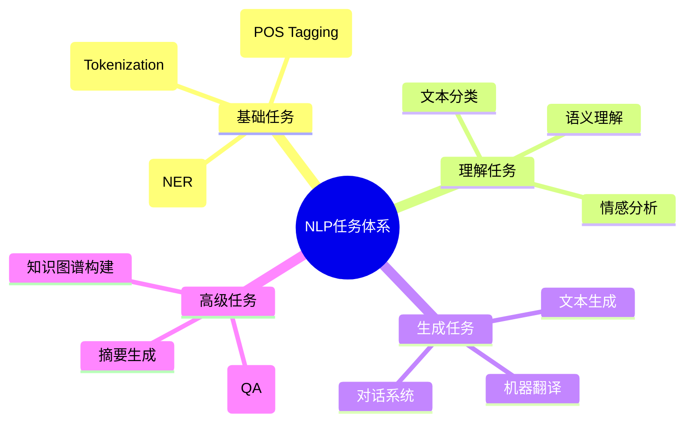
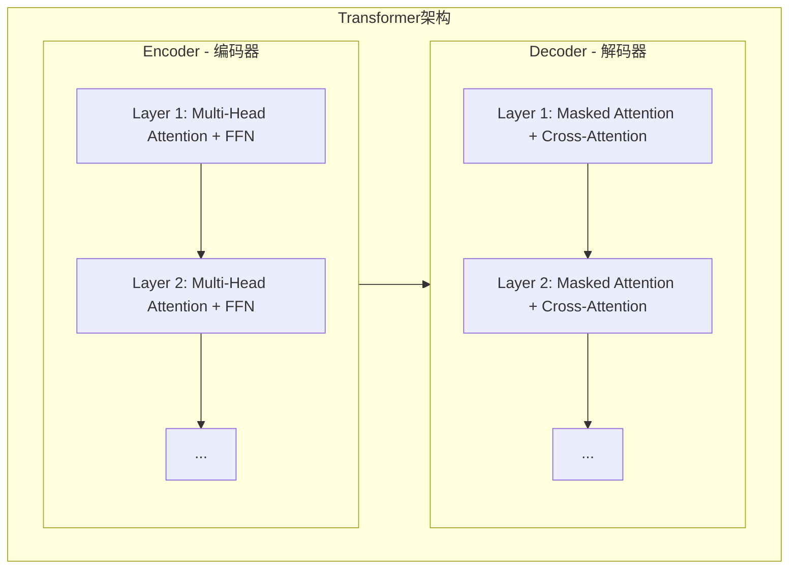
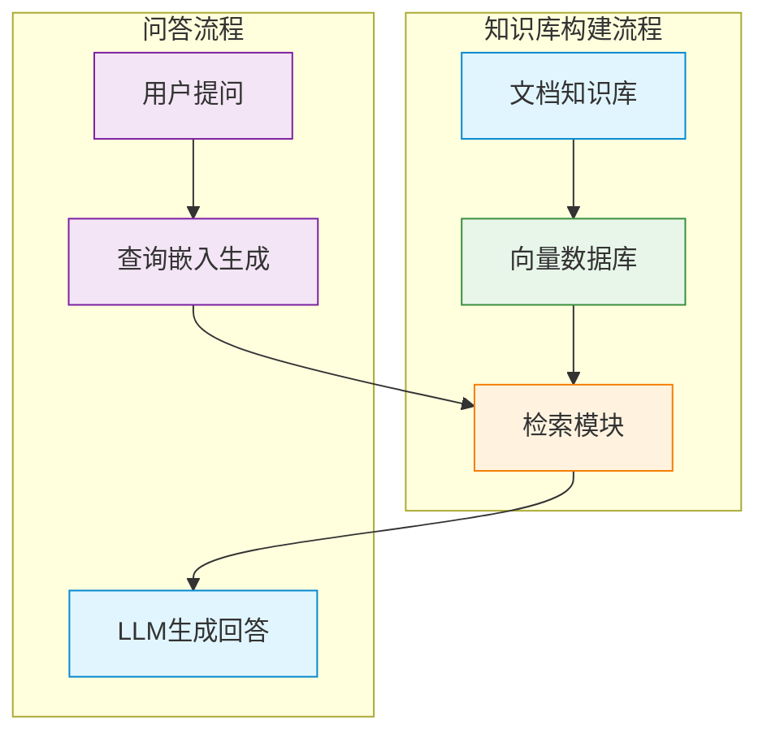

## 一、NLP基础概念

**自然语言处理（Natural Language Processing, NLP）** 是人工智能领域中研究如何让计算机理解、处理和生成人类语言的技术。它是连接人类语言与计算机系统的桥梁。

### 1.1 NLP的发展历程

| 阶段 | 时间 | 核心技术 | 代表任务 |
| :--- | :--- | :--- | :--- |
| **规则时代** | 1950s-1990s | 基于语法规则和专家系统 | 机器翻译（早期）、文本解析 |
| **统计时代** | 1990s-2010s | 机器学习、概率模型 | 朴素贝叶斯分类、隐马尔可夫模型 |
| **深度学习时代** | 2010s-至今 | 神经网络、Transformer | 预训练模型、生成式AI |

### 1.2 NLP核心任务


### 1.3 关键概念回顾

在深入NLP之前，回顾我们在 [AI大模型基础](https://blog.itdn.top/posts/2026/ai_base/) 和 [大语言模型原理](https://blog.itdn.top/posts/2026/ai_llm/) 中学过的核心概念：

- **Token（词元）**：模型处理的最小单位，通过分词器将文本转换为Token序列
- **Embedding（嵌入）**：将离散符号映射到连续向量空间，捕捉语义信息
- **Transformer**：基于自注意力机制的架构，是现代NLP的基石
- **LLM（大语言模型）**：在海量文本上预训练的大型模型，具备强大的语言理解和生成能力


## 二、NLP核心技术

### 2.1 文本预处理

文本预处理是NLP的第一步，将原始文本转换为模型可处理的格式。

```python
import re
import jieba

def preprocess(text):
    # 1. 去除特殊字符和标点
    text = re.sub(r'[^\w\s]', '', text)
    
    # 2. 转换为小写（英文）
    text = text.lower()
    
    # 3. 中文分词
    tokens = jieba.lcut(text)
    
    # 4. 去除停用词
    stopwords = ['的', '了', '是', '在', '我', '有', '和']
    tokens = [token for token in tokens if token not in stopwords]
    
    return tokens

text = "我爱自然语言处理，它是人工智能的重要分支！"
print(preprocess(text))
# 输出: ['我', '爱', '自然语言处理', '人工智能', '重要', '分支']
```

### 2.2 词嵌入技术

词嵌入是NLP的核心技术，将词语转换为高维向量。正如我们在 [嵌入模型](https://blog.itdn.top/posts/2026/ai_embedding/) 中讨论的：

```python
from sentence_transformers import SentenceTransformer

# 加载预训练嵌入模型
model = SentenceTransformer('all-MiniLM-L6-v2')

# 生成词/句嵌入
sentences = ["猫很可爱", "狗很忠诚", "人工智能很强大"]
embeddings = model.encode(sentences)

print(f"向量维度: {len(embeddings[0])}")  # 输出: 384
print(f"句子数量: {len(embeddings)}")     # 输出: 3
```

**词嵌入的关键特性**：
- **语义相似性**：相似含义的词在向量空间中距离更近
- **线性运算**：可以进行向量运算，如 `国王 - 男人 + 女人 ≈ 女王`

### 2.3 Transformer架构详解

Transformer是现代NLP的核心，正如我们在 [大语言模型原理](https://blog.itdn.top/posts/2026/ai_llm/) 中深入讨论的：



**自注意力机制**的核心公式：
$$ \text{Attention}(Q, K, V) = \text{softmax}\left(\frac{QK^T}{\sqrt{d_k}}\right)V $$

### 2.4 预训练模型

预训练模型是NLP的革命，通过在海量数据上预训练，然后在特定任务上微调：

| 模型系列 | 特点 | 代表模型 |
| :--- | :--- | :--- |
| **BERT** | 双向Transformer，擅长理解任务 | BERT-base、RoBERTa |
| **GPT** | 自回归Transformer，擅长生成任务 | GPT-3、GPT-4 |
| **T5** | 统一框架，将所有任务转为文本生成 | T5-base、T5-large |
| **ChineseBERT** | 专为中文优化 | ChineseBERT、ERNIE |


## 三、NLP实践应用

### 3.1 文本分类

文本分类是最基础的NLP任务之一，将文本归类到预定义的类别中。

```python
from transformers import pipeline

# 使用预训练模型进行情感分析
classifier = pipeline("sentiment-analysis", model="distilbert-base-uncased-finetuned-sst-2-english")

results = classifier([
    "I love natural language processing!",
    "This movie is terrible.",
    "The weather is okay."
])

for result in results:
    print(f"文本: {result['label']}, 置信度: {result['score']:.4f}")

# 输出:
# 文本: POSITIVE, 置信度: 0.9998
# 文本: NEGATIVE, 置信度: 0.9991
# 文本: POSITIVE, 置信度: 0.5987
```

### 3.2 命名实体识别（NER）

NER用于识别文本中的实体，如人名、地名、组织名等。

```python
# 中文NER示例
from transformers import AutoTokenizer, AutoModelForTokenClassification
import torch

tokenizer = AutoTokenizer.from_pretrained("uer/roberta-base-chinese-ner")
model = AutoModelForTokenClassification.from_pretrained("uer/roberta-base-chinese-ner")

text = "张三在北京的阿里巴巴公司工作"
inputs = tokenizer(text, return_tensors="pt")

with torch.no_grad():
    outputs = model(**inputs)

predictions = torch.argmax(outputs.logits, dim=2)
labels = [model.config.id2label[p.item()] for p in predictions[0]]

print(f"文本: {text}")
print(f"实体标签: {labels}")
# 输出: ['O', 'B-PER', 'I-PER', 'O', 'B-LOC', 'O', 'B-ORG', 'I-ORG', 'I-ORG', 'O', 'O']
```

### 3.3 问答系统

问答系统让模型根据上下文回答问题。

```python
# 基于上下文的问答
question_answerer = pipeline("question-answering", model="distilbert-base-cased-distilled-squad")

context = """
自然语言处理（NLP）是人工智能的一个子领域，
它使计算机能够理解、处理和生成人类语言。
Transformer架构于2017年由Google提出，
是现代NLP的基石。
"""

questions = [
    "NLP是什么？",
    "Transformer是什么时候提出的？",
    "谁提出了Transformer？"
]

for question in questions:
    result = question_answerer(question=question, context=context)
    print(f"问题: {question}")
    print(f"答案: {result['answer']} (置信度: {result['score']:.4f})")
    print()

# 输出:
# 问题: NLP是什么？
# 答案: 人工智能的一个子领域 (置信度: 0.9234)
# 
# 问题: Transformer是什么时候提出的？
# 答案: 2017年 (置信度: 0.9987)
# 
# 问题: 谁提出了Transformer？
# 答案: Google (置信度: 0.9991)
```

### 3.4 文本生成

文本生成是NLP最具挑战性的任务之一。

```python
# 使用GPT-2进行文本生成
from transformers import GPT2LMHeadModel, GPT2Tokenizer

tokenizer = GPT2Tokenizer.from_pretrained("gpt2")
model = GPT2LMHeadModel.from_pretrained("gpt2")

# 设置pad token
tokenizer.pad_token = tokenizer.eos_token

prompt = "自然语言处理的未来发展方向是"
inputs = tokenizer(prompt, return_tensors="pt", padding=True)

# 生成文本
outputs = model.generate(
    **inputs,
    max_length=100,
    num_return_sequences=1,
    temperature=0.7,
    do_sample=True
)

generated_text = tokenizer.decode(outputs[0], skip_special_tokens=True)
print(f"生成文本:\n{generated_text}")

# 输出示例:
# 自然语言处理的未来发展方向是多模态融合、小样本学习和可解释性提升。
# 通过结合视觉、语音等多种模态，模型能够更全面地理解人类语言。
```

### 3.5 机器翻译

机器翻译是NLP的经典应用。

```python
# 使用预训练模型进行翻译
translator = pipeline("translation_en_to_zh", model="Helsinki-NLP/opus-mt-en-zh")

text = "Natural language processing is transforming the world."
result = translator(text)

print(f"原文: {text}")
print(f"译文: {result[0]['translation_text']}")
# 输出: 自然语言处理正在改变世界。
```


## 四、RAG在NLP中的应用

正如我们在 [嵌入模型](https://blog.itdn.top/posts/2026/ai_embedding/) 和 [RAG](https://blog.itdn.top/posts/2026/ai_rag/) 中讨论的，**检索增强生成（RAG）** 是提升NLP系统性能的关键技术。

### 4.1 RAG架构



### 4.2 实践：构建简单RAG系统

```python
from sentence_transformers import SentenceTransformer, util
import numpy as np

# 1. 准备知识库
documents = [
    "自然语言处理（NLP）是人工智能的一个子领域",
    "Transformer架构于2017年由Google提出",
    "BERT是一种基于Transformer的预训练模型",
    "GPT系列模型擅长文本生成任务",
    "词嵌入将词语转换为高维向量"
]

# 2. 加载嵌入模型
model = SentenceTransformer('all-MiniLM-L6-v2')

# 3. 生成文档嵌入
doc_embeddings = model.encode(documents)

# 4. 用户提问
query = "BERT是什么？"
query_embedding = model.encode(query)

# 5. 检索相似文档
similarities = util.cos_sim(query_embedding, doc_embeddings)[0]
top_k = 2
top_indices = np.argsort(-similarities.numpy())[:top_k]

# 6. 构建上下文
context = "\n".join([documents[idx] for idx in top_indices])
print(f"检索到的上下文:\n{context}\n")

# 7. 使用LLM生成回答（伪代码）
# response = llm.generate(f"基于以下信息回答问题：\n{context}\n\n问题：{query}")
# print(f"回答: {response}")
```


## 五、NLP最佳实践

### 5.1 数据准备
1. **数据清洗**：去除噪声、特殊字符和无关内容
2. **数据标注**：确保标注质量，使用专业工具（如LabelStudio）
3. **数据划分**：合理划分训练集、验证集和测试集（通常70/20/10）

### 5.2 模型选择
| 任务类型 | 推荐模型 | 理由 |
| :--- | :--- | :--- |
| **文本分类** | BERT/RoBERTa | 双向上下文理解能力强 |
| **文本生成** | GPT/T5 | 自回归生成能力出色 |
| **机器翻译** | MarianMT/NLLB | 专门优化的翻译模型 |
| **中文任务** | ChineseBERT/ERNIE | 专为中文优化 |

### 5.3 训练技巧
1. **学习率调度**：使用线性热身和余弦退火
2. **早停机制**：监控验证集性能，避免过拟合
3. **数据增强**：同义词替换、回译等技术增加数据多样性
4. **混合精度训练**：使用FP16加速训练

### 5.4 部署建议
1. **模型压缩**：使用量化、蒸馏等技术减小模型体积
2. **推理优化**：使用ONNX、TensorRT等加速推理
3. **服务化部署**：使用FastAPI、Flask封装为API服务

