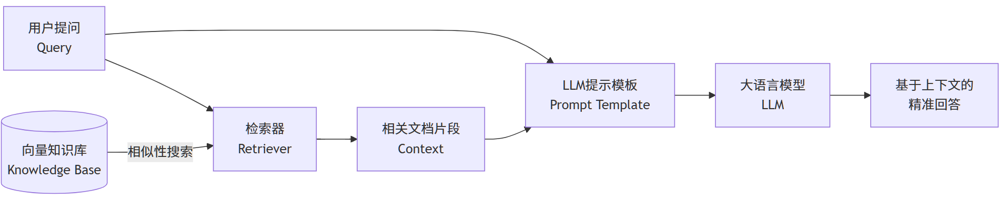

## 一、基础概念

RAG（Retrieval-Augmented Generation，检索增强生成）是一种将**信息检索**与**文本生成**相结合的人工智能技术。通过从外部知识库中检索相关信息，并将其作为上下文（Context）输入给大语言模型（LLM），以增强模型处理知识密集型任务的能力，如智能问答、文本摘要、内容生成等。

其核心流程可概括为：  
`用户提问 → 检索相关文档 → 将检索结果与问题融合 → 生成最终答案`

### 1.1 大语言模型的固有缺陷

大语言模型虽然强大，但存在以下关键局限：

| 缺陷 | 说明 |
| --- | --- |
| **知识滞后性（Knowledge Cutoff）** | 模型的训练数据有截止日期（如 GPT-4 为 2023 年 10 月），无法获取实时新知识 |
| **幻觉问题（Hallucination）** | 可能生成看似合理但事实上不准确或完全错误的信息 |
| **缺乏溯源能力（Lack of Provenance）** | 无法提供生成答案的依据或来源，可信度低 |
| **私有/领域知识有限** | 模型没有接触过企业内部文档、专业数据库等非公开信息 |

### 1.2 RAG 的解决方案

**“站在巨人的肩膀上，而非仅凭记忆”**

RAG 通过**外部知识库**来增强 LLM 的能力。在回答问题时，系统会：
1. 从外部知识源（文档、数据库、网页等）中检索相关信息
2. 将这些信息作为**可靠的证据**提供给 LLM
3. 让 LLM 基于这些上下文生成答案

### 1.3 RAG 的核心价值

- **提高准确性**：提供事实依据，有效减少幻觉现象
- **动态知识更新**：无需重新训练模型，只需更新知识库即可获取最新信息
- **增强可信度**：答案可追溯、可验证，便于引用来源
- **专业领域适配**：支持医疗、法律等垂直领域的私有知识库
- **降低成本**：相比微调（Fine-tuning）整个大模型，RAG 的成本更低


## 二、RAG 核心架构与工作流程

RAG Pipeline 通常分为两个主要阶段：**检索（Retrieval）** 和 **增强生成（Augmented Generation）**。



完整的 RAG 应用流程包含两个阶段：

| 阶段 | 流程 |
| --- | --- |
| **数据准备（离线）** | 数据提取 → 文本分割 → 向量化（Embedding）→ 数据入库 |
| **应用阶段（运行时）** | 用户提问 → 数据检索（召回）→ 注入 Prompt → LLM 生成答案 |

### 2.1 数据索引（Data Indexing）- 准备阶段

**目的**：构建一个可供高效检索的外部知识库。

**步骤**：

1. **加载（Loading）**：从各种来源（PDF、Word、网页、数据库等）加载原始数据
2. **切分（Chunking）**：使用文本分割器将长文档切分成较小的 chunk（片段）。这是关键步骤，chunk 的大小和质量直接影响检索效果
3. **嵌入（Embedding）**：即向量化，使用**嵌入模型**将每个文本 chunk 转换为一个**高维向量**，该向量代表了文本的语义信息
4. **存储（Storing）**：将向量和对应的原始文本存储到**向量数据库**（如 FAISS、Milvus、Pinecone）中

### 2.2 检索（Retrieval）- 运行时

**目的**：针对用户查询，从知识库中找到最相关的信息。

**步骤**：

1. 用户输入一个**查询（Query）**
2. 使用**相同的嵌入模型**将 Query 转换为向量
3. 在向量数据库中进行**相似性搜索**，找出与查询向量最接近的 K 个向量（即最相关的文本 chunk）。常用**余弦相似度（Cosine Similarity）**衡量相关性

### 2.3 增强生成（Augmented Generation）- 运行时

**目的**：将检索到的信息作为上下文，指导 LLM 生成高质量答案。

**步骤**：

1. **提示工程（Prompt Engineering）**：将检索到的上下文（Context）和用户查询（Query）组合成一个精心设计的提示（Prompt）

    **模板示例**：
    ```
    请根据以下提供的背景信息来回答问题。如果背景信息中没有答案，请直接说"根据提供的资料，我无法回答这个问题"。
    
    背景信息：{检索到的相关上下文}
    
    问题：{用户查询}
    
    答案：
    ```

2. **LLM 生成**：将组装好的 Prompt 发送给 LLM，LLM 基于给定的上下文生成最终答案

## 三、RAG 典型应用场景

| 场景 | 案例 | 技术要点 |
| --- | --- | --- |
| **智能问答** | 企业知识库客服、政策查询 | 结构化提示 + 多路召回 |
| **AI 搜索** | Kimi/DeepSeek 的"联网搜索"功能 | 实时网页检索 + 摘要生成 |
| **代码辅助** | RepoCoder 代码生成 | 迭代检索-生成（Iter-RetGen） |
| **多模态应用** | 图像/音频语义检索 | 跨模态向量对齐 |

### 3.1 RAG 实践难点与解决方案

#### 1. 检索精度问题
- **问题**：切分粒度影响召回效果（过粗包含噪声，过细丢失上下文）
- **解决方案**：
  - **Small2Big 策略**：先以短句建立索引，召回后再扩展上下文
  - **句子窗口检索**：以关键句为中心扩展上下文块

#### 2. 生成质量控制
- **问题**：冗余信息干扰或上下文溢出（Token 超限）
- **解决方案**：
  - **上下文压缩**：基于 BM25 的句子级筛选
  - **自适应检索**：模型置信度低时触发检索（如 Self-RAG）

#### 3. 知识库更新
- **实时同步**：监听数据源变更，自动触发切分 → 向量化 → 索引更新
- **版本管理**：保留历史索引支持回溯（如 Milvus 的 Time Travel 功能）

### 3.2 RAG 优势与局限

**优势**：
- **减少幻觉**：基于事实信息生成，答案更可靠
- **知识更新方便**：更新文档库即可，无需重新训练模型
- **可追溯性**：可以引用来源文档，增强可信度

**局限**：
- **检索粒度问题**：chunk 过大或过小都会影响效果
- **跨 chunk 信息丢失**：分散在不同 chunk 的信息难以关联
- **缺乏深层语义理解**：简单的相似性检索可能错过深层关联
- **关系推理能力弱**：难以处理复杂的关系查询


## 四、RAG 优化方向

### 4.1 检索优化

- **更优的 Chunk 策略**：不仅按长度分割，还可按语义、章节分割，或使用重叠滑动窗口
- **混合搜索（Hybrid Search）**：结合**关键词搜索**（稀疏检索，如 BM25）和**向量搜索**（稠密检索），兼顾精确匹配和语义匹配
- **重排序（Re-Ranking）**：使用更精细的交叉编码器（Cross-Encoder）模型对检索出的 Top-K 结果进行二次排序，选出最相关的前 N 个（如 Top-3），提升上下文质量
- **元数据过滤**：在检索时利用元数据（如日期、作者、类别）进行过滤，提高精准度

### 4.2 生成优化

- **提示工程（Prompt Engineering）**：设计更高效的提示模板，明确要求 LLM“根据上下文”回答，并限制其生成无关内容
- **引用溯源（Citation）**：要求 LLM 在生成答案时注明引用的具体文档和段落

### 4.3 评估指标

评估一个 RAG 系统需要从多个维度衡量：

| 维度 | 指标 | 说明 |
| --- | --- | --- |
| **检索质量** | 上下文相关性（Context Relevance） | 检索结果与问题的相关性评分 |
| **生成质量** | 答案忠实度（Faithfulness） | 答案是否基于检索内容，避免幻觉 |
| **综合性能** | 响应延迟（Latency） | 端到端处理时间（目标 < 2 秒） |

---

## 五、经典 RAG 架构示例

```python
# 简化版 RAG 实现逻辑
class BasicRAG:
    def __init__(self, llm, vector_store):
        self.llm = llm
        self.vector_store = vector_store
    
    def query(self, question):
        # 1. 检索相关文档
        relevant_docs = self.vector_store.search(
            query=question,
            top_k=5
        )
        
        # 2. 构建提示
        context = "\n".join([doc.content for doc in relevant_docs])
        prompt = f"""
        基于以下信息回答问题：
        
        {context}
        
        问题：{question}
        
        答案：
        """
        
        # 3. 生成答案
        answer = self.llm.generate(prompt)
        return answer
```
