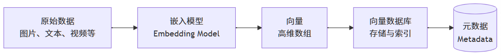

## 一、基础概念

### 1.1 传统数据库的局限性

传统关系型数据库（如 MySQL）或 NoSQL 数据库（如 MongoDB）擅长进行**精确匹配**和**范围查询**，但它们无法有效处理基于“相似性”的查询，例如：“找出所有与这张图片相似的图片”。

### 1.2 向量数据库（Vector Database）

一种专门为存储、索引和检索**高维向量**而设计的数据库。其核心能力是进行**近似最近邻搜索**，快速找到与查询向量最相似的向量集合。能够高效地处理**非结构化数据**（如文本、图像、音视频等）。

### 1.3 核心概念

| 概念 | 说明 |
| --- | --- |
| **向量（Vector）** | 多维空间中某点的数学表示（如 `{12, 13, 19, 8, 9}` 表示 5 维空间坐标），通过几何方式表达数据的语义特征 |
| **嵌入（Embedding）** | 机器学习生成的向量，将文本、图像等非结构化数据映射到向量空间，使语义相近的数据点在空间中距离更近 |

### 1.4 运作机制

1. **存储**：存储数据点（文档、图像、音视频等）的嵌入向量，并建立向量到原始数据的映射关系
2. **检索**：通过相似性搜索（如计算余弦相似度、欧氏距离）快速检索最接近的向量，支持语义级查询

## 二、工作流程

向量数据库的核心工作流程分为**写入**和**查询**两部分。

### 2.1 写入 (Ingestion) 流程

- **向量化 (Vectorization)**：使用嵌入模型将原始数据转换为向量
- **存储与索引 (Storage & Indexing)**：将向量和与之关联的**元数据**（如原始文本、图片 ID、创建时间等）一并存储，并为其创建专门的**索引**以加速后续查询

### 2.2 查询 (Query) 流程

- **向量化查询**：将用户的查询输入（如一段文字）同样转换为向量（查询向量）
- **相似性搜索 (Similarity Search)**：在数据库中快速找到与查询向量最相似的 K 个向量
- **返回结果**：返回这些相似向量对应的原始数据（或元数据），如最相关的文档段落

## 三、核心原理

### 3.1 向量嵌入（Vector Embedding）

简单来说，向量嵌入是一段信息（如文本、图片、用户）的数字表示，它被编码为一个高维空间中的点（即一个向量）。

**核心特征**：

- **数字表示**：将非数值数据（如文字）或复杂关系转化为计算机能够理解和处理的数值形式
- **高维空间**：这些向量通常有几十、几百甚至几千个维度，每个维度都代表了数据的某种潜在特征或属性
- **数学本质**：本质是高维空间中的坐标点，使用嵌入模型（如 BERT、CLIP、ResNet）将非结构化数据（文本/图像等）映射到向量空间
- **语义关联**：语义相似的数据在向量空间中距离更近（如“猫”与“猫咪”的向量距离小于“猫”与“汽车”）
- **降维表达**：将复杂数据（如百万像素图像）压缩为低维向量（如 512 维），保留核心语义特征

#### 3.1.1 向量嵌入的生成

嵌入不是人为设计的，而是**神经网络模型**在完成特定任务的过程中**自动学习**得到的副产品。

- **词的嵌入（Word2Vec）**：一个词的含义可以由它周围经常出现的词（上下文）来定义
- **图像嵌入**：使用卷积神经网络（CNN，如 ResNet）处理图像，网络的最后一层隐藏层的输出就可以作为该图像的嵌入。相似的图片会得到相似的嵌入
- **图嵌入**：将图中的节点（如社交网络中的用户）表示为向量，使得图中相连的、结构相似的节点在嵌入空间中也更接近
- **协同过滤嵌入**：在推荐系统中，为用户和物品分别学习一个嵌入。如果用户喜欢某个物品，那么他们的嵌入在空间中就应该是接近的

#### 3.1.2 向量嵌入的核心特性

- **相似性可度量**：通过计算向量之间的距离（如余弦相似度、欧氏距离），可以量化两个实体的相似程度
- **关系可推理**：语义关系可以通过向量运算来捕捉（如：国王 - 男人 + 女人 ≈ 王后）
- **作为通用接口**：任何数据（文本、图像、音频）一旦被转化为向量嵌入，就可以使用统一的相似性搜索方法进行处理。这正是向量数据库工作的基础

### 3.2 相似性度量（Similarity Measurement）

通过距离函数计算向量间的相似度。比如，它要判断两个向量是“方向一致”（用余弦相似度），还是“在空间里挨得近”（用欧氏距离）。

#### 3.2.1 常用相似性度量方法

**余弦相似度（Cosine Similarity）**：只关注方向，不关注长度

- 向量夹角**余弦值**（`cos(θ)`）范围在 `[-1, 1]` 之间：
  - `1`：完全相似，**夹角为 0°**，两个向量方向完全相同
  - `0`：不相关，**夹角为 90°**，正交，两个向量垂直，表示无关
  - `-1`：完全负相关（相反），**夹角为 180°**，两个向量方向完全相反
- 数学公式：\( \frac{A \cdot B}{\|A\| \|B\|} = \frac{\sum_{i=1}^{n} A_i B_i}{\sqrt{\sum_{i=1}^{n} A_i^2} \cdot \sqrt{\sum_{i=1}^{n} B_i^2}} \)

**欧几里得距离（Euclidean Distance）**：计算空间中向量的**绝对距离**

- 空间直线距离，范围 `[0, +∞)`，**数值越小**表示两点越相似
- 数学公式：\( d(A,B) = \sqrt{\sum_{i=1}^{n} (a_i - b_i)^2} \)

**点积相似度（Dot-Product Similarity）**：同时受向量方向和幅度（长度）影响

- 值越大表示越相似，范围 `(−∞,+∞)`：
  - `点积值大`：方向相同且幅度大
  - `点积值为 0`：方向垂直
  - `点积值为负`：方向相反
- 数学公式：\( A \cdot B = \sum_{i=1}^{n} (a_i b_i) \)

**汉明距离（Hamming Distance）**：两个等长字符串在相同位置上不同字符的个数

- 数学公式：\( d_H(A,B) = \sum_{i=1}^{n} \mathbf{1}_{(a_i \neq b_i)} \)，其中 \( \mathbf{1}_{(a_i \neq b_i)} \) 是指示函数，当 \(a_i \neq b_i\) 时为 1，否则为 0

#### 3.2.2 对比与适用场景

| 度量方式 | 计算原理 | 适用场景 | 局限性 |
| --- | --- | --- | --- |
| **余弦相似度** | 向量夹角余弦值 | 文本语义匹配（如问答系统） | 忽略向量长度差异 |
| **欧氏距离** | 空间直线距离 | 图像特征匹配（如人脸识别） | 高维空间失效（维度灾难） |
| **点积相似度** | 向量投影强度 | 推荐系统排序（如广告点击率预测） | 需向量归一化 |
| **汉明距离** | 二进制位差异数量 | 指纹识别、编码纠错 | 仅适用于等长序列，高维下区分能力弱 |

#### 3.2.3 选择建议

- **文本匹配**：使用余弦相似度
- **地理位置**：使用欧氏距离
- **高维数据（>100 维）**：欧氏距离失效，需降维（PCA）或改用余弦相似度或专用 ANN 算法
- **大规模数据（百亿级）**：需结合近似算法（如 HNSW、LSH）加速
- **跨模态检索（图文互搜）**：需对齐不同嵌入空间，常用对比学习（Contrastive Learning）优化

### 3.3 近似最近邻搜索（Approximate Nearest Neighbors, ANN）

在一个庞大的数据集中，快速找到与给定查询项最相似的几个项（Top-K）或所有在某个相似度范围内的项（范围查询）。

**核心特点**：

- **近似最近邻搜索（ANN）**：在高维向量世界里，用**极小的精度损失换取巨大的性能提升**
- **加速机制**：
  - **牺牲精度**：允许返回次优解（如相似度 95% 的向量），换取 100～1000 倍速度提升
  - **减少计算**：通过索引结构（如图、哈希表）避免全量距离计算
- **技术价值**：使亿级向量库的毫秒级检索成为可能，支撑实时推荐、语义搜索等场景

#### 3.3.1 经典索引结构与算法

**低维数据索引（维度 d<20）**：基于空间划分的**树形结构**非常有效

- **KD-Tree**：将多维空间递归地沿数据方差最大的维度划分为二叉树。在低维空间中非常高效，高维空间性能急剧下降（维度灾难）
- **R-Tree**：用最小边界矩形来概括和分组空间中的对象，形成一个平衡树。适合存储和查询空间对象（如多边形、线段），结构相对复杂

**高维数据索引（文本嵌入、图像特征）**：高维空间中的数据分布非常稀疏，传统的树形结构效率低下

| 索引类型 | 算法 | 原理 | 特点 |
| --- | --- | --- | --- |
| **基于哈希** | LSH（局部敏感哈希） | 通过哈希函数将相似向量映射至同一个哈希桶 | 理论坚实，动态更新困难 |
| **基于图** | HNSW（分层可导航小世界图） | 构建分层图结构，通过贪心搜索逐层向下 | 精度和速度平衡好，支持动态插入，内存占用高 |
| **基于量化** | IVF-PQ（倒排文件-乘积量化） | IVF 聚类缩小范围，PQ 压缩加速计算 | 内存效率极高，索引构建成本高，有精度损失 |
| **基于森林** | ANNOY（近似最近邻） | 构建多棵二叉树分割空间 | 索引紧凑，内存友好，难以动态添加 |

#### 3.3.2 算法性能对比

| 算法类型 | 比喻 | 查询速度 | 精度 | 内存占用 | 适用场景 |
| --- | --- | --- | --- | --- | --- |
| **HNSW** | 一个多层的、有高速通道的社交网络 | ⚡️⚡️⚡️⚡️ | 🎯🎯🎯🎯 | 高 | 高精度大规模检索（亿级） |
| **ANNOY** | 一个由许多“是/否”问题构成的决策森林 | ⚡️⚡️⚡️ | 🎯🎯🎯 | 中 | 中小规模实时系统（百万级） |
| **LSH** | 一个精心设计的“物以类聚”分拣系统 | ⚡️⚡️ | 🎯🎯 | 低 | 超大规模粗筛（十亿级） |
| **IVF-PQ** | “分地区管理”+“信息压缩存储”的超级图书馆 | ⚡️⚡️⚡️ | 🎯🎯🎯 | 极低 | 内存受限设备（移动端） |

#### 3.3.3 选择建议

- **追求最佳精度和速度**：首选 **HNSW**（数据量百万到数亿级别，内存充足）
- **内存极度紧张或需要进程共享**：考虑 **ANNOY**
- **处理十亿级以上数据，且内存是首要瓶颈**：**IVF-PQ**（通常在 GPU 上使用 FAISS 实现）
- **特定理论需求或场景**：**LSH**（密码学、重复检测等特定领域）

## 四、主流产品

| 产品名 | 公司/社区 | 主要特点 | 适用场景 |
| :--- | :--- | :--- | :--- |
| **Milvus** | Zilliz | 开源/托管，**功能丰富**，集群能力强，支持多种索引（HNSW、IVF-PQ）和混合查询 | 超大规模、复杂的向量检索场景 |
| **Pinecone** | Pinecone | **全托管 SaaS 服务**，易用性极高，性能稳定 | 追求快速上线、不想运维基础设施的团队 |
| **Chroma** | 开源社区 | 轻量级，**专注于 AI 原生**，开发体验好 | 原型开发、研究、中小项目 |
| **Weaviate** | Weaviate | 开源/托管，**功能全面**，支持 GraphQL，混合搜索强 | 需要复杂查询和过滤的生产级应用 |
| **Qdrant** | Qdrant | 开源/托管，Rust 编写，**性能优异** | 对性能和资源控制有高要求的场景 |
| **Redis** | Redis | 作为模块支持向量搜索，**生态成熟** | 已在使用 Redis，需要增加向量功能的场景 |
| **PGVector** | 开源 | PostgreSQL 的扩展，**复用现有 PG 生态** | 技术栈已基于 PostgreSQL 的项目 |

