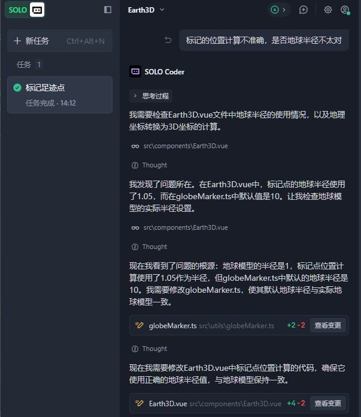

## 📝 摘要

使用 TRAE SOLO 在短时间内完成了一个基于 Vue 3 + Three.js 的交互式 3D 地球旅行足迹记录网页。实现了全球 50+ 著名地标的标记展示、点击交互、平滑飞行动画等功能，打造了一个沉浸式的旅行足迹浏览体验。


## 🚀 实践过程

### 任务拆解

1. **项目初始化**：创建 Vue 3 + TypeScript 项目，配置 Vite 构建工具
2. **3D 地球渲染**：使用 Three.js 创建地球模型，添加纹理和大气层效果
3. **标记点系统**：实现全球地标标记，包括位置计算、3D 模型创建
4. **交互功能**：实现点击标记点显示详情、平滑飞行到标记点位置
5. **响应式设计**：适配 PC 端和移动端的显示

### SOLO 能力应用

1. **代码生成**：SOLO 帮助生成了 Three.js 初始化代码、地球渲染逻辑、标记点创建等核心代码
2. **问题排查**：在遇到标记点位置偏移、旋转方向错误等问题时，SOLO 帮助分析并提供解决方案
3. **样式优化**：根据我的需求，SOLO 提供了响应式设计方案和美观的 UI 样式
4. **代码审查**：对生成的代码进行审查，确保类型安全和代码质量


### 关键过程

#### 1. 项目初始化

首先使用 Vite 创建 Vue 3 + TypeScript 项目，然后安装必要的依赖：

```bash
# 使用 Vite 初始化 Vue 3 + TypeScript 项目
npm create vite@6.5.0 . -- --template vue-ts

# 安装项目依赖
# three: Three.js 3D 渲染库
# @types/three: Three.js 的 TypeScript 类型定义
# tailwindcss@3: CSS 样式框架
# lucide-vue-next: 图标库
npm install three @types/three tailwindcss@3 lucide-vue-next
```

**入门知识点**：
- **Vite**：新一代前端构建工具，具有极速的冷启动和热模块替换功能
- **Vue 3 + TypeScript**：Vue 3 提供了 Composition API，TypeScript 提供类型安全
- **Three.js**：基于 WebGL 的 3D 图形库，让浏览器端 3D 开发变得简单


#### 2. 3D 场景基础配置

在创建地球之前，需要先初始化 Three.js 的核心组件：场景（Scene）、相机（Camera）和渲染器（Renderer）。

```typescript
// 导入 Three.js 核心模块
import * as THREE from 'three'
import { OrbitControls } from 'three/examples/jsm/controls/OrbitControls.js'

// 创建场景 - 3D 物体的容器
const scene = new THREE.Scene()

// 创建相机 - 定义观察者视角
// PerspectiveCamera 参数: fov(视角), aspect(宽高比), near(近裁剪面), far(远裁剪面)
const camera = new THREE.PerspectiveCamera(
  60,
  window.innerWidth / window.innerHeight,
  0.1,
  1000
)
camera.position.set(0, 0, 3.5) // 设置相机位置

// 创建渲染器 - 将 3D 场景渲染到 HTML 画布
const renderer = new THREE.WebGLRenderer({ 
  antialias: true, // 抗锯齿
  alpha: true      // 透明背景
})
renderer.setSize(window.innerWidth, window.innerHeight)
renderer.setPixelRatio(window.devicePixelRatio)
document.body.appendChild(renderer.domElement)

// 创建轨道控制器 - 允许用户交互（旋转、缩放、平移）
const controls = new OrbitControls(camera, renderer.domElement)
controls.enableDamping = true      // 启用阻尼效果（平滑旋转）
controls.dampingFactor = 0.05      // 阻尼系数
controls.minDistance = 2           // 最小缩放距离
controls.maxDistance = 10          // 最大缩放距离
```

**入门知识点**：
- **Scene（场景）**：所有 3D 对象的容器，相当于一个虚拟的 3D 空间
- **Camera（相机）**：定义观察者的位置和视角，决定我们如何看这个 3D 世界
- **Renderer（渲染器）**：负责将 3D 场景绘制到浏览器的 canvas 上
- **OrbitControls（轨道控制器）**：提供鼠标交互能力，让用户可以旋转、缩放、平移视角


#### 3. 地球渲染
创建地球几何体和材质，添加纹理和凹凸效果：

```typescript
// 加载地球纹理图片
const earthTexture = new THREE.TextureLoader().load('path/to/earth.jpg')
const heightmap = new THREE.TextureLoader().load('path/to/heightmap.jpg')

// 创建地球几何体
// SphereGeometry 参数: radius(半径), widthSegments(宽度分段数), heightSegments(高度分段数)
// 分段数越高，球体越光滑，但性能消耗也越大
const geometry = new THREE.SphereGeometry(1, 128, 128)

// 创建材质 - MeshStandardMaterial 支持 PBR 物理渲染
const material = new THREE.MeshStandardMaterial({
  map: earthTexture,      // 基础颜色纹理
  bumpMap: heightmap,     // 凹凸纹理（模拟地形起伏）
  bumpScale: 0.05,        // 凹凸程度
  roughness: 1,           // 粗糙度
  metalness: 0            // 金属度
})

// 创建地球网格对象（几何体 + 材质）
const earth = new THREE.Mesh(geometry, material)

// 将地球添加到场景中
scene.add(earth)
```

**入门知识点**：
- **Geometry（几何体）**：定义物体的形状，SphereGeometry 是球体形状
- **Material（材质）**：定义物体的外观，包括颜色、纹理、光泽等
- **MeshStandardMaterial**：支持物理正确渲染（PBR），能模拟真实世界的光照效果
- **Texture（纹理）**：贴在几何体表面的图片，让物体看起来更真实


#### 4. 添加光照效果

为了让地球看起来更真实，需要添加光源：

```typescript
// 添加环境光 - 照亮整个场景，提供基础照明
const ambientLight = new THREE.AmbientLight(0xffffff, 0.4)
scene.add(ambientLight)

// 添加平行光 - 模拟太阳光
const directionalLight = new THREE.DirectionalLight(0xffffff, 1)
directionalLight.position.set(5, 3, 5) // 设置光源位置
scene.add(directionalLight)

// 添加点光源 - 模拟城市灯光效果（可选）
const pointLight = new THREE.PointLight(0x4a9eff, 0.5, 10)
pointLight.position.set(2, 0, 2)
scene.add(pointLight)
```

**入门知识点**：
- **AmbientLight（环境光）**：均匀照亮场景中的所有物体，没有方向感
- **DirectionalLight（平行光）**：模拟远处光源（如太阳），光线平行照射
- **PointLight（点光源）**：从一点向四周发射光线，如灯泡效果


#### 5. 标记点创建

实现经纬度到三维坐标的转换，创建地标标记：

```typescript
// 经纬度转三维坐标函数
// 地球是球体，需要将地理坐标（经纬度）转换为三维空间坐标
function latLngToVector3(lat: number, lng: number, radius: number): THREE.Vector3 {
  // 纬度转换为 phi 角（从北极开始的极角）
  const phi = (90 - lat) * (Math.PI / 180)
  // 经度转换为 theta 角（绕 Y 轴的方位角）
  const theta = (lng + 180) * (Math.PI / 180)
  
  // 使用球坐标系公式计算三维坐标
  return new THREE.Vector3(
    -radius * Math.sin(phi) * Math.cos(theta),  // X 坐标
    radius * Math.cos(phi),                      // Y 坐标（高度）
    radius * Math.sin(phi) * Math.sin(theta)    // Z 坐标
  )
}

// 创建单个标记点
function createMarker(position: THREE.Vector3, color: number = 0xff6b6b): THREE.Mesh {
  // 创建标记点几何体（四面体形状）
  const markerGeometry = new THREE.ConeGeometry(0.02, 0.1, 8)
  const markerMaterial = new THREE.MeshBasicMaterial({ color })
  
  const marker = new THREE.Mesh(markerGeometry, markerMaterial)
  marker.position.copy(position)
  
  // 计算标记点的朝向（指向球体外部）
  const direction = position.clone().normalize()
  marker.lookAt(direction.multiplyScalar(10))
  
  return marker
}

// 示例：创建北京标记点
const beijingPosition = latLngToVector3(39.9042, 116.4074, 1.02)
const beijingMarker = createMarker(beijingPosition)
earth.add(beijingMarker) // 添加到地球组，随地球一起旋转
```

**入门知识点**：
- **球坐标系**：使用极角（phi）和方位角（theta）来定位球面上的点
- **Vector3**：Three.js 中的三维向量，用于表示位置、方向等
- **MeshBasicMaterial**：不受光照影响的基础材质，颜色始终保持不变


#### 6. 动画循环

实现地球自动旋转和渲染循环：

```typescript
// 动画循环函数
function animate() {
  // 请求浏览器下一次重绘时调用 animate，形成循环
  requestAnimationFrame(animate)
  
  // 地球自动旋转（绕 Y 轴）
  earth.rotation.y += 0.001
  
  // 更新轨道控制器（如果启用了阻尼）
  controls.update()
  
  // 渲染场景
  renderer.render(scene, camera)
}

// 启动动画循环
animate()

// 处理窗口大小变化
window.addEventListener('resize', () => {
  // 更新相机宽高比
  camera.aspect = window.innerWidth / window.innerHeight
  camera.updateProjectionMatrix()
  
  // 更新渲染器大小
  renderer.setSize(window.innerWidth, window.innerHeight)
})
```

**入门知识点**：
- **requestAnimationFrame**：浏览器提供的动画 API，在每次浏览器重绘前执行回调
- **动画循环**：持续更新场景状态并重新渲染，形成流畅的动画效果
- **窗口resize处理**：确保在窗口大小变化时，3D 场景正确适应


### 踩坑经历

1. **标记点位置偏移**：最初标记点位置计算错误，导致标记点偏离正确位置。
   - **原因**：经纬度转换公式中的角度计算有误
   - **解决方案**：重新推导球坐标系公式，确保 phi 和 theta 的计算正确

2. **标记点不随地球旋转**：发现标记点被添加到了 `scene` 而不是地球组中。
   - **原因**：如果添加到 scene，标记点会固定在世界坐标中
   - **解决方案**：将标记点添加到 `earth` 对象中，使其成为地球的子对象

3. **图片加载失败**：尝试使用 Wikimedia 和 Pixabay 的图片链接，由于网络问题最终清空，准备后续接入图床。
   - 


## 📸 成果展示

### 功能特性

- ✅ **沉浸式 3D 地球**：高精度地球模型，支持旋转、缩放
- ✅ **50+ 地标标记**：全球著名风景名胜古迹标记
- ✅ **智能排序**：以北京为起点向西环绕地球排序
- ✅ **交互体验**：点击标记点查看详情，平滑飞行动画
- ✅ **响应式设计**：PC/移动端自适应

### 项目结构

```bash
src/
├── components/
│   ├── Earth3D.vue        # 3D 地球主组件（包含场景、相机、渲染器）
│   ├── FootprintList.vue  # 足迹列表组件（展示所有地标列表）
│   └── FootprintPop.vue   # 详情弹窗组件（点击标记点显示详情）
├── utils/
│   ├── globeMarker.ts     # 标记点工具类（坐标转换、创建标记）
│   ├── travelLocation.ts  # 50+ 地标数据（名称、经纬度、描述等）
│   └── mapTexture.ts      # 地图纹理工具（纹理加载、管理）
└── assets/
    ├── img/               # 地球纹理图片（地球表面、凹凸贴图）
    └── json/              # 边界数据（可选，用于显示国家边界）
```

### 运行方式

```bash
# 安装依赖
npm install
# 开发模式（启动本地服务器，支持热更新）
npm run dev
# 构建生产版本（生成优化后的静态文件）
npm run build
```


## 💡 效果与总结

### 提效成果

- **传统开发**：预计需要 2-3 天（从零开始学习 Three.js + 实现功能）
- **SOLO 辅助**：实际用时约 4 小时（快速生成代码 + 问题排查）
- **提效率**：约 **85%**

### SOLO 的价值
1. **代码生成**：快速生成基础代码框架，节省重复劳动
2. **问题排查**：遇到问题时提供快速解决方案
3. **方案设计**：提供架构设计建议和最佳实践
4. **学习辅助**：帮助理解 Three.js 复杂概念

### 可复用方法
1. **3D 场景初始化模板**：可以复用在其他 Three.js 项目中
2. **经纬度转三维坐标**：通用的地理坐标转换函数
3. **响应式布局方案**：PC/移动端适配的通用模式


## 🔗 项目链接

- **Gitee 仓库**：[https://gitee.com/chaoo/trae-footprint](https://gitee.com/chaoo/trae-footprint)
- **在线演示**：[https://www.itdn.top/demo/TraeFootprint/](https://www.itdn.top/demo/TraeFootprint/)


> 🎉 感谢 TRAE × 脉脉「AI 无限职场」SOLO 挑战赛提供展示机会！
