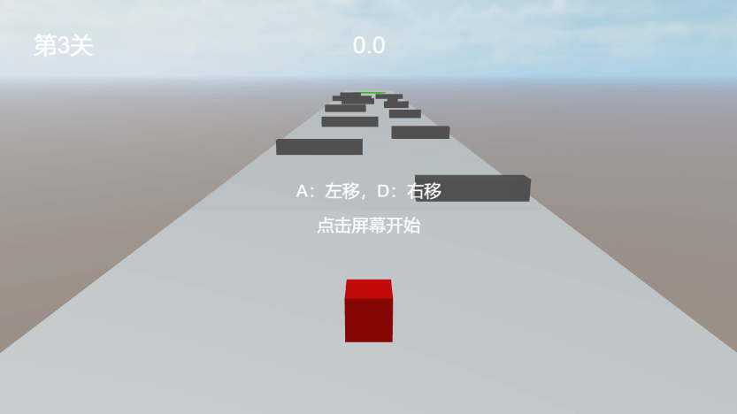

## 游戏介绍
- 《方块先生》是一款入门级别的跑酷小游戏，通过此雏形可以一步步做更多更强大的3D游戏。
- 此游戏完全参照**Cocos引擎官方**的bilibili视频教程[《合集·麒麟子教你做3D跑酷游戏》](https://space.bilibili.com/491120849/channel/collectiondetail?sid=842152)。

## 游戏效果
- DEMO试玩：[https://www.itdn.top/game/BoxRun/](https://www.itdn.top/game/BoxRun/)



## 前置知识
生命周期回调函数(按触发先后排列)：`onLoad`，`onEnable`，`start`，`update`，`lateUpdate`，`onDisable`，`onDestroy`。

### 网格渲染器 MeshRenderer
- `MeshRenderer`（网格渲染器）组件用于显示一个静态的 3D 模型。通过属性 `Mesh`（网格） 决定3D模型形状，通过属性 `Materials`（材质） 控制模型的显示外观。
    + 一个模型可以有多个材质，子网格的划分和材质编号的指定工作，一般是由交给美术人员完成的。
    + 当一个材质发生改变时，所有已使用这个材质的模型都会发生改变。

### 物理能力
完整的物理能力 = 刚体（`RigidBody`）+ 碰撞体（`Collider`）。
- 刚体（`RigidBody`）可以使对象受重力影响：【添加组件】 -> 【Physics】 -> 【RigidBody】。
    + 刚体类型分为：静态刚体(STATIC)、动力学刚体(DYNAMIC)、运动学刚体(KINEMATIC)。
    + 静态刚体(STATIC)与其他物体发生碰撞时，不会产生物理行为，因此，也不会移动，例如：建筑物。（①当对象只有碰撞体没有刚体的时候，引擎内部会添加一个默认的静态刚体。②静态刚体只和动力学刚体刚体产生碰撞。）
    + 动力学刚体(DYNAMIC)可以通过**力的作用**运动物体。（刚体组件提供了`applyForce(力的方向与大小:Vec3, 质心:Vec3)`接口施加作用力。）
    + 运动学刚体(KINEMATIC)可以看做是可以移动的静态刚体，例如：电梯。
- 碰撞体（`Collider`）描述对象的物理形状和表面属性：基础碰撞体包含 盒、球、圆柱、圆锥、胶囊 碰撞体等。例如盒碰撞体：【添加组件】 -> 【Physics】 -> 【BoxCollider】。
    + 【**Collider】组件下的【Material】（**物理材质**）可以配置摩擦力相关参数。

### 物理事件
- 碰撞事件：`onCollisionEnter`(碰撞开始时)，`onCollisionStay`(碰撞保持时，会不断的触发)，`onCollisionExit`(碰撞结束时)。
  + 碰撞体【**Collider】组件属性`IsTrigger默认false`，组件默认为碰撞器，可以结合刚体产生碰撞效果。
- 触发事件：`onTriggerEnter`(触发开始时)，`onTriggerStay`(触发保持时,会频发触发该事件)，`onTriggerExit`(触发结束时)。
  + 碰撞体【**Collider】组件属性`IsTrigger设置为true`时组件为触发器，触发器只用于碰撞检测和触发事件。

- 触发事件和碰撞事件区别：
    - ①触发事件由触发器生成，碰撞事件根据碰撞数据生成。
    - ②触发事件可以由触发器和另一个触发器/碰撞器产生。
    - ③碰撞事件需要由至少一个动力学刚体的碰撞器和另一个碰撞器产生（两个碰撞器产生）。


## 实现步骤
将使用`Cocos Creator 3.8` 的 API 来实现基本的《方块先生》游戏功能，其中涉及到对象与组件机制、3D游戏引擎中的物理系统、脚本组件、碰撞与触发器等多个方面。

### 1. 创建游戏场景
首先，创建一个新的 Cocos Creator 3D 项目，设计尺寸为横屏 `1280*720`，并添加一个场景。

### 2. 添加角色和地面
- 创建一个3D对象【Cube立方体】并命名为`Player`作为玩家角色，通过属性 `Materials`（材质）拷贝默认材质命名为`material-player`并修改其颜色；
- 在`Player`节点下,①【添加组件】 -> 【Physics】 -> 【BoxCollider】；②【添加组件】 -> 【Physics】 -> 【RigidBody】。
- 创建一个3D对象【Cube立方体】并命名为`GroundStart`作为初始地板，修改 `Scale` 为 `(15,1,20)`,【添加组件】 -> 【Physics】 -> 【BoxCollider】,默认为静态刚体。
- 拷贝`GroundStart`并命名为`GroundBlock`挪动拼接到`GroundStart`后面，并在地面上添加多个障碍物【Cube立方体】并命名为`Obstacle`，并为其添加刚体和碰撞体。
- 在地板的最后添加终点墙【Cube立方体】并命名为`EndPoint`，并为其添加刚体和碰撞体,并且设置BoxCollider为触发器（属性`IsTrigger设置为true`）。

### 3. 设置光照和阴影
环境光照和光源都会影响物体的颜色，阴影设置可以增强画面的立体感和空间感。
- 环境光设置：选中【场景根节点】->属性【Ambient】->【天空颜色(SkyLightingColor)，环境光亮度(SkyIllum)，地面反射光颜色(GroundLightingColor)】。
- 方向光设置：选中【Main Light】->属性【DirectionalLight】->【光源颜色(Color)，流明度(Illumination)】
- 阴影设置：
    - ①选中【场景根节点】->属性【Shadows】->【勾选 Enabled】；
    - ②选中【Main Light】->属性【DirectionalLight】 ->属性【Dynamic Shadow Settings】->【勾选 Shadow Enabled】；
    - ③选中【3D节点】->属性【MeshRenderer】->【勾选 ShadowCastingMode(阴影投射)】【勾选ReceiveShadow(接收阴影，若阴影类型是 ShadowMap就勾选)】；

### 4. 控制角色移动
在 `Player` 节点下添加脚本 `PlayerController.ts`,控制角色移动与相机跟随角色:
```typescript
@ccclass('PlayerController')
export class PlayerController extends Component {
    @property(Node)
    player:Node;
    @property(Node)
    camera:Node;
    @property(Vec3)
    cameraOffset:Vec3 = new Vec3();
    @property(CCInteger)
    forwardForce:number = 0; //前进推力
    @property(CCInteger)
    sideForce:number = 0; //左右推力

    rigidBody:RigidBody; //钢体
    collider:BoxCollider; //碰撞体
    isLeftDown:boolean = false;
    isRightDown:boolean = false;
    isPlaying:boolean = false;// 游戏状态

    start() {
        // 键盘事件
        input.on(Input.EventType.KEY_DOWN, this.onKeyDown, this);
        input.on(Input.EventType.KEY_UP, this.onKeyUp, this);
        this.rigidBody = this.player.getComponent(RigidBody);
        this.collider = this.player.getComponent(BoxCollider);
        // 碰撞事件
        if (this.collider) {
            this.collider.on('onCollisionEnter', this.onCollisionEnter, this);
            this.collider.on('onTriggerEnter', this.onTriggerEnter, this);
        }
    }

    tmpPos = new Vec3();
    update(deltaTime: number) {
        // 相机跟随
        this.player.getPosition(this.tmpPos);
        this.tmpPos.add(this.cameraOffset);
        this.camera.position = this.tmpPos;
        // 施加作用力
        if (this.isPlaying) {
            let force = new Vec3(0, 0, this.forwardForce * deltaTime);
            if (this.rigidBody) {
                this.rigidBody.applyForce(force);
                if(this.isLeftDown){
                    let leftForce = new Vec3(this.sideForce * deltaTime, 0, 0);
                    this.rigidBody.applyForce(leftForce);
                }
                if(this.isRightDown){
                    let rightForce = new Vec3(-this.sideForce * deltaTime, 0, 0);
                    this.rigidBody.applyForce(rightForce);
                }
            }
            // 掉落检测
            if (this.player.getPosition().y < 0) {
                // 停止游戏
                this.isPlaying = false;
                // 自定义事件，关卡失败
                director.getScene().emit('level_failed');
            }
        }
    }
    // 键盘按下
    onKeyDown(event: EventKeyboard) {
        console.log('onKeyDown');
        if(event.keyCode == KeyCode.KEY_A){
            this.isLeftDown = true;
        }
        if(event.keyCode == KeyCode.KEY_D){
            this.isRightDown = true;
        }
    }
    // 键盘抬起
    onKeyUp(event: EventKeyboard) {
        console.log('onKeyUp');
        if(event.keyCode == KeyCode.KEY_A){
            this.isLeftDown = false;
        }
        if(event.keyCode == KeyCode.KEY_D){
            this.isRightDown = false;
        }
    }

    // 碰撞事件
    onCollisionEnter(event:ICollisionEvent){
        console.log('hit');
        // 碰到障碍物
        if(event.otherCollider.node.name == 'Obstacle'){
            // 停止游戏
            this.isPlaying = false;
            // 自定义事件，关卡失败
            director.getScene().emit('level_failed');
        }
    }

    // 触发事件
    onTriggerEnter(event:ITriggerEvent){
        // 通关
        console.log('Run The End!')
        // 停止游戏
        this.isPlaying = false;
        // 自定义事件，关卡成功
        director.getScene().emit('level_successful');
    }
}
```

### 5. 游戏UI管理
- 添加两个2D `Button` 用于开始游戏和重玩按钮，三个`Label` 组件用于显示移动距离，失败和成功界面。
- 在 `Canvas` 节点下下添加脚本 `GameManager.ts`:
```typescript
@ccclass('GameManager')
export class GameManager extends Component {
    @property(PlayerController)
    playerCtl: PlayerController;
    @property(Button)
    startBtn: Button;
    @property(Label)
    distance:Label;
    @property(Node)
    uiFailure:Node;
    @property(Node)
    uiSuccess:Node;
    start() {
        // 开始游戏
        this.startBtn.node.on(Button.EventType.CLICK, this.onStartGame, this);
        // 监听 自定义事件 (关卡失败)
        director.getScene().on('level_failed', this.onLevelFailed, this);
        // 监听 自定义事件 (关卡成功)
        director.getScene().on('level_successful', this.onLevelSuccessful, this);
        // 隐藏失败成功界面
        this.uiFailure.active = false;
        this.uiSuccess.active = false;
    }
    update(deltaTime: number) {
        this.distance.string = this.playerCtl.node.position.z.toFixed(1);
    }
    onStartGame(){
        this.playerCtl.isPlaying = true;
        this.startBtn.node.active = false;
    }
    onLevelFailed(){
        this.uiFailure.active = true;
    }
    onLevelSuccessful(){
      this.uiSuccess.active = true;
    }
    // 重玩
    onBtnReplay(){
        director.loadScene(director.getScene().name);
    }
}
```

## 完整代码示例
完整代码示例：[https://gitee.com/chaoo/cocos-box-run.git](https://gitee.com/chaoo/cocos-box-run)。
