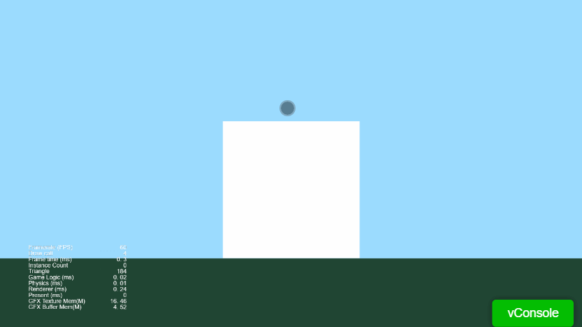
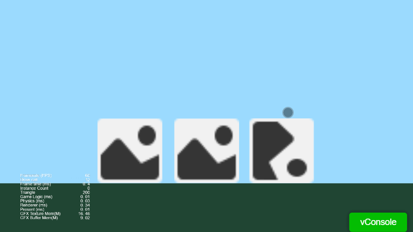

COCOS CREATOR 版本：`Cocos Creator 3.8`。
## 基本思路
1. 创建可切割的物体：使用2D物理组件`Rigidbody2D`（2D刚体）和`PolygonCollider2D`（多边形碰撞体）为要切割的物体设置物理属性。
2. 射线检测：鼠标画线，并通过射线检测其画线路径上的多边形碰撞体（`PolygonCollider2D`）。需要正反来两次射线检测来记录射线的路径上所有的交点。
3. 以一个多边形碰撞体和射线的两个交点为界限把多边形顶点分割为两部分，通过这两部分顶点把这个边形碰撞体一分为二。
4. 根据分割的顶点重新绘制两个多边形碰撞体。

## 游戏效果
- DEMO试玩：[https://www.itdn.top/game/Physicalcut/](https://www.itdn.top/game/Physicalcut/)


## 一、切割单个碰撞体
### 1.1 创建多边形碰撞体
1. 创建一个待切割节点，添加2D物理组件：`Rigidbody2D`（2D刚体）和`PolygonCollider2D`（多边形碰撞体）。
2. 为待切割节点添加绘画组件（`Graphics`），以便根据物理包围盒的顶点填充绘图。
```typescript
/**
 * 根据物理包围盒的 points 填充绘图
 * @param box 注意要使用多边形碰撞盒
 * @param isNewColor 是否随机颜色
 */
private drawCollider (box: Node, isNewColor: boolean = false) {
    const points = box.getComponent(PolygonCollider2D).points;
    const ctx = box.getComponent(Graphics);
    ctx.clear();
    const len = points.length;
    ctx.moveTo(points[len - 1].x, points[len - 1].y);
    for (let i = 0; i < points.length; i++) {
        ctx.lineTo(points[i].x, points[i].y);
    }
    // 是否随机一个颜色
    if (isNewColor) {
        ctx.fillColor = new Color(Math.round(Math.random() * 255), Math.round(Math.random() * 255), Math.round(Math.random() * 255));
    }
    ctx.fill();
}
```

### 1.2 鼠标划线
通过注册`Touch`事件，获取起点和当前点然后绘图线段。
```typescript
/**
 * 注册监听触摸事件
 */
private registerEvent () {
    this.node.on(Node.EventType.TOUCH_MOVE, (e: EventTouch) => {
        this.cutGraphics.clear();
        const startPoint = e.getUIStartLocation();
        const movePoint = e.getUILocation();
        this.cutGraphics.moveTo(startPoint.x, startPoint.y);
        this.cutGraphics.lineTo(movePoint.x, movePoint.y);
        this.cutGraphics.stroke();
    }, this);
    this.node.on(Node.EventType.TOUCH_END, (e: EventTouch) => {
        this.cutGraphics.clear();
        const startPoint = e.getUIStartLocation();
        const endPoint = e.getUILocation();
        log(`画线起始点：${startPoint}，画线终点：${endPoint}`);
        // 检测两个画线点与碰撞体相交
        this.checkPoints(startPoint, endPoint);
    }, this);
}
```

### 1.3 射线检测
- 检测在给定射线的路径上的碰撞体，射线检测将忽略包含起始点的碰撞体。
- 射线检测的模式分为四种：`Any`，`Closest`，`All`，`AllClosest`。
    + `ERaycast2DType.Any`：检测射线路径上任意的碰撞体，一旦检测到任何碰撞体，将立刻结束检测其他的碰撞体；最快。
    + `ERaycast2DType.Closest`：检测射线路径上最近的碰撞体，这是射线检测的默认值；稍慢。
    + `ERaycast2DType.All`：检测射线路径上的所有碰撞体，检测到的结果顺序不是固定的，一个碰撞体可能会返回多个结果；慢。
    + `ERaycast2DType.AllClosest`：检测射线路径上所有碰撞体，但只返回每一个碰撞体距离射线起始点最近的；最慢。
```typescript
/**
 * 检测两个画线点与碰撞体相交
 */
private checkPoints(point1, point2) {
    // 射线检测 （Closest：检测射线路径上最近的碰撞体）
    const result1 = PhysicsSystem2D.instance.raycast(point1, point2, ERaycast2DType.Closest);
    // 获取所有的交点，需要正反来两次射线检测
    const result2 = PhysicsSystem2D.instance.raycast(point2, point1, ERaycast2DType.Closest);
    if (result1.length === 0 || result2.length === 0) {
        warn('无碰撞体');
        return;
    }
    if (result1[0].collider !== result2[0].collider) {
        warn('不是单独碰撞体');
        return;
    }
    if (!(result1[0].collider instanceof PolygonCollider2D)) {
        warn('非多边形物理碰撞盒无points属性');
        return;
    }
    // 与射线相交的碰撞体(单独)
    const baseCollider: PolygonCollider2D = result1[0].collider;
    let jointPoint1: Vec2 = v2(0, 0);
    let jointPoint2: Vec2 = v2(0, 0);
    // 射线与碰撞体相交的点 转换为 刚体本地坐标系下的点
    baseCollider.body.getLocalPoint(result1[0].point, jointPoint1);
    baseCollider.body.getLocalPoint(result2[0].point, jointPoint2);
    // 把碰撞体的顶点以两个交点为界限分割为两部分
    this.cutCollider(baseCollider, jointPoint1, jointPoint2);
}
```

### 1.4 顶点分割
把碰撞体的顶点（`points`）以两个交点为界限分割为两部分。
```typescript
/**
 * 把碰撞体的顶点以两个交点为界限分割为两部分
 * @param baseCollider 碰撞体
 * @param jointPoint1 射线与碰撞体相交点1 
 * @param jointPoint2 射线与碰撞体相交点2
 */
private cutCollider(baseCollider: PolygonCollider2D, jointPoint1: Vec2, jointPoint2: Vec2) {
    // 多边形顶点数组
    const points = baseCollider.points;
    log("points：", points);
    // 获取相交点在碰撞体边的下标
    let index1 = undefined;
    let index2 = undefined;
    for (let i = 0; i < points.length; i++) {
        let p1 = points[i];
        let p2 = i === points.length - 1 ? points[0] : points[i + 1];
        // 计算点到直线的距离（近似判断点在线上,记录交点边的下标） pointLineDistance(point,lineStart,lineEnd,isSegment)
        if (Intersection2D.pointLineDistance(jointPoint1, p1, p2, true) < 1) {
            index1 = i;
        }
        if (Intersection2D.pointLineDistance(jointPoint2, p1, p2, true) < 1) {
            index2 = i;
        }
        if (index1 !== undefined && index2 !== undefined) {
            break;
        }
    }
    log(`相交点1的边下标${index1}，交点2的边下标${index2}`);
    // 根据此次分割的位置，把顶点装入两个数组
    const cutPoints1: Vec2[] = [];
    const cutPoints2: Vec2[] = [];
    let cutFlag = true;
    for (let i = 0; i < points.length; i++) {
        let temp = points[i].clone();
        if (cutFlag) {
            cutPoints1.push(temp);
        } else {
            cutPoints2.push(temp);
        }
        if (i === index1 || i === index2) {
            cutPoints1.push(i === index1 ? jointPoint1.clone() : jointPoint2.clone());
            cutPoints2.push(i === index1 ? jointPoint1.clone() : jointPoint2.clone());
            cutFlag = !cutFlag;
        }
    }
    log("分割后的顶点", cutPoints1, cutPoints2);
    // 重新设置碰撞体顶点
    this.reSetCollider(baseCollider, cutPoints1, cutPoints2);
}
```

### 1.5 重绘碰撞体
根据分割的顶点重新绘制两个多边形碰撞体。
```typescript
/**
 * 重新设置碰撞体
 * @param baseCollider 本体
 * @param basePoints 本体新顶点
 * @param cutPoints  切割体顶点
 */
private reSetCollider(baseCollider: PolygonCollider2D, basePoints: Vec2[], cutPoints: Vec2[]) {
    // 设置本体碰撞体顶点
    baseCollider.points = basePoints;
    baseCollider.apply();
    // 重新绘制本体
    this.drawCollider(baseCollider.node);
    // 克隆一个本体作为切下来的碰撞体
    const cloneNode = instantiate(baseCollider.node);
    this.node.addChild(cloneNode);
    const cutCollider = cloneNode.getComponent(PolygonCollider2D);
    cutCollider.points = cutPoints;
    cutCollider.apply();
    // 绘制第二个，随机颜色
    this.drawCollider(cloneNode, true);
}
```

### 1.6 最终效果
- 代码示例：[https://gitee.com/chaoo/physical-cutting.git](https://gitee.com/chaoo/physical-cutting)。
- 切割单个效果：



## 二、切割多个碰撞体
步骤`2.1`和`2.2`同上。
### 2.3 碰撞体分类
切割多个碰撞体需要检测射线路径上的所有碰撞体（`ERaycast2DType.All`），然后根据碰撞体进行分类。
```typescript
/**
 * 检测两个画线点与碰撞体相交
 * 将交点按碰撞体进行分类
 */
private checkPoints(point1, point2) {
    // 射线检测 （All：检测射线路径上的所有碰撞体）
    const result1 = PhysicsSystem2D.instance.raycast(point1, point2, ERaycast2DType.All);
    // 获取所有的交点，需要正反来两次射线检测
    const result2 = PhysicsSystem2D.instance.raycast(point2, point1, ERaycast2DType.All);
    // 将结果合并
    let results = result1.concat(result2);
    // 根据结果统计碰撞体
    this._colliderList = [];
    for (let i = 0; i < results.length; i++) {
        // 判断多边形物理碰撞盒
        if (results[i].collider instanceof PolygonCollider2D) {
            // 是否已经存在
            let repeatFlag = false;
            if (this._colliderList.length > 0) {
                for (let j = 0; j < this._colliderList.length; j++) {
                    if (results[i].collider === this._colliderList[j].collider) {
                        repeatFlag = true;
                    }
                }
            }
            // 相同的Collider不重复装入
            if (!repeatFlag) {
                this._colliderList.push({
                    collider: <PolygonCollider2D>results[i].collider, 
                    joints: []
                })
            }
        }
    }
    log("待切割碰撞体个数：", this._colliderList.length);
    // 将交点按碰撞体进行分类
    for (let i = 0; i < this._colliderList.length; i++) {
        let baseJoints: Vec2[] = [];
        for (let j = 0; j < results.length; j++) {
            if (this._colliderList[i].collider === results[j].collider) {
                let repeatPoint = baseJoints.find(item => {
                    // 物理世界没有绝对相等，官方取的判断临界是根号 5，很小的距离来判断点在同一位置
                    // 注意用clone()来计算，不然会改变原来的值
                    return (item.clone().subtract(results[j].point.clone()).lengthSqr() <= 5);
                });
                // 移除同碰撞体内部的多余的点，成对位置相等（很近）
                if (repeatPoint) {
                    baseJoints.splice(baseJoints.indexOf(repeatPoint), 1);
                } else {
                    baseJoints.push(results[j].point);
                }
            }
        }
        // 把每个碰撞体的点分别处理
        this._colliderList[i].joints = baseJoints.sort();
        log(`碰撞体${i}的交点：${this._colliderList[i].joints}`);
    }
    // 根据分类处理切割
    this.cutCollider();
}
```

### 2.4 处理切割
根据按碰撞体进行分类的交点处理切割。
```typescript
/**
 * 根据按碰撞体进行分类的交点处理切割
 */
private cutCollider() {
    // 遍历已经分好的碰撞体及其交点
    this._colliderList.forEach((item, idx) => {
        // 至少两个点才能切割
        if (item.joints.length >= 2) {
            // 将一个碰撞体上的所有点分成几个部分，比如两个交点就是两部分，四个交点就可能需要分成三部分（凹多边形）
            let splitResults: { points: Vec2[], edge: number[] }[] = [];
            for (let i = 0; i < item.joints.length; i+=2) {
                // 每两点循环一次
                if (item.joints[i] && item.joints[i + 1]) {
                    // 将分割后的结果放入 splitResults 中
                    let jointPoint1: Vec2 = v2(0, 0);
                    let jointPoint2: Vec2 = v2(0, 0);
                    // 射线与碰撞体相交的点 转换为 刚体本地坐标系下的点
                    item.collider.body.getLocalPoint(item.joints[i], jointPoint1);
                    item.collider.body.getLocalPoint(item.joints[i + 1], jointPoint2);
                    log(`碰撞体${idx}：交点${i}：${jointPoint1}，交点${i+1}：${jointPoint2}`);
                    // 把碰撞体的顶点以两个交点为界限分割
                    this.splitPoints(item.collider.points, jointPoint1, jointPoint2, splitResults);
                }
            }
            log("待重新绘制个数：", splitResults.length);
            log("待重新绘制的点：", JSON.stringify(splitResults));
            // 重新设置碰撞体顶点（真正执行切割）
            if (splitResults.length > 0) {
                // 设置本体碰撞体顶点
                item.collider.points = splitResults[0].points;
                item.collider.apply();
                // 重新绘制本体
                this.drawCollider(item.collider.node);
                // 克隆 N 个
                for (let j = 1; j < splitResults.length; j++) {
                    let cutPoints = splitResults[j].points;
                    if (cutPoints.length < 3) continue;
                    // 克隆本体作为第 N 个
                    const cloneNode = instantiate(item.collider.node);
                    this.node.addChild(cloneNode);
                    const cutCollider = cloneNode.getComponent(PolygonCollider2D);
                    cutCollider.points = cutPoints;
                    cutCollider.apply();
                    // 绘制第二个，随机颜色
                    this.drawCollider(cloneNode, true);
                }
            }
        }
    });
}
```

### 2.5 顶点分割核心逻辑
考虑到凹多边形一刀会切成三部分，把分类后每个碰撞体的交点，每两点循环一次分割，最后汇总成一个顶点数组，再根据这个数组绘制碰撞体。
```typescript
/**
 * 把碰撞体的顶点以每两个交点为界限分割
 * @param baseCollider 碰撞体
 * @param jointPoint1 射线与碰撞体相交点1 
 * @param jointPoint2 射线与碰撞体相交点2
 */
private splitPoints(points: Vec2[], jointPoint1: Vec2, jointPoint2: Vec2, splitResults) {
    // 多边形顶点数组
    log("原始顶点数组：", JSON.stringify(points));
    // 获取相交点在碰撞体边的下标
    let jointEdge1 = undefined;
    let jointEdge2 = undefined;
    for (let i = 0; i < points.length; i++) {
        let p1 = points[i];
        let p2 = i === points.length - 1 ? points[0] : points[i + 1];
        // 计算点到直线的距离（近似判断点在线上,记录交点边的下标） pointLineDistance(point,lineStart,lineEnd,isSegment)
        if (Intersection2D.pointLineDistance(jointPoint1, p1, p2, true) < 1) {
            jointEdge1 = i;
        }
        if (Intersection2D.pointLineDistance(jointPoint2, p1, p2, true) < 1) {
            jointEdge2 = i;
        }
        if (jointEdge1 !== undefined && jointEdge2 !== undefined) {
            break;
        }
    }
    log(`相交点1的边下标${jointEdge1}，交点2的边下标${jointEdge2}`);
    // 定义此次待切割的所有点
    let splitPoints: { points: Vec2[], edge: number[] } = { points: [], edge: [] };
    // 此次分割的位置
    let index1 = jointEdge1;
    let index2 = jointEdge2;
    // 检测重叠部分
    let repeatFlag = false;
    if (splitResults.length > 0) {
        for (let i = 0; i < splitResults.length; i++) {
            // 检测重叠：同一碰撞体之前分割点对应边的下标 是否同时包含此次分割两个交点边的下标
            let i1 = splitResults[i].edge.indexOf(jointEdge1);
            let i2 = splitResults[i].edge.indexOf(jointEdge2);
            if (i1 !== -1 && i2 !== -1) {
                repeatFlag = true;
                splitPoints = splitResults.splice(i, 1)[0];
                // 更新此次分割的位置
                index1 = i1;
                index2 = i2;
                break;
            }
        }
    }
    // 如果没有重叠，将碰撞体所有点装入
    if (!repeatFlag) {
        splitPoints = { points: [], edge: [] };
        for (let i = 0; i < points.length; i++) {
            // 顶点
            splitPoints.points.push(points[i].clone());
            // 对应边的下标
            splitPoints.edge.push(i);
        }
    }
    log("将被分割的点：", splitPoints);
    log(`分割位置1：${index1}，分割位置2：${index2}`);
    // 分割后的第一部分
    let cutPoints1: { points: Vec2[], edge: number[] } = { points: [], edge: [] };
    cutPoints1.points.push(jointPoint2);
    cutPoints1.edge.push(jointEdge2);
    cutPoints1.points.push(jointPoint1);
    cutPoints1.edge.push(jointEdge1);
    // 从位置1走到位置2，装载路径上的所有点
    for (let i = (index1 + 1); i !== (index2 + 1); i++) {
        if (i >= splitPoints.points.length) {
            i = 0;
        }
        cutPoints1.points.push(splitPoints.points[i]);
        cutPoints1.edge.push(splitPoints.edge[i]);
    }
    splitResults.push(cutPoints1);
    log("分割后的第一部分：", cutPoints1);
    // 分割后的第二部分
    let cutPoints2: { points: Vec2[], edge: number[] } = { points: [], edge: [] };
    cutPoints2.points.push(jointPoint1);
    cutPoints2.edge.push(jointEdge1);
    cutPoints2.points.push(jointPoint2);
    cutPoints2.edge.push(jointEdge2);
    // 再从位置2走到位置1，装载路径上的所有点
    for (let i = (index2 + 1); i !== (index1 + 1); i++) {
        if (i >= splitPoints.points.length) {
            i = 0;
        }
        cutPoints2.points.push(splitPoints.points[i]);
        cutPoints2.edge.push(splitPoints.edge[i]);
    }
    splitResults.push(cutPoints2);
    log("分割后的第二部分：", cutPoints2);
}
```

### 2.6 最终效果
- 代码示例：[https://gitee.com/chaoo/physical-cutting.git](https://gitee.com/chaoo/physical-cutting)。
- 切割多个效果：


## 三、切割精灵图片
- 通过`Mask`实现，多边形碰撞体节点加`Mask`组件，子节点为精灵图片。
- 切割精灵图片效果：



## 完整代码示例
完整代码示例：[https://gitee.com/chaoo/physical-cutting.git](https://gitee.com/chaoo/physical-cutting)。
