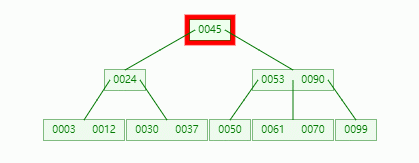
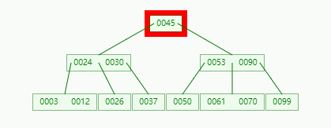
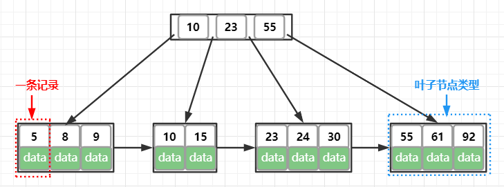
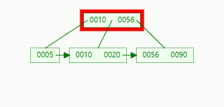

一般情况，我们可以把整个数据结构存储到计算机的主存中；可如果数据更多装不下主存，那么意味着必须把数据结构放到磁盘上。
此时“大`O`模型”不再适用，因为大`O`分析假设所有操作耗时都是相同的，所以涉及到**磁盘I/O**就不再适用了。与内存相比，磁盘必须花成倍的时间来存取一个数据元素，这是因为磁盘的机械部件读写数据的速度远远赶不上纯电子媒体的内存。
```
【CPU】 <---> 【内存】 <--I/O--> 【磁盘】
```
当在大量数据存储中，查询时我们不能一下子将所有数据加载到内存中，只能逐一加载磁盘页，每个磁盘页对应树的节点。造成大量磁盘`I/O`操作（最坏情况下为树的高度）。
平衡二叉树由于树深度过大而造成磁盘I/O读写过于频繁，进而导致效率低下。
为了减少磁盘`I/O`操作的次数，就你必须降低树的深度，将“瘦高”的树变得“矮胖”。
所以，就引入了`B 树`。`B 树`利用多个分支（称为子树）的节点，减少获取记录时所经历的节点数，从而达到节省存取时间的目的。
<!-- more -->

### 1. B 树（B Tree）
`B 树`（B-Tree），是一种**平衡的多路查找树**，主要面向于动态查找，常用于文件系统中。
`B 树`中，节点的子树最大数目称为 **B 树的阶**。
- 一颗**m 阶**`B 树`（m叉树）或为空树，或满足：
    - 叶子节点都出现在同一层，且不带信息。
    - 树中每个节点最多有`m`棵子树。
    - 叶子节点的父节点称为**终端节点**，若根节点不是终端节点，则至少有两棵子树。
    - 除根节点外的所有非终端节点至少有`m/2`棵子树。
    - 非终端节点都包括数据：`{n,A0, K1,A1, K2,A2..., Kn,An}`，其中`n`为关键字个数(取值范围是`[(m/2)-1,m-1]`,向上取整)，`Ki`为关键字，`Ai`为指向子树根节点的指针，且指针`Ai`所指子树中所有节点的关键字均大于`Ki`且小于 `K{i+1}`（即关键字有序）。 

节点的结构：


一般情况下，`B 树`的叶子节点可以看做外部节点，即查找失败的点，实际上这些节点并不存在，指向这些节点的指针都为`NULL`；
`B 树`是树高平衡的，此外，`B 树`中每个节点中关键字的个数为`子树个数-1`。


#### 1.1 构建 B 树（插入）
`B 树`也是从空树开始，但是在插入新的关键字时并不是每次都向树中插入新的节点。
- 对于`m`阶的`B 树`来说，节点中包含关键字的个数`n`的范围是`[(m/2)-1,m-1]`，在插入新的关键字时，首先向最底层的某个终端节点中添加:
    - 若节点中关键字个数`n`小于`m-1`，则直接插入成功；
    - 若节点中关键字个数`n`等于`m-1`，插入后`n>m-1`引起节点分裂；以该节点中间关键字为分界，取中间关键字（偶数个数，中间两个随机选取）插入到父节点中；
    - 重复上面动作，直到所有节点符合B 树的规则`[(m/2)-1,m-1]`；最坏的情况一直分裂到根节点，生成新的根节点，高度增加`1`；

如图，有一颗`3`阶 `B 树`（深度为`4`）：

分别插入关键字 `30`、`26`、`85`、`7`。
（`3`阶 `B 树`节点中关键字个数`n`的范围是`[(m/2)-1,m-1]`向上取整，即`[1,2]`，插入后`n>2`就分裂）。

- 插入关键字`30`：


插入关键字`30`的过程：【45】-->【24】-->【37】直接插入变成【30,37】

- 插入关键字`26`：


插入关键字`26`的过程：【45】-->【24】-->【30,37】；
`26`插入【30,37】节点后变成【26,30,37】其关键字个数`n>2`分裂：①`37`存储到新的节点【37】，②`30`存储到父节点变成【24,30】，同时`30`的右侧的指针指向新节点【37】。

- 插入关键字`85`：


插入关键字`85`的过程：【45】-->【53,90】-->【61,70】；
`85`插入【61,70】节点后变成【61,70,85】其关键字个数`n>2`分裂：①`85`存储到新的节点【85】，②`70`存储到父节点变成【53,70,90】，同时`70`的右侧的指针指向新节点【85】。
节点【53,70,90】分裂：①`90`存储到新的节点【90】，②`70`存储到父节点变成【45,70】，同时`70`的右侧的指针指向新节点【90】。

- 插入关键字`7`：


插入关键字`7`的过程：【45,70】-->【24,30】-->【3,12】该节点关键字为`2`等于`m-1`；
`7`插入【3,12】节点后变成【3,7,12】其关键字个数`n>2`分裂：①`12`存储到新的节点【12】，②`7`存储到父节点变成【7,24,30】，同时`7`的右侧的指针指向新节点【12】。
节点【7,24,30】分裂：①`30`存储到新的节点【30】，②`24`存储到根节点变成【24,45,70】，同时`24`的右侧的指针指向新节点【30】。
根节点【24,45,70】分裂：①`70`存储到新的节点【70】，②【45】变成新的根节点，同时【45】的右侧的指针指向新节点【70】；【45】的左侧的指针指向【24】。


#### 1.2 B 树的删除
在`B 树`中删除关键字时，首先找到该关键字所在节点，然后在节点中对关键字进行删除；首先判断该关键字是否有子节点，如果没有，直接删除；如果有，删除后则上移子节点中的某相近关键字(“左子节点最右关键字”或“右子节点最左关键字”)到此节点中。
然后是移动之后的情况：
- 某节点中关键字个数`n`小于`m/2-1`（向上取整），则需要看其左右相邻兄弟节点是否丰满：
    - ①如果有一个丰满（节点中关键字个数`n`大于`m/2-1`），则向父节点借一个关键字来满足条件，上移该丰满节点最后或最前一个关键字到父节点中；
    - ②如果其相邻兄弟都不丰满，则该节点与其相邻的某一兄弟节点进行“合并”成一个节点；

如图，有一颗`5`阶 `B 树`（深度为`4`）：


依次删除依次删除`8`、`20`、`18`、`5`。
（`5`阶 `B 树`节点中关键字个数`n`的范围是`[(m/2)-1,m-1]`向上取整，即`[2,4]`，关键要领：关键字个数小于`2`就合并，大于`4`就分裂）。

- 删除关键字`8`：


删除`8`，首先查找`8`，`8`在一个终端节点【8,11,12】中，删除后该节点关键字个数`n=2`，符合`B 树`规则`[2,4]`，操作很简单，节点中删除关键字后面的关键字向前移动，也就是只需要移动`11`至原来`8`的位置，移动`12`至`11`的位置。

- 删除关键字`20`：


删除`20`,因为`20`在节点【17，20】中不是终端节点，上移其孩子节点中的某相近关键字(`19`或`23`)，若上移`19`该子节点关键字个数`n<2`则还需额外操作，所以`23`上移到`20`的位置，该子节点关键字个数为`3`，无需进行合并操作。

- 删除关键字`18`：


删除`18`，`18`在一个终端节点【18,19】中，但是该节点中关键字个数`n=2`，删除后就小于`2`，没达标，而相邻右兄弟节点比较丰满，则先向父节点借一个关键字`23`下移到该删除节点中，代替原来`19`的位置，`19`前移；然后将丰满兄弟节点的`24`上移到父节点中。

- 删除关键字`5`：


删除`5`，`5`在一个终端节点中且关键字个数`n=2`，删除后就小于`2`，没达标，而相邻右兄弟节点都不丰满，所以需要该节点与某相邻兄弟节点进行**合并操作**：子节点【1,3】【6】，父节点【4,7】；首先将父节点的关键字`4`下移到删除的节点中变成【4,6】,然后合并【1,3】与【4,6】变成一个节点【1,3,4,6】。
此时，你会发现父节点只包含一个关键字`7`，`n=1`没达标`[2,4]`，而相邻右兄弟节点都不丰满，只能进行合并，而根节点中的唯一关键字`13`下移到子节点，这样，**树的高度减少一层**，根节点变成【7,13,17,24】。


### 2. 磁盘I/O 与 预读
计算机存储设备一般分为：**内存储器**(main memory)和**外存储器**(external memory)。 
- 内存储器为**内存**，内存存取速度快，但容量小，价格昂贵，且数据不能长期保存(数据断电就没了)。
- 外存储器为**磁盘读取**，磁盘读取数据靠的是机械运动，每次读取数据花费的时间可以分为**寻道时间**、**旋转延迟**、**传输时间**三个部分：
    + 寻道时间指磁臂移动到指定磁道所需要的时间，主流磁盘一般在`5ms`以下；
    + 旋转延迟指的是磁盘转速，比如一个磁盘`7200`转，表示每分钟能转`7200`次，也就是说`1`秒钟能转`120`次，旋转延迟就是`1/120/2 = 4.17ms`；
    + 传输时间指的是从磁盘读出或将数据写入磁盘的时间，一般在零点几毫秒，相对于前两个时间可以忽略不计。

那么粗略计算一次磁盘I/O的时间约`5+4.17 = 9ms`左右，但要知道一台`500-MIPS`的机器每秒可以执行`5亿`条指令，因为指令依靠的是电的性质，换句话说执行一次I/O的时间可以执行`40万`条指令，数据库动辄十万百万乃至千万级数据，每次`9`毫秒的时间，显然是个灾难。

由于磁盘IO的高耗时操作，计算机系统做了很多优化，当一次磁盘I/O时，不仅会读取当前磁盘地址的数据，还会把相邻的数据也一起读到内存中，因为一般情况下，其相邻的数据很快也会被访问到，这就是局部预读性原理。
由于磁盘顺序读取的效率很高（不需要寻道时间，只需很少的旋转时间），因此对于具有局部性的程序来说，**预读可以提高I/O效率**。
预读的长度一般为页（page）的整倍数。页是计算机管理存储器的逻辑块，硬件及操作系统往往将主存和磁盘存储区分割为连续的大小相等的块，每个存储块称为一页（在许多操作系统中，页得大小通常为`4k`或`8k`），主存和磁盘以页为单位交换数据。当程序要读取的数据不在主存中时，会触发一个缺页异常，此时系统会向磁盘发出读盘信号，磁盘会找到数据的起始位置并向后连续读取一页或几页载入内存中，然后异常返回，程序继续运行。

内存(`ns`级别) << 磁盘(`ms`级别)，相差`100000`倍；为了避免1次外存访问，宁愿访问内存100+次，所以将最常用的数据存储在最快的存储器中。

索引查询的数据主要受限于磁盘的I/O速度，查询I/O次数越少，速度越快，所以`B 树`的结构才应需求而生；`B 树`的每个节点的关键字可以视为一次I/O读取，树的高度表示最多的I/O次数，在相同数量的总关键字个数下，每个节点的关键字个数越多，高度越低，查询所需的I/O次数越少；
假设，一次磁盘一次I/O数据为8K，索引用int(4字节)类型数据建立，理论上一个节点最多可以为2000个关键字，2000*2000*2000=8000000000，80亿条的数据只需3次I/O（理论值），可想而知，`B 树`做为索引的查询效率有多高；


### 3. B+ 树（B+ Tree）
`B+ 树`是应文件系统所需而产生的`B 树`的变形树，严格意义上来讲，其已经不是一棵树了。
由于 `B+ 树`的非叶节点不含有实际数据，因此磁盘页中可以容纳更多节点关键字，也就是说同样数据情况下，`B+ 树`会 `B 树`更加“矮胖”，因此查询效率更快，磁盘读写代价更低。
`B+ 树`的叶子节点包含了全部的数据，任何关键字的查找必须走一条从根节点到叶子节点的路。所有关键字查询的路径长度相同，导致每一个数据的查询效率相当；所以查询效率是稳定的。
`B 树`在提高了I/O性能的同时并没有解决关键字遍历效率低下的问题，范围查找时`B 树`只能挨个中序遍历比较大小。由于 `B+ 树`的叶子节点是一个有序链表，只需在叶子节点上遍历即可。

各种资料上`B+ 树`的定义各有不同，一种定义是关键字个数与子树个数相同。这里我们采取维基百科上所定义的方式，即关键字个数比子树个数小`1`，即对于`m`阶的`B+ 树`来说，最多有`m-1`个关键字，最多`m`个子树。
除此之外`B+ 树`还有以下要求：**非叶子节点不存数据仅用作索引**，非叶子节点的关键字都在它的下一级子树中同样存在，最后**所有数据都存储在叶子节点中**，每个叶子节点都**存有相邻叶子节点的指针**，叶子节点本身依关键字的大小自小而大顺序链接。根节点的关键字个数最少可以只有`1`个。



- `B+ 树`的特性：
    - 所有关键字都出现在叶子节点的链表中（稠密索引），且链表中的关键字恰好是有序的；
    - 不可能在非叶子节点命中；
    - 非叶子节点相当于是叶子节点的索引（稀疏索引），叶子节点相当于是存储（关键字）数据的数据层；
    - 更适合文件索引系统；


#### 3.1 构建 B+ 树（插入）
`B+ 树`的插入操作全部都在**叶子节点**上进行，且不能破坏关键字自小而大的顺序；
- 对于`m`阶的`B+ 树`来说，根据维基百科上的定义节点中包含关键字的个数`n`的范围是`[(m/2)-1,m-1]`（根节点的关键字个数最少可以只有`1`个），在插入新的关键字时：
    - 若节点中关键字个数`n`小于`m-1`，则直接插入成功；
    - 若节点中关键字个数`n`等于`m-1`，插入后`n>m-1`引起节点分裂；以该节点中间关键字为分界，取中间关键字（偶数个数，中间两个随机选取）上移至父节点中；
    - 重复上面动作，直到所有节点符合`B+ 树`关键字个数的规则；

如图，构建一颗`3`阶 `B+ 树`：`10`、`56`、`90`、`5`、`20`、`80`。


- 插入`10`、`56`，直接插入成功节点变成【10,56】；
- 插入`90`:


`90`插入后节点后变成【10,56,90】其关键字个数`n>2`分裂成【10】【56,90】，`56`上移至父节点中变成【56】，同时`56`的左指针指向【10】，`56`的右指针指向【56,90】；

- 插入`5`，找到节点【10】，直接插入变成【5,10】；
- 插入`20`:


插入`20`，找到节点【5,10】，插入后变成【5,10,20】分裂成【5】【10,20】，`10`上移至父节点中变成【10,56】，同时`10`的左指针指向【5】，`10`的右指针指向【10,20】；

- 插入`80`:


插入`80`，找到节点【56,90】，插入后变成【56,80,90】分裂成【56】【80,90】，`80`上移至父节点中变成【10,56,80】，同时`80`的左指针指向【56】，`80`的右指针指向【80,90】；此时节点【10,56,80】继续分裂成【10】【80】，`56`上移至父节点中变成【56】，同时`56`的左指针指向【10】，`56`的右指针指向【80】；


#### 3.2 B+ 树的删除
`B+ 树`的删除操作也仅在**叶子节点**上进行；
删除时，如果不破坏`B+ 树`本身的性质，直接完成操作；
删除时还要注意有时需要更改其父节点中的索引值；
在删除关键字后，如果导致其节点中关键字个数不足，有两种方法：一种是向兄弟节点去借，另外一种是同兄弟节点合并（与`B 树`类似）。

如图，有一颗`5`阶 `B+ 树`：


- 删除`53`:


删除`53`后，节点【50】关键字不足，向兄弟节点借一个最相近的`68`后变成【50,68】，兄弟节点变成【69,70,71】，父节点索引由原来的`68`变成`69`；

- 删除`69`:


删除`69`后，节点【70,71】不破坏`B+ 树`本身的性质，只需更改父节点索引为`70`即可；

- 删除`70`:


删除`70`后，节点【71】关键字不足，兄弟节点也不丰满，与兄弟节点合并为【50,68,71】，合并后只有一个叶子节点，树的高度减一；


### 4. B* 树（B* Tree）
`B* 树`是`B+ 树`的变形树，其也非严格意义上的树。
`B* 树`在`B+ 树`的基础上进行了改进，**在`B+ 树`的非根和非叶子节点上行增加了指向兄弟的指针**，且规定`m`阶树非叶节点关键字个数至少为`(2/3)m`，即块的最低使用率为`2/3`，可以看出，`B* 树`空间利用率更高。


### 5. InnoDB 存储引擎
`InnoDB`是`MySQL`的默认事务引擎，也是目前最重要、使用最广泛的存储引擎。
- 在`InnoDB`中，表都是根据主键顺序以索引的形式存放的，这种存储方式的表称为索引组织表。
- `InnoDB`使用了`B+树`索引模型，所以数据都是存储在`B+树`中的。
- 每一个索引在`InnoDB`里面对应一棵`B+树`，每一张表其实就是多个 `B+树`，即一个主键索引树和多个非主键索引树。
    - 主键索引的叶子节点存的是整行数据。主键索引也被称为聚簇索引（clustered index）。
    - 非主键索引的叶子节点内容是主键索引的引用。非主键索引也被称为二级索引（secondary index）。

执行查询的效率，使用主键索引 > 使用非主键索引 > 不使用索引（从主索引 `B+树`的叶子节点进行遍历）。
使用非主键索引查询会触发回表，因为非主键索引只存储主键索引的引用，我们需要多扫描一棵索引树。因此，我们在应用中应该尽量使用主键查询。


> 参考资料：
> [B+ 树 外文文档](https://www.cs.helsinki.fi/u/mluukkai/tirak2010/B-tree.pdf)
