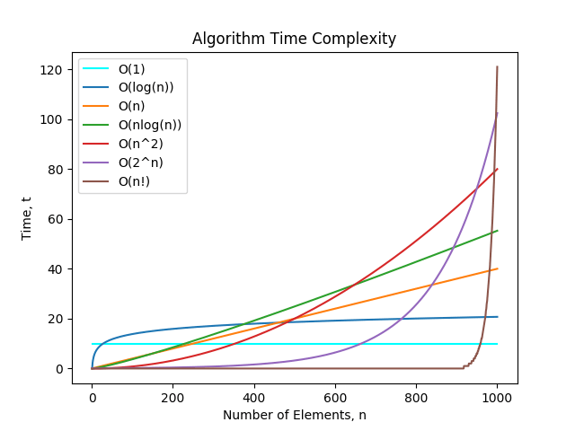

数据结构与算法解决的是：如何让计算机更快时间、更省空间的解决问题。
因此需要从执行时间和占用空间两个维度来评估数据结构和算法的性能，二者统称为复杂度。
复杂度描述的是算法执行时间或占用系统空间与数据规模的增长关系。
<!-- more -->
和性能测试相比，复杂度分析有不依赖执行环境、成本低、效率高、易操作、指导性强的特点。
掌握复杂度分析，将能编写出性能更优的代码，有利于降低系统开发和维护成本。

### 1. 时间复杂度与空间复杂度

大O表示法：所有代码的执行时间`T(n)`与每行代码的执行次数`f(n)`成正比，用`T(n) = O(f(n))`表示，其中`n`表示数据规模的大小
- `T(n) = O(f(n))`表示*算法的执行时间与数据规模之间的增长关系*，所以也叫*渐进时间复杂度*（asymptotic time complexity），简称**时间复杂度**。
- 类比一下，S(n)=O(f(n))表示**空间复杂度**全称就是*渐进空间复杂度*（asymptotic space complexity），表示*算法的存储空间与数据规模之间的增长关系*。

### 2. 复杂度量级

- 多项式量级：随着数据规模的增长，算法的执行时间和空间占用，按照多项式的比例增长。这类有：
    + 常量阶`O(1)`
    + 对数阶`O(logn)`
    + 线性阶`O(n)`
    + 线性对数阶`O(nlogn)`
    + 平方阶`O(n^2)`、立方阶`O(n^3)`、···、k次方阶`O(n^k)`
- 非多项式量级NP（NP：Non-Deterministic Polynomial，非确定多项式）：随着数据规模的增长，算法的执行时间和空间占用暴增，这类算法性能极差。非多项式量级只有两个：指数阶`O(2^n)` 和 阶乘阶`O(n!)`。

- 复杂度分析法则
    1. 单段代码看高频：比如循环。
    2. 多段代码取最大：比如一段代码中有单循环和多重循环，那么取多重循环的复杂度。
    3. 嵌套代码求乘积：比如递归、多重循环等
    4. 多个规模求加法：比如方法有两个参数控制两个循环的次数，那么这时就取二者复杂度相加。

### 3.复杂度分析的4个概念

代码复杂度在不同情况下出现量级差别时，为了更全面，更准确的描述代码的时间复杂度，所以引入这4个概念。大多数情况下，是不需要区别分析它们的。

1. 最好时间复杂度（best case time complexity）：代码在最理想情况下执行的时间复杂度。
2. 最坏时间复杂度（worst case time complexity）：代码在最坏情况下执行的时间复杂度。
3. 平均时间复杂度（average case time complexity）：用代码在所有情况下执行的次数的加权平均值表示。
    + 分析：代码在不同情况下复杂度出现量级差别，则用代码所有可能情况下执行次数的加权平均值表示。
5. 均摊时间复杂度（amortized time complexity）：在代码执行的所有复杂度情况中绝大部分是低级别的复杂度，个别情况是高级别复杂度且发生具有时序关系时，可以将个别高级别复杂度均摊到低级别复杂度上。均摊结果一般都等于低级别复杂度。
    + 分析：两个条件满足时使用：①代码在绝大多数情况下是低级别复杂度，只有极少数情况是高级别复杂度；②低级别和高级别复杂度出现具有时序规律。均摊结果一般都等于低级别复杂度。

