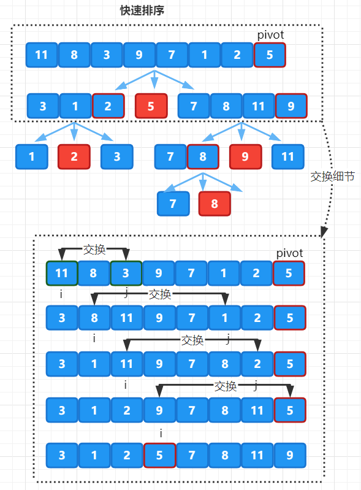
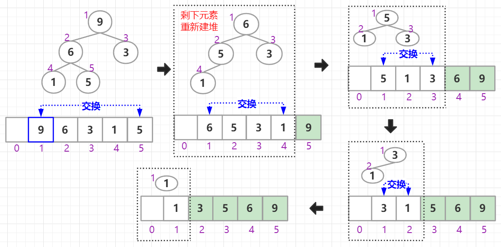

排序算法可以分为内部排序和外部排序，内部排序是数据记录在内存中进行排序，而外部排序是因排序的数据很大，一次不能容纳全部的排序记录，在排序过程中需要访问外存。常见的内部排序算法有：插入排序、希尔排序、选择排序、冒泡排序、归并排序、快速排序、堆排序、基数排序等。
<!-- more -->
用一张图概括：


名词解释：
- `n`：数据规模
- `k`："桶"的个数
- `In-place`：占用常数内存，不占用额外内存
- `Out-place`：占用额外内存
- `稳定性`：排序后 2 个相等键值的顺序和排序之前它们的顺序相同

| 内部排序 | 描述 |
|:--------|:-----|
| 冒泡排序 | （无序区，有序区）<br> 从无序区通过交换找出最大元素放到有序区最前端。|
| 选择排序 | （无序区，有序区）<br> 从无序区选择一个最小的元素放到有序区的末尾。比较多，交换少|
| 插入排序 | （无序区，有序区）<br> 把无序区的第一个元素插入到有序区合适的位置。比较少，交换多|
| 希尔排序 | 通过比较相距一定间隔的元素来进行（每一定间隔取一个元素组成子序列），各趟比较所用的距离随着算法的进行而减小，直到只比较相邻元素的最后一趟排序为止。|
| 归并排序 | 把数组从中间分成前后两部分，分别排序，再将排好序的两部分合并。|
| 快速排序 | （小数，基准，大数）<br> 随机一个元素作为基准数，将小于基准的元素放在基准之前，大于基准的放在基准之后，再分别对小数区与大数区进行排序。|
| 堆排序 | （大顶堆，有序区）<br> 取出堆顶元素放在有序区，再恢复堆。|
| 计数排序 | 统计小于等于该元素值的元素个数i,于是该元素就放在目标数组的索引i位（i>=0）。|
| 桶排序 | 将值为i的元素放在i号桶，最后依次把桶里元素倒出来。 |
| 基数排序 | 一种多关键字的排序算法，可用桶排序实现。 |


### 1. 冒泡排序（Bubble Sort）
`冒泡排序（Bubble Sort）`是一种简单直观的排序算法。它重复地走访过要排序的数列，一次比较两个元素，如果他们的顺序错误就把他们交换过来。走访数列的工作是重复地进行直到没有再需要交换，也就是说该数列已经排序完成。

- 冒泡排序步骤：
    1. 比较相邻的元素。如果第一个比第二个大，就交换他们两个。
    2. 对每一对相邻元素作同样的工作，从开始第一对到结尾的最后一对。这步做完后，最后的元素会是最大的数。
    3. 针对所有的元素重复以上的步骤，除了最后一个。
    4. 持续每次对越来越少的元素重复上面的步骤，直到没有任何一对数字需要比较。


Java代码实现：
``` java
/**
 * 冒泡排序
 */
public void bubbleSort(int[] arr, int len){
    if (len <= 1) return;
    for (int i = 0; i < len; i++) {
        // 若已有序，提前退出标志位
        boolean flag = false;
        for (int j = 0; j < len-i; j++) {
            if(arr[j] > arr[j+1]){
                int temp = arr[j];
                arr[j] = arr[j+1];
                arr[j+1] = temp;
                // 发生交换
                flag = true;
            }
        }
        if (!flag){
            // 若已有序,未发生交换，提前退出循环
            break;
        }
    }
}
```


### 2. 选择排序（Selection sort）
`选择排序（Selection sort）`是一种简单直观的排序算法。 它的工作原理是：第一次从待排序的数据元素中选出最小（或最大）的一个元素，存放在序列的起始位置，然后再从剩余的未排序元素中寻找到最小（大）元素，然后放到已排序的序列的末尾。 以此类推，直到全部待排序的数据元素的个数为零。 选择排序是不稳定的排序方法。
- 冒泡排序步骤：
    1. 首先在未排序序列中找到最小（大）元素，存放到排序序列的起始位置。
    2. 再从剩余未排序元素中继续寻找最小（大）元素，然后放到已排序序列的末尾。
    3. 重复第二步，直到所有元素均排序完毕。


Java代码实现：
``` java
/**
 * 选择排序
 */
public void selectionSort(int[] arr, int len){
    if (len <= 1) return;
    for (int i = 0; i < len-1; i++) {
        int min=i;
        for (int j = i+1; j < len; j++) {
            if(arr[j] < arr[min]){
                min = j;
            }
        }
        if (i != min){
            // 交换
            int temp = arr[i];
            arr[i] = arr[min];
            arr[min] = temp;
        }
    }
}
```


### 3. 插入排序（Insertion Sort）
`插入排序（Insertion Sort）`是一种最简单直观的排序算法，一般也被称为直接插入排序。
通过构建有序序列，对于未排序数据，在已排序序列中从后向前扫描，找到相应位置并插入。
- 插入排序步骤：
    1. 将第一待排序序列第一个元素看做一个有序序列，把第二个元素到最后一个元素当成是未排序序列。
    2. 从头到尾依次扫描未排序序列，将扫描到的每个元素插入有序序列的适当位置。（如果待插入的元素与有序序列中的某个元素相等，则将待插入元素插入到相等元素的后面。）


Java代码实现：
``` java
/**
 * 插入排序
 */
public void insertionSort(int[] arr, int len){
    if (len <= 1 ) return;
    for (int i = 1; i < len; i++) {
        int temp = arr[i];
        int j = i-1;
        for (; j >=0; j--) {
            if (arr[j] > temp){
                arr[j+1] = arr[j];
            } else {
                break;
            }
        }
        arr[j+1] = temp;
    }
}
```


### 4. 希尔排序（Shell Sort）
`希尔排序（Shell Sort）`是插入排序的一种更高效的改进版本；又称缩小增量排序，因 DL.Shell 于 1959 年提出而得名。
通过比较相距一定间隔的元素来进行（每一定间隔取一个元素组成子序列），各趟比较所用的距离随着算法的进行而减小，直到只比较相邻元素的最后一趟排序为止。
- 希尔排序步骤：
    1. 将 len 个元素的数组序列 分割为间隔 gap (gap = len/2) 的子序列（每间隔 gap 取一个元素）
    2. 在每一个子序列中分别采用直接插入排序。
    3. 然后缩小间隔 gap，将 gap = gap/2。
    4. 重复上述的子序列划分和排序工作，随着序列减少最后变为一个，也就完成了整个排序。


Java代码实现：
``` java
/**
 * 希尔排序
 */
public void shellSort(int[] arr, int len){
    if (len <= 1) return;
    for (int gap = len/2; gap > 0; gap = gap/2) {
        for (int i = gap; i < len; i++) {
            int temp = arr[i];
            int j = i-gap;
            for (; j >=0; j = j-gap) {
                if (arr[j] > temp){
                    arr[j+gap] = arr[j];
                } else {
                    break;
                }
            }
            arr[j+gap] = temp;
        }
    }
}
```


### 5. 归并排序（Merge sort）
归并排序（Merge sort）是建立在归并操作上的一种有效、稳定的排序算法，该算法是采用分治法(Divide and Conquer）的一个非常典型的应用。
将已有序的子序列合并，得到完全有序的序列；即先使每个子序列有序，再使子序列段间有序。若将两个有序表合并成一个有序表，称为二路归并。
归并排序使用的就是分治思想。分治算法一般都是用递归来实现的。分治是一种解决问题的处理思想，递归是一种编程技巧，这两者并不冲突。
- 归并排序步骤：
    1. 先把数组从中间分成前后两部分子序列，然后对前后两部分分别排序，然后再合并。
    2. 前后两部分子序列递归重复上述步骤。


Java代码实现：
``` java
/**
 * 归并排序（稳定的排序算法）
 */
public void mergeSort(int[] arr, int len) {
    mergeSortRecursion(arr, 0, len-1);
}

/**
 * 归并排序递归调用函数
 * 给下标从 p 到 r 之间的数组排序。我们将这个排序问题转化为了两个子问题，
 * 分割点下标 q 等于 p 和 r 的中间位置，也就是 (p+r)/2。当下标从 p 到 q 和从 q+1 到 r 这两个子数组都排好序之后，我们再将两个有序的子数组合并在一起，这样下标从 p 到 r 之间的数据就也排好序了。
 */
private void mergeSortRecursion(int[] arr, int p, int r) {
    if (p == r) return;
    // 分割点下标
    int q = p + (r-p)/2;
    // 递归左边排序
    mergeSortRecursion(arr, p, q);
    // 递归右边排序
    mergeSortRecursion(arr, q+1, r);
    // 合并左右
    mergeResult(arr, p, q, r);
}

/**
 * 合并
 * 将已经有序的 A[p...q]和 A[q+1....r]合并成一个有序的数组，并且放入 A[p....r]。
 * 具体我们申请一个临时数组 tmp，大小与 A[p...r]相同。我们用两个游标 i 和 j，分别指向 A[p...q]和 A[q+1...r]的第一个元素。比较这两个元素 A[i]和 A[j]，如果 A[i]<=A[j]，我们就把 A[i]放入到临时数组 tmp，并且 i 后移一位，否则将 A[j]放入到数组 tmp，j 后移一位。
 * 继续上述比较过程，直到其中一个子数组中的所有数据都放入临时数组中，再把另一个数组中剩余的数据依次加入到临时数组的末尾，这个时候，临时数组中存储的就是两个子数组合并之后的结果了。最后再把临时数组 tmp 中的数据拷贝到原数组 A[p...r]中。
 */
private void mergeResult(int[] arr, int p, int q, int r) {
    int[] temp = new int[r-p+1];
    // i是arr前半部分下标
    int i = p;
    // j是arr后半部分下标
    int j = q +1;
    // k是临时新数组temp下标
    int k = 0;
    // 当arr数组两边都还有数时,依次从小到大拷贝到临时新数组temp
    while (i <= q && j <= r) {
        if (arr[i] <= arr[j]) {
            temp[k] = arr[i];
            i++;
        } else {
            temp[k] = arr[j];
            j++;
        }
        k++;
    }
    // 判断哪个子数组中有剩余的数据
    int start = i, end = q;
    if (j <= r) {
        // arr后半部分还有剩余(初始化时默认前半部分还有剩余)
        start = j;
        end = r;
    }
    // 将剩余的数据拷贝到临时数组temp
    while (start <= end) {
        temp[k++] = arr[start++];
    }
    //将排好序的temp数组拷贝回arr[p...r]
    System.arraycopy(temp, 0, arr, p, temp.length);
}
```


### 6. 快速排序（Quick Sort）
快速排序使用分治法（Divide and conquer）策略来把一个序列（list）分为两个子序列（sub-lists）。快速排序又是一种分而治之思想在排序算法上的典型应用。本质上来看，快速排序应该算是在冒泡排序基础上的递归分治法。

通过一趟排序将要排序的数据分割成独立的两部分，其中一部分的所有数据都比另外一部分的所有数据都要小，然后再按此方法对这两部分数据分别进行快速排序，整个排序过程可以递归进行，以此达到整个数据变成有序序列。

排序算法的思想非常简单，在待排序的数列中，我们首先要找一个数字作为基准数。把小于基准数的元素移动到待排序的数列的左边，把大于基准数的元素移动到待排序的数列的右边。这时，左右两个分区的元素就相对有序了；接着把两个分区的元素分别按照上面两种方法继续对每个分区找出基准数，然后移动，直到各个分区只有一个数时为止。

- 快速排序步骤：
    1. 从数列中挑出一个元素，称为 “基准”（pivot）。
    2. 将小于基准的元素放在基准之前，大于基准的放在基准之后，再分别对小数区与大数区进行快速排序。
    3. 小数区与大数区子序列递归地重复上述步骤（直到分区子序列的大小是0或1）。



Java代码实现：
``` java
/**
 * 快速排序
 */
public void quickSort(int[] arr, int len) {
    quickSortRecursion(arr, 0, len-1);
}

/**
 * 快速排序递归函数，p,r为下标
 * 根据分治、递归的处理思想，我们可以用递归排序下标从 p 到 q-1 之间的数据和下标从 q+1 到 r 之间的数据，直到区间缩小为 1，就说明所有的数据都有序了。
 */
private void quickSortRecursion(int[] arr, int p, int r) {
    if (p >= r) return;
    // 获取分区点下标
    int q = getPartitionIndex(arr, p, r);
    System.out.println("pivotIndex=: " + q + ",pivot=" + arr[q]);
    System.out.println(Arrays.toString(Arrays.copyOfRange(arr, p, r+1)));
    // 用递归排序下标从 p 到 q-1 之间的数据
    quickSortRecursion(arr, p, q-1);
    // 用递归排序下标从 q+1 到 r 之间的数据
    quickSortRecursion(arr, q+1, r);
}

/**
 * 获取分区点
 * 随机选择一个元素作为分区点 pivot（一般情况下，可以选择 p 到 r 区间的最后一个元素），然后对 A[p...r]分区，返回 pivot 的下标。
 * 遍历 p 到 r 之间的数据，将小于 pivot 的放到左边，将大于 pivot 的放到右边，将 pivot 放到中间。经过这一步骤之后，数组 p 到 r 之间的数据就被分成了三个部分，前面 p 到 q-1 之间都是小于 pivot 的，中间是 pivot，后面的 q+1 到 r 之间是大于 pivot 的。
 */
private int getPartitionIndex(int[] arr, int p, int r) {
    int pivot = arr[r];
    int i = p;
    for (int j = p; j < r; j++) {
        if (arr[j] < pivot) {
            swapArr(arr, i, j);
            i++;
        }
    }
    swapArr(arr, i, r);
    return i;
}

/**
 * 交换
 */
private void swapArr(int[] arr, int a, int b) {
    int temp = arr[a];
    arr[a] = arr[b];
    arr[b] = temp;
}
```


### 7. 堆排序（Heap Sort）
堆排序（Heap Sort）是指利用堆这种数据结构所设计的一种排序算法。
堆积是一个近似完全二叉树的结构，并同时满足堆积的性质：即子结点的键值或索引总是小于（或者大于）它的父节点。
堆排序可以说是一种利用堆的概念来排序的选择排序。分为两种方法：
- 大顶堆：每个节点的值都大于或等于其子节点的值，在堆排序算法中用于升序排列；
- 小顶堆：每个节点的值都小于或等于其子节点的值，在堆排序算法中用于降序排列；

- 堆排序步骤：
    1. 创建一个堆（建堆后数组中的第一个元素就是堆顶，大顶堆的堆顶也就是最大的元素）。
    2. 堆顶（最大值）和堆尾互换（最大元素就放到了下标为 `n` 的位置）。
    3. 剩下 `n-1` 个元素重复这个过程(堆化->取堆顶)。
    4. 直到最后堆中只剩下标为 1 的一个元素，排序完成。



Java代码实现：
``` java
/**
 *  堆排序
 *  len 表示数据的个数，数组a中的数据从下标1到n的位置。
 */
public void heapSort(int[] arr, int len) {
    buildHeap(arr, len);
    int k = len;
    while (k > 1) {
        swapArr(arr, 1, k);
        --k;
        heapify(arr, k, 1);
    }
}
/**
 * 构建堆
 */
private void buildHeap(int[] arr, int len) {
    for (int i = len/2; i >= 1; --i) {
        heapify(arr, len, i);
    }
}
/**
 * 堆化
 */
private void heapify(int[] arr, int len, int i) {
    while (true) {
        int maxPos = i;
        if (i*2 <= len && arr[i] < arr[i*2]) maxPos = i*2;
        if (i*2+1 <= len && arr[maxPos] < arr[i*2+1]) maxPos = i*2+1;
        if (maxPos == i) break;
        swapArr(arr, i, maxPos);
        i = maxPos;
    }
}
/**
 * 交换
 */
private void swapArr(int[] arr, int a, int b) {
    int temp = arr[a];
    arr[a] = arr[b];
    arr[b] = temp;
}
```


### 8. 计数排序（Counting Sort）
计数排序（Counting Sort）是一种牺牲内存空间来换取低时间复杂度的排序算法，同时它也是一种不基于比较的算法。
它的优势在于在对一定范围内的整数排序时，它的复杂度为`Ο(n+k)`（其中k是整数的范围），快于任何比较排序算法。
它适合于最大值和最小值的差值不是不是很大的排序。

基本思想：就是把数组元素作为数组的下标，然后用一个临时数组统计该元素出现的次数，例如 temp[i] = m, 表示元素 i 一共出现了 m 次。最后再把临时数组统计的数据从小到大汇总起来，此时汇总起来是数据是有序的。

- 计数排序步骤：
    1. 找出待排序数组中最大值 `max` 和最小值 `min`；
    2. 创建临时数组，大小为 `(max - min + 1)`；
    3. 统计待排序数组中每个值为`i`的元素出现的次数，存入临时数组的第`i`项；
    4. 反向填充目标数组：依次从临时数组中取出放入新数组。


Java代码实现：
``` java
/**
 * 计数排序
 */
public void countingSort(int[] arr, int len) {
    if (len <= 1 ) return;
    // 寻找数组的最大值与最小值
    int min = getMin(arr);
    int max = getMax(arr);
    // 创建大小为(max - min + 1)的临时数组
    int range = max - min + 1;
    int[] temp = new int[range];
    // 统计元素i出现的次数
    for (int i = 0; i < len; i++) {
        temp[arr[i] - min]++;
    }
    // 把临时数组统计好的数据汇总到原数组
    int k = 0;
    for (int i = 0; i < range; i++) {
        for (int j = temp[i]; j > 0; j--) {
            arr[k++] = i + min;
        }
    }
}
/**
 * 寻找数组的最大值
 */
private int getMax(int[] arr) {
    int max = arr[0];
    for (int value : arr) {
        if (max < value) {
            max = value;
        }
    }
    return max;
}
/**
 * 寻找数组的最小值
 */
private int getMin(int[] arr) {
    int min = arr[0];
    for (int value : arr) {
        if (min > value) {
            min = value;
        }
    }
    return min;
}
```


### 9. 桶排序（Bucket Sort）
桶排序（Bucket sort）是计数排序的升级版。核心思想是将要排序的数据分到几个有序的“桶”里，每个桶里的数据再单独进行排序。
桶内排完序之后，再把每个桶里的数据按照顺序依次取出，组成的序列就是有序的了。
桶排序的表现取决于数据的分布。当数据在各个桶之间的分布是比较均匀的，排序效率非常高；在极端情况下，如果数据都被划分到一个桶里，那就退化为 O(nlogn) 的排序算法了。


Java代码实现：
``` java
/**
 * 桶排序
 */
public void bucketSort(int[] arr, int len) {
    if (len <= 1 ) return;
    // 寻找数组的最大值与最小值
    int min = getMin(arr);
    int max = getMax(arr);
    // 创建 (max - min) / 5 + 1 个桶，第 i 桶存放  5*i ~ 5*i+5-1范围的数
    int range = max - min;
    int bucketNum = range / 5 + 1;
    ArrayList<LinkedList<Integer>> bucketList = new ArrayList<>(bucketNum);
    // 初始化桶
    for (int i = 0; i < bucketNum; i++) {
        bucketList.add(new LinkedList<Integer>());
    }
    // 遍历原数组，将每个元素放入桶中
    for (int a : arr) {
        bucketList.get((a - min) / range).add(a - min);
    }
    //对桶内的元素进行排序，我这里采用系统自带的排序工具
    for (int i = 0; i < bucketNum; i++) {
        Collections.sort(bucketList.get(i));
    }
    //把每个桶排序好的数据进行合并汇总放回原数组
    int k = 0;
    for (int i = 0; i < bucketNum; i++) {
        for (Integer t : bucketList.get(i)) {
            arr[k++] = t + min;
        }
    }
}
```


### 10. 基数排序（Radix Sort）
基数排序（Radix Sort）要求数据可以划分成高低位，位之间有递进关系。比较两个数，我们只需要比较高位，高位相同的再比较低位。
而且每一位的数据范围不能太大，因为基数排序算法需要借助桶排序或者计数排序来完成每一个位的排序工作。
基数排序的方式可以采用最低位优先LSD（Least sgnificant digital）法或最高位优先MSD（Most sgnificant digital）法，LSD的排序方式由键值的最右边开始，而MSD则相反，由键值的最左边开始。

- 基数排序步骤：
    1. 将所有待比较数值统一为同样的数位长度，数位较短的数前面补零。
    2. 然后，从最低位开始，依次进行一次排序。
    3. 这样从最低位排序一直到最高位排序完成以后, 数列就变成一个有序序列。


Java代码实现：
``` java
/**
 * 基数排序
 */
public void radixSort(int[] arr, int len) {
    if (len <= 1 ) return;
    // 计算最大值是几位数
    int num = getMaxNum(arr);
    // 创建10个桶
    ArrayList<LinkedList<Integer>> bucketList = new ArrayList<>(10);
    // 初始化桶
    for (int i = 0; i < 10; i++) {
        bucketList.add(new LinkedList<Integer>());
    }
    // 进行每一趟的排序，从个位数开始排
    for (int i = 1; i <= num; i++) {
        for (int j = 0; j < len; j++) {
            // 获取每个数最后第 i 位是数组
            int radio = (arr[j] / (int)Math.pow(10,i-1)) % 10;
            // 放进对应的桶里
            bucketList.get(radio).add(arr[j]);
        }
        // 合并放回原数组
        int k = 0;
        for (int j = 0; j < 10; j++) {
            for (Integer t : bucketList.get(j)) {
                arr[k++] = t;
            }
            // 取出来合并了之后把桶清光数据
            bucketList.get(j).clear();
        }
    }
}

/**
 * 计算最大值是几位数
 */
private int getMaxNum(int[] arr) {
    int max = arr[0];
    // 寻找数组的最大值
    for (int value : arr) {
        if (max < value) {
            max = value;
        }
    }
    // 计算最大值是几位数
    int num = 1;
    while (max / 10 > 0) {
        num++;
        max = max / 10;
    }
    return num;
} 
```

