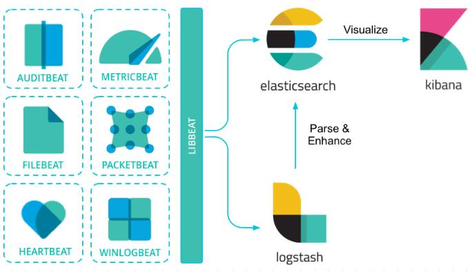
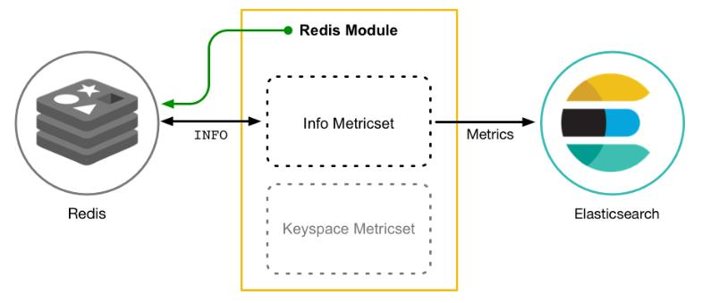

### 1. ElasticStack 的组成

1. **`Beats`**：数据采集
2. **`LogStash`**: 数据处理
3. **`ElasticSearch`**(核心引擎): 数据存储、查询和分析
4. **`Kibana`**: 数据探索与可视化分析
<!-- more -->



### 2. Filebeat

`Filebeat`是本地文件的轻量型日志数据采集器。
`Beats`可以直接（或者通过`Logstash`）将数据发送到`Elasticsearch`，在那里你可以进一步处理和增强数据，然后在`Kibana`中将其可视化。

#### 2.1 Filebeat 工作原理

Filebeat 由两个主要组件组成：`prospector`和`harvester`。这些组件一起工作来读取文件（tail file）并将事件数据发送到您指定的输出

- **`Harvester`**：
    - 负责**读取单个文件**的内容
    - 如果文件在读取时被删除或重命名，`Filebeat`将继续读取文件
- **`prospector`**：
    - `prospector`负责**管理`harvester`**并找到所有要读取的文件来源
    - 如果输入类型为日志，则查找器将查找路径匹配的所有文件，并为每个文件启动一个`harvester`
    - `Filebeat`目前支持两种`prospector`类型：`log`和`stdin`


> - `Filebeat`如何**保持文件的状态**
    >   - `Filebeat` 保存每个文件的状态并经常将状态刷新到磁盘上的注册文件中
>   - 该状态用于记住`harvester`正在读取的最后偏移量，并确保发送所有日志行
>   - 如果输出（例如`Elasticsearch`或`Logstash`）无法访问，`Filebeat`会跟踪最后发送的行，并在输出再次可用时继续读取文件。
>   - 在`Filebeat`运行时，每个`prospector`内存中也会保存的文件状态信息，当重新启动`Filebeat`时，将使用注册文件的数据来重建文件状态，`Filebeat`将每个`harvester`在从保存的最后偏移量继续读取
>   - `Filebeat`存储唯一标识符以检测文件是否先前已采集过

> - `Filebeat`如何**确保至少一次交付**
    >   - `Filebeat`保证事件至少会被传送到配置的输出一次，并且不会丢失数据。 `Filebeat`能够实现此行为，因为它将每个事件的传递状态存储在注册文件中。
>   - 在输出阻塞或未确认所有事件的情况下，`Filebeat`将继续尝试发送事件，直到接收端确认已收到。
>   - 如果`Filebeat`在发送事件的过程中关闭，它不会等待输出确认所有收到事件。
>   - 发送到输出但在`Filebeat`关闭前未确认的任何事件在重新启动`Filebeat`时会再次发送。
>   - 这可以确保每个事件至少发送一次，但最终会将重复事件发送到输出。
>   - 也可以通过设置`shutdown_timeout`选项来配置`Filebeat`以在关闭之前等待特定时间

#### 2.2 Filebeat 安装与配置

安装`Filebeat`，创建配置文件`itcast.yml`，控制台运行测试

```bash
#创建如下配置文件 itcast.yml
filebeat.inputs:
- type: stdin  # 标准输入
  enabled: true
output.console: # 输出到控制台
  pretty: true
  enable: true

#启动filebeat
./filebeat -e -c itcast.yml
```

输入 hello 运行结果如下：

```bash
hello
{
  "@timestamp": "2019-11-23T09:21:19.213Z",
  "@metadata": { #元数据信息
    "beat": "filebeat",
    "type": "_doc",
    "version": "7.4.2" # beat版本
  },
  "host": {
    "name": "chaooo"
  },
  "agent": { },
  "log": {
    "offset": 0,
    "file": {
      "path": ""
    }
  },
  "message": "hello", # 输入的内容
  "input": { # 控制台标准输入
    "type": "stdin"
  },
  "ecs": {
    "version": "1.1.0"
  }
}
```

#### 2.3 读取文件

创建配置文件`itcast-log.yml`

```bash
filebeat.inputs:
- type: log
  enabled: true
  paths:
    - /test/*.log   # 可以使用单个路径
output.console: # 输出到控制台
  pretty: true
  enable: true
#启动filebeat
./filebeat -e -c itcast-log.yml
```

在`/test/`下创建`a.log`文件，并输入如下内容`hello world`,观察`filebeat`输出:

```bash
{
  "@timestamp": "2019-11-23T09:45:56.379Z",
  "@metadata": {
    "beat": "filebeat",
    "type": "_doc",
    "version": "7.4.2"
  },
  "log": {
    "offset": 0,
    "file": {
      "path": "/test/a.log"
    }
  },
  "message": "hello",
  "input": {
    "type": "log"
  },
  "ecs": {
    "version": "1.1.0"
  },
  "host": {
    "name": "chaooo"
  },
  "agent": { }
}
{
  "@timestamp": "2019-11-23T09:45:56.379Z",
  "@metadata": {
    "beat": "filebeat",
    "type": "_doc",
    "version": "7.4.2"
  },
  "host": {
    "name": "chaooo"
  },
  "agent": { },
  "log": {
    "file": {
      "path": "/test/a.log"
    },
    "offset": 7
  },
  "message": "world",
  "input": {
    "type": "log"
  },
  "ecs": {
    "version": "1.1.0"
  }
}
```

#### 2.4 自定义字段

```bash
filebeat.inputs:
- type: log
  enabled: true
  paths:
    - /test/*.log   # 可以使用单个路径
  tags: ["web"] #添加自定义tag，便于后续的处理
  fields: #添加自定义字段
    from: itcast-im
  fields_under_root: true #true为添加到根节点，false为添加到子节点中
output.console: # 输出到控制台
  pretty: true
  enable: true
```

#### 2.5 输出到 Elasticsearch

```bash
filebeat.inputs:
- type: log
  enabled: true
  paths:
    - /test/*.log   # 可以使用单个路径
  tags: ["web"] #添加自定义tag，便于后续的处理
  fields: #添加自定义字段
    from: itcast-im
  fields_under_root: false
setup.template.settings:
  index.number_of_shards: 3 #指定索引的分区数
output.elasticsearch: #指定ES的配置
  hosts: ["192.168.1.7:9200","192.168.1.7:9201","192.168.1.7:9202"]
```

#### 2.6 读取 Nginx 日志文件

```bash
filebeat.inputs:
- type: log
  enabled: true
  paths:
    - /usr/local/nginx/logs/*.log
  tags: ["nginx"]
setup.template.settings:
  index.number_of_shards: 3 #指定索引的分区数
output.elasticsearch: #指定ES的配置
  hosts: ["192.168.1.7:9200","192.168.1.7:9201","192.168.1.7:9202"]
```

#### 2.7 Filebeat 的 Module

日志数据的读取与处理可以不用手动配置的，在`Filebeat`中，有大量的`Module`，可以直接使用简化配置。

```bash
./filebeat modules list
Enabled:

Disabled:
apache
auditd
aws
cef
cisco
coredns
elasticsearch
envoyproxy
googlecloud
haproxy
ibmmq
icinga
iis
iptables
kafka
kibana
logstash
mongodb
mssql
mysql
nats
netflow
nginx
osquery
panw
postgresql
rabbitmq
redis
santa
suricata
system
traefik
zeek
```

可以看到，内置了很多的`module`，但都没有启用，如果需要启用需要进行`enable`操作：

```bash
/filebeat modules enable nginx #启动
./filebeat modules disable nginx #禁用
```

#### 2.8 nginx module 与 filebeat 配置

```bash
- module: nginx
  access:      # Access logs
    enabled: true
    var.paths: ["/usr/local/nginx/logs/access.log*"]
  error:       # Error logs
    enabled: true
    var.paths: ["/usr/local/nginx/logs/error.log*"]
```

```bash
#vim itcast-nginx.yml
filebeat.inputs:
#- type: log
# enabled: true
# paths:
# - /usr/local/nginx/logs/*.log
# tags: ["nginx"]
setup.template.settings:
  index.number_of_shards: 3
output.elasticsearch:
  hosts: ["192.168.40.133:9200","192.168.40.134:9200","192.168.40.135:9200"]
filebeat.config.modules:
  path: ${path.config}/modules.d/*.yml
  reload.enabled: false
```

若启动报错，需要在`Elasticsearch`中安装`ingest-user-agent、ingest-geoip`插件

### 3. Metricbeat

用于从系统和服务**收集指标**。`Metricbeat`和`Filebeat`一样，是一个**轻量级的采集器**，`Metricbeat`由模块(`Module`)和度量集(`Metricset`)组成。`Metricbeat`模块定义了从特定服务（如 Redis，MySQL 等）收集数据的基本逻辑。该模块指定有关服务的详细信息，包括如何连接，收集指标的频率以及要收集的指标。

- `Metricbeat`有 2 部分组成，一部分是`Module`，另一部分为`Metricset`。
- `Module`
    - 收集的对象，如：`mysql、redis、nginx、操作系统`等；
- `Metricset`
    - 收集指标的集合，如：`cpu、memory、network`等；
- 以`Redis Module`为例：
  

#### 3.1 安装配置

安装 Metricbeat，根据实际情况配置文件`metricbeat.yml`

```bash
metricbeat.config.modules:
  path: ${path.config}/modules.d/*.yml
  reload.enabled: false
setup.kibana:
  host: "192.168.56.13:5601"
output.elasticsearch:
  hosts: ["192.168.56.13:9200"]
  username: "elastic"
  password: "qiuyuetao"
```

启动：`./metricbeat -e`
查看`module`列表：`./metricbeat modules list`

```bash
Enabled:
system #默认启用

Disabled:
apache
elasticsearch
nginx
mysql
redis
...
```

`system module`默认启用的，其配置:

```bash
cat system.yml
# Module: system
# Docs: https://www.elastic.co/guide/en/beats/metricbeat/6.5/metricbeat-modulesystem.html
- module: system
  period: 10s
  metricsets:
    - cpu
    - load
    - memory
    - network
    - process
    - process_summary
    #- core
    #- diskio
    #- socket
  process.include_top_n:
    by_cpu: 5 # include top 5 processes by CPU
    by_memory: 5 # include top 5 processes by memory
- module: system
  period: 1m
  metricsets:
    - filesystem
    - fsstat
  processors:
  - drop_event.when.regexp:
    system.filesystem.mount_point: '^/(sys|cgroup|proc|dev|etc|host|lib)($|/)'
- module: system
  period: 15m
  metricsets:
    - uptime
```

#### 3.2 Nginx Module

在 nginx 中，需要开启状态查询，才能查询到指标数据。

```bash
# 配置nginx
location /nginx-status {
    stub_status on;
    access_log off;
}
```

- 通过`192.168.56.13/nginx-status`查看`nginx-status`
    - `Active connections`：正在处理的活动连接数
    - `server accepts handled requests`（连接数，握手数，处理请求总数）
    - `Reading: 0 Writing: 1 Waiting: 1`（ 读取到客户端的 Header 信息数，返回给客户端 Header 信息数，已经处理完正在等候下一次请求指令的驻留链接）

配置`Nginx Module（metricbeat/modules.d/nginx.yml）`

```bash
- module: nginx
  metricsets: ["stubstatus"]
  period: 10s
  # Nginx hosts
  hosts: ["http://192.168.56.11"]
  # Path to server status. Default server-status
 server_status_path: "nginx_status"
```

启动：`./metricbeat -e`

### 4. Logstash

`Logstash`是`ElasticStack`中的实时数据采集引擎，可以采集来自不同数据源的数据，并对数据进行处理后输出到多种输出源，是`Elastic Stack`的重要组成部分。


#### 4.1 Logstash 的数据处理过程

- `Inputs(Codecs)-->Filters-->Outputs(Codecs)`
    - 用户通过定义`pipeline`配置文件，设置需要使用的`input`，`filter`，`output`, `codec`插件，以实现特定的数据采集，数据处理，数据输出等功能

1. `Inputs`：用于从数据源获取数据，常见的插件如`file, syslog, redis, beats`等
2. `Filters`：用于处理数据如格式转换，数据派生等，常见的插件如`grok, mutate, drop, clone, geoip`等
3. `Outputs`：用于数据输出，常见的插件如`elastcisearch，file, graphite, statsd`等
4. `Codecs`：`Codecs`不是一个单独的流程，而是在输入和输出等插件中用于数据转换的模块，用于对数据进行编码处理，常见的插件如`json，multiline`

#### 4.2 执行模型

1. 每个`Input`启动一个线程，从对应数据源获取数据
2. `Input`会将数据写入一个队列：默认为内存中的有界队列（意外停止会导致数据丢失）。为了防止数丢失`Logstash`提供了两个特性：
    - `Persistent Queues`：通过磁盘上的`queue`来防止数据丢失
    - `Dead Letter Queues`：保存无法处理的`event`（仅支持`Elasticsearch`作为输出源）
3. `Logstash`会有多个`pipeline worker`, 每一个`pipeline worker`会从队列中取一批数据，然后执行`filter`和`output`（`worker`数目及每次处理的数据量均由配置确定）

#### 4.3 安装配置

下载`Logstash`并解压，配置有三部分，如下：

```bash
input { #输入
stdin { ... } #标准输入
}
filter { #过滤，对数据进行分割、截取等处理
...
}
output { #输出
stdout { ... } #标准输出
}
```

#### 4.4 读取自定义日志

1. 日志结构：`2019-11-23 21:21:21|ERROR|读取数据出错|参数：id=1002`，日志中的内容是使用`“|”`进行分割的，使用，我们在处理的时候，也需要对数据做分割处理。
2. 编写配置文件

```bash
#vim itcast-pipeline.conf
input {
  file {
    path => "/itcast/logstash/logs/app.log"
    start_position => "beginning"
  }
}
filter {
  mutate {
    split => {"message"=>"|"}
  }
}
output {
  stdout { codec => rubydebug }
}
```

3. 启动测试

```bash
#启动
./bin/logstash -f ./itcast-pipeline.conf
#写日志到文件
echo "2019-11-23 21:21:21|ERROR|读取数据出错|参数：id=1002" >> app.log
#输出的结果
{
  "@timestamp" => 2019-03-15T08:44:04.749Z,
        "path" => "/itcast/logstash/logs/app.log",
    "@version" => "1",
        "host" => "node01",
     "message" => [
        [0] "2019-11-23 21:21:21",
        [1] "ERROR",
        [2] "读取数据出错",
        [3] "参数：id=1002"
     ]
}
```

4. 输出到`Elasticsearch`配置

```bash
output {
  elasticsearch {
    hosts => [ "192.168.40.133:9200","192.168.40.134:9200","192.168.40.135:9200"]
  }
}
```

### 5. Elasticsearch + Logstash + Beats + Kibana 基础整合

```bash
           (读取)          (发送)           (写入)                (读取)
「日志文件」<----「FileBeat」---->「Logstash」---->「Elasticsearch」<----「Kibana」

```

1. `Filebeat`配置与启动：

```bash
#vim itcast-dashboard.yml
filebeat.inputs:
- type: log
  enabled: true
  paths:
    - /itcast/logs/*.log
setup.template.settings:
  index.number_of_shards: 3
output.logstash:
  hosts: ["192.168.40.133:5044"] #Logstash端口号

#启动
./filebeat -e -c itcast-dashboard.yml
```

2. `Logstash`配置与启动：

```bash
#vim itcast-dashboard.conf
input {
  beats {
    port => "5044"
  }
}
filter {
  mutate {
    split => {"message"=>"|"}
  }
  mutate {
    add_field => {
      "userId" => "%{message[1]}"
      "visit" => "%{message[2]}"
      "date" => "%{message[3]}"
      }
    }
    mutate {
      convert => {
        "userId" => "integer"
        "visit" => "string"
        "date" => "string"
      }
    }
  }
output {
  elasticsearch {
    hosts => [ "192.168.40.133:9200","192.168.40.134:9200","192.168.40.135:9200"]
  }
}

#启动
./bin/logstash -f itcast-dashboard.conf
```

3. `ElasticSearch`启动与`Kibana`启动：

```bash
# ElasticSearch默认端口:9200
bin/elasticsearch
# kibana默认端口:5601
bin/kibana
#通过浏览器进行访问,添加Logstash索引到Kibana中
http://192.168.40.133:5601
```
