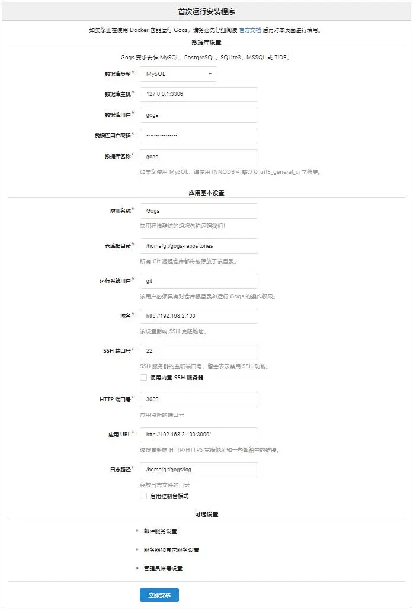

### 1. 创建gogs用户

为Gogs创建一个MySQL用户`gogs` <!-- more -->
``` shell
#先创建一个MySQL用户
use mysql;
create user 'gogs'@'localhost' identified by 'J5p";~OVazNl%y)?';
 
#再进行授权
grant all privileges on *.* to 'gogs'@'%'  IDENTIFIED BY 'J5p";~OVazNl%y)?' with grant option;
flush privileges;
```

为Gogs创建一个系统用户`git`
``` shell
# 创建一个用户
[root@localhost ~]# useradd -mU git -s /bin/bash
[root@localhost ~]# passwd git
# 切换到git用户
[root@localhost ~]# su git
[git@localhost ~]$ cd /home/git
```


### 2. 下载安装

下载Gogs二进制安装包
``` shell
wget https://dl.gogs.io/0.12.3/gogs_0.12.3_linux_amd64.tar.gz
# 解压安装包
tar -zxvf gogs_0.12.3_linux_amd64.tar.gz
```

使用Gogs脚本创建gogs数据库
``` sql
# 切换目录到gogs脚本文件夹
cd /home/git/gogs/scripts/

# 使用mysql.sql创建gogs数据库，这里会要求输入密码
mysql -u root -p < mysql.sql

# 假如执行这条命令会报错【ERROR 1115 (42000) at line 2: Unknown character set: 'utf8mb4'】的话继续执行下面这个可选操作,在重新执行上面的命令。
# 修改mysql.sql
vim mysql.sql
/*************** 原文 ***************/
DROP DATABASE IF EXISTS gogs;
CREATE DATABASE IF NOT EXISTS gogs CHARACTER SET utf8mb4 COLLATE utf8mb4_general_ci;
/*************** 修改为 *************/
DROP DATABASE IF EXISTS gogs;
CREATE DATABASE IF NOT EXISTS gogs CHARACTER SET utf8 COLLATE utf8_general_ci;
/*************** 结束 ***************/
```

开放端口：
``` shell
firewall-cmd --zone=public --add-port=3000/tcp --permanent
firewall-cmd --reload
```

启动Gogs服务
``` shell
/home/git/gogs/gogs web
```

访问Gogs网站 `http://你的服务器IP:3000`



填写正确的配置信息，点击 “`立即安装`”


### 3. 配置开机自启动

配置Gogs服务自启动
``` shell
# 关闭gogs服务
ctrl + c 
# 切换到root用户
su root
cp /home/git/gogs/scripts/systemd/gogs.service /usr/lib/systemd/system/
systemctl enable gogs.service
systemctl start gogs.service
```

若CentOS 8开机启动gogs失败，先禁用SELinux:
``` shell
vim /etc/selinux/config
```

将SELinux属性设置为Disabled，如下所示：
``` shell
# This file controls the state of SELinux on the system.
# SELINUX= can take one of these three values:
#    enforcing - SELinux security policy is enforced.
#    permissive - SELinux prints warnings instead of enforcing.
#    disabled - No SELinux policy is loaded.
SELINUX=disabled
# SELINUXTYPE= can take one of these three values:
#    targeted - Targeted processes are protected,
#    minimum - Modification of targeted policy. Only selected processes are protected.
#    mls - Multi Level Security protection.
SELINUXTYPE=targeted
```

重启系统：
``` shell
reboot
```