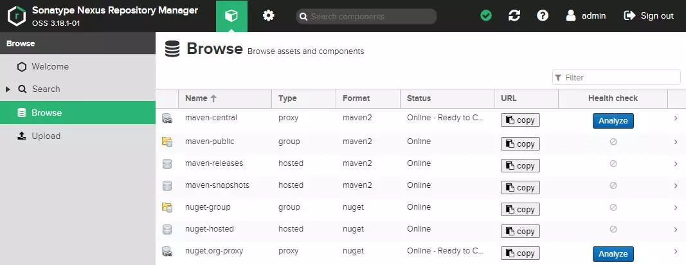
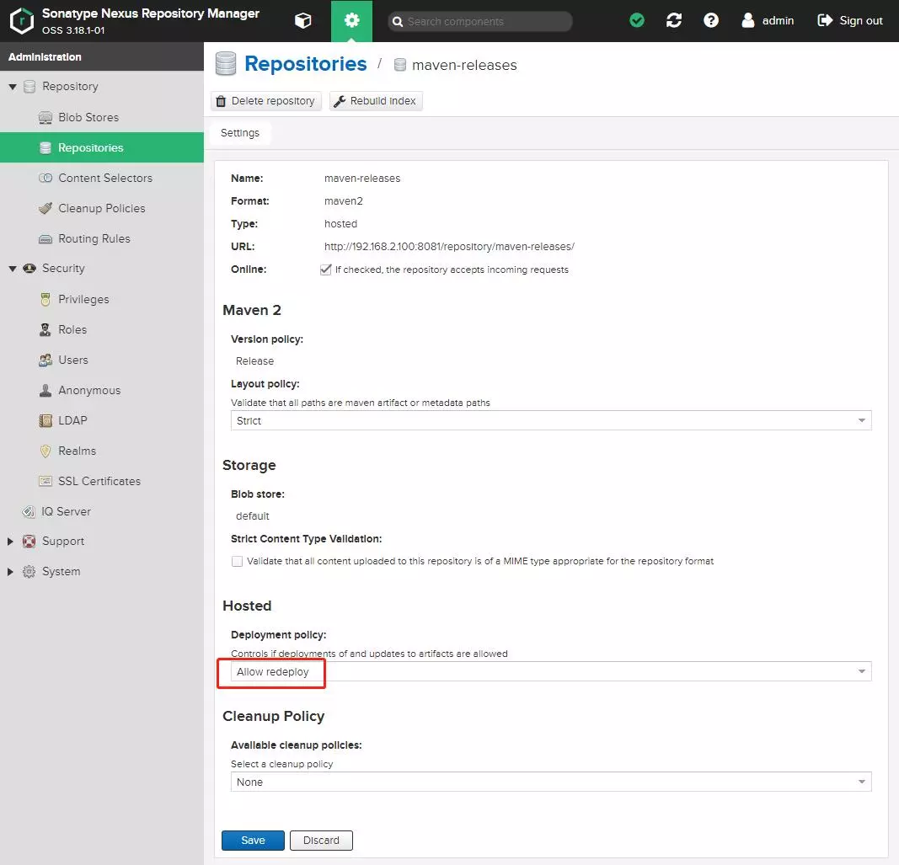
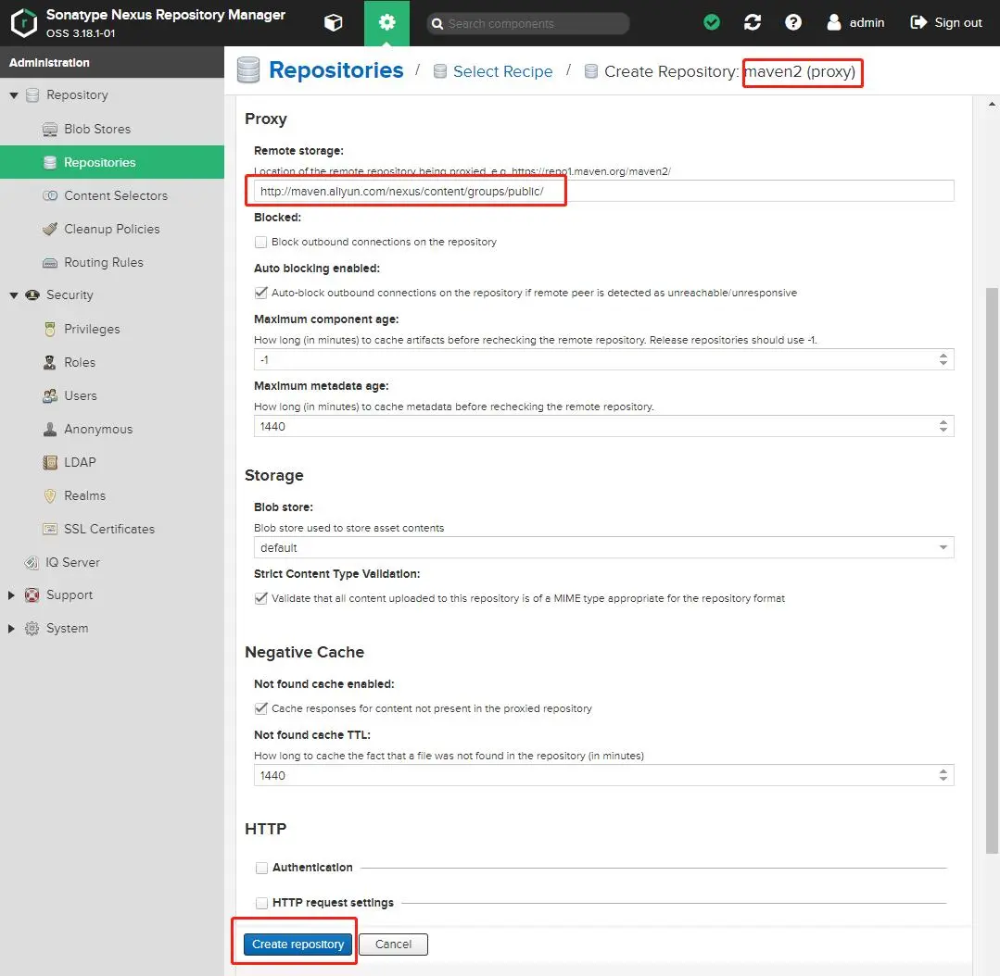
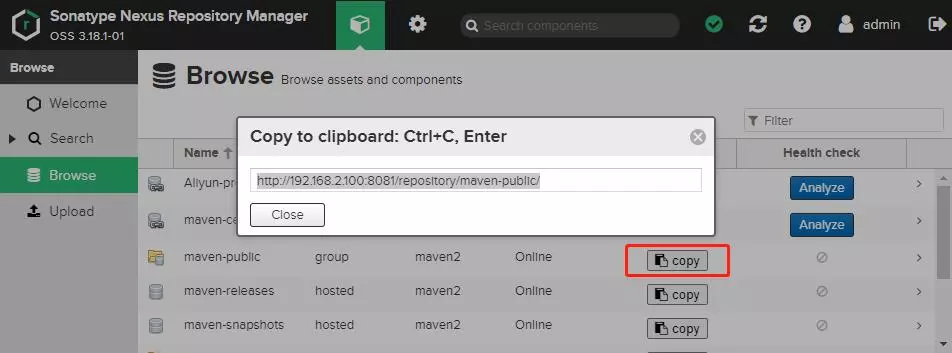

**Maven私服** 就是在内网架设一个`Maven仓库服务器`，在代理远程仓库的同时维护本地仓库。
当我们需要下载一些构件（artifact）时，如果本地仓库没有，再去私服下载，私服没有，再去中央仓库下载。

**Nexus**是一个专门的 Maven仓库管理软件。它提供了强大的仓库管理功能，构件搜索功能；
它占用较少的内存，基于REST，基于简单文件系统而非数据库。


### 1. 安装Nexus服务
#### 1.1 前置条件：`jdk1.8环境 `
#### 1.2 下载Nexus

``` shell
wget https://sonatype-download.global.ssl.fastly.net/repository/repositoryManager/3/nexus-3.18.1-01-unix.tar.gz
```

下载失败的话，可以试试这个：
```
百度云: https://pan.baidu.com/s/16IfFUtL3W0YGciS-XPlPfQ
提取码: naxi 
```

#### 1.3 安装Nexus
解压到安装目录（`/data/apps/nexus/`），会得到两个文件夹：nexus-3.18.1-01（nexus 服务目录）、sonatype-work（私有库目录）。
``` shell
[root@localhost ~]# mkdir -p /data/apps/nexus/
[root@localhost ~]# mv nexus-3.18.1-01-unix.tar.gz /data/apps/nexus/nexus-3.18.1-01-unix.tar.gz
[root@localhost ~]# cd /data/apps/nexus/
[root@localhost nexus]# tar -zvxf nexus-3.18.1-01-unix.tar.gz
[root@localhost nexus]# ls
nexus-3.18.1-01  nexus-3.18.1-01-unix.tar.gz  sonatype-work
```

进入 nexus-3.18.1-01 文件夹，其中 etc/nexus-default.properties 文件配置端口（默认为 8081）和 work 目录信息，可以按需修改。

#### 1.4 开放端口并启动服务
``` shell
[root@localhost nexus-3.18.1-01]# firewall-cmd --zone=public --add-port=8081/tcp --permanent && firewall-cmd --reload
[root@localhost nexus-3.18.1- /data/apps/nexus/nexus-3.18.1-01/bin
[root@localhost bin]# ./nexus start
WARNING: ************************************************************
WARNING: Detected execution as "root" user.  This is NOT recommended!
WARNING: ************************************************************
Starting nexus
```

首次启动，初始账号为：`admin`，查看初始密码：
``` shell
[root@localhost bin]# cat /data/apps/nexus/sonatype-work/nexus3/admin.password
e6c47f75-dc91-4f87-a2a9-0188df6e4b7c
```


### 2. 配置Nexus
#### 2.1 登录Nexus
Nexus服务启动以后，使用浏览器访问`http://IP:8081/`，并用初始账号密码登录，登陆后会让我们先修改初始密码。



仓库浏览在左侧菜单栏`Browse`，这里有多种仓库：
1. `maven-central`：maven 中央库，默认从 https://repo1.maven.org/maven2/ 拉取 jar
2. `maven-releases`：私库发行版 jar，初次安装请将 Deployment policy 设置为 Allow redeploy
3. `maven-snapshots`：私库快照（调试版本）jar
4. `maven-public`：仓库分组，把上面三个仓库组合在一起对外提供服务，在本地 maven 基础配置 settings.xml 或项目 pom.xml 中使用

+ 仓库类型说明：
    * `group`：这是一个仓库聚合的概念，用户仓库地址选择 Group 的地址，即可访问 Group 中配置的，用于方便开发人员自己设定的仓库。maven-public 就是一个 Group 类型的仓库，内部设置了多个仓库，访问顺序取决于配置顺序，3.x 默认为 Releases、Snapshots、Central，当然你也可以自己设置。
    * `hosted`：私有仓库，内部项目的发布仓库，专门用来存储我们自己生成的 jar 文件
    * `snapshots`：本地项目的快照仓库
    * `releases`： 本地项目发布的正式版本
    * `proxy`：代理类型，从远程中央仓库中寻找数据的仓库（可以点击对应的仓库的 Configuration 页签下 Remote Storage 属性的值即被代理的远程仓库的路径），如可配置阿里云 maven 仓库
    * `central`：中央仓库

#### 2.2 设置
1. 配置Releases版本可重复上传: `Deployment pollcy --> Allow redeploy`。



2. 增加一个代理仓库，使用的是阿里云公共仓库。首先点击`Create repository`按钮开始创建一个仓库，类型选择 maven2（proxy）。


3. 配置阿里云地址`http://maven.aliyun.com/nexus/content/groups/public/`，并创建。



4. 阿里云代理仓库创建完毕后，我们编辑`maven-public`，将其添加到放入`group`中，并调整优先级，然后保存。


5. 点击maven-public条目的`copy`按钮即可拷贝私服地址




### 3. Maven配置使用私服
#### 3.1 使用配置（下载依赖）
两种方式：①通过`Maven`的`setting.xml`文件配置（全局模式），②通过`项目`的`pom.xml`文件配置（项目独享模式）。
> 注意：若`pom.xml`和`setting.xml`同时配置了，以`pom.xml`为准。

1. 全局模式：通过`Maven`的`setting.xml`文件配置

``` xml
<mirrors>
    <mirror>
        <!--该镜像的唯一标识符。id用来区分不同的mirror元素。 -->
        <id>maven-public</id>
        <!--镜像名称 -->
        <name>maven-public</name>
        <!--*指的是访问任何仓库都使用我们的私服-->
        <mirrorOf>*</mirrorOf>
        <!--该镜像的URL。构建系统会优先考虑使用该URL，而非使用默认的服务器URL。 -->
        <url>http://192.168.2.100:8081/repository/maven-public/</url>     
    </mirror>
</mirrors>
```

2. 项目独享模式：通过`项目`的`pom.xml`文件配置

``` xml
<repositories>
    <repository>
        <id>maven-nexus</id>
        <name>maven-nexus</name>
        <url>http://192.168.2.100:8081/repository/maven-public/</url>
        <releases>
            <enabled>true</enabled>
        </releases>
        <snapshots>
            <enabled>true</enabled>
        </snapshots>
    </repository>
</repositories>
```


#### 3.2 发布配置（发布依赖）
1. 修改`setting.xml`文件，指定`releases`和`snapshots server`的用户名和密码：

``` xml
<servers>
    <server>
        <id>releases</id>
        <username>admin</username>
        <password>456</password>
    </server>
    <server>
        <id>snapshots</id>
        <username>admin</username>
        <password>123456</password>
    </server>
</servers>
```

2. 在发布依赖项目的`pom.xml`文件中加入`distributionManagement`节点（这里`repository id`需要和上一步里的`server id`名称保持一致）：

``` xml
<distributionManagement>
    <repository>
        <id>releases</id>
        <name>Releases</name>
        <url>http://192.168.2.100:8081/repository/maven-releases/</url>
    </repository>
    <snapshotRepository>
        <id>snapshots</id>
        <name>Snapshot</name>
        <url>http://192.168.2.100:8081/repository/maven-snapshots/</url>
    </snapshotRepository>
</distributionManagement>
```

3. 执行`mvn deploy`命令发布。
4. 登录`Nexus`，查看对应的仓库就能看到发布的依赖包了。

> 发布到的仓库说明：
> ①若项目版本号末尾带有`-SNAPSHOT`，则会发布到`snapshots`快照版本仓库。
> ②若项目版本号末尾带有`-RELEASES`或什么都不带，则会发布到`releases`正式版本仓库。


### 4. 设置Nexus开机自启
``` shell
vim /usr/lib/systemd/system/nexus.service
``` 

`nexus.service`：
``` shell
[Unitt]
Description=nexus service
After=network.target

[Service]
Type=forking
ExecStart=/data/apps/nexus/nexus-3.18.1-01/bin/nexus start
ExecReload=/data/apps/nexus/nexus-3.18.1-01/bin/nexus restart
ExecStop=/data/apps/nexus/nexus-3.18.1-01/bin/nexus stop

[Install]
WantedBy=multi-user.target
```

``` shell
# 开启开机启动
systemctl enable nexus.service
# 启动服务
systemctl start nexus.service
# 停止服务
systemctl stop nexus.service
``` 
