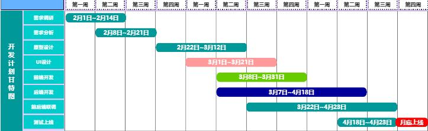
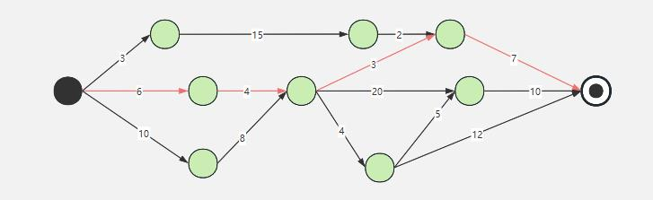

软件工程涵盖了软件开发的全生命周期、方法、模型、工具和原则。
**软件生命周期**：需求分析、设计、编码、测试、维护。

## 一、软件开发模型
软件开发模型：是指开发软件的过程中所采用的一种规范化方法或框架。常见的软件开发模型：
1. **瀑布模型（Waterfall Model）**：阶段明确，依次进行需求分析、设计、编码、测试、维护。（顺序性开发，阶段依赖前一阶段的结果）
   - **优点**：简单易用，适合需求明确的项目。
   - **缺点**：难以应对需求变化，后期修改成本高。
   - **关键词**: 依赖前一阶段、文档驱动、较小规模、需求明确、修复问题晚、用户参与低、需求变化会延期。
2. **迭代模型（Iterative Model）**：将整个项目分为多个迭代，每个迭代都是一个完整的开发周期。
   - **优点**：能够逐步完善系统，适应需求变化，降低风险。
   - **缺点**：需要良好的项目管理，迭代之间的协调复杂。
3. **增量模型（Incremental Model）**：将系统分为多个增量，每个增量都是一个可交付的产品部分。（第一个增量是核心）
   - **优点**：早期交付部分功能，用户反馈及时，风险分散。
   - **缺点**：需要良好的架构设计，增量之间的集成可能复杂。
4. **演化模型 (Evolutionary Model)**：迭代过程，逐步演化出更完整的软件版本。（从核心功能开始，逐步扩展和优化）
   - **优点**：灵活性强，能够适应需求变化，用户反馈及时，适合探索性项目。
   - **缺点**：需求不明确，需要良好的架构设计，可能导致系统结构不够清晰，管理复杂。
5. **螺旋模型（Spiral Model）**：结合瀑布模型和迭代模型，强调风险分析。（适用于大型、复杂度高、风险高的系统，对小型项目可能过于繁琐）
   - **优点**：适合大型复杂项目，风险控制能力强。
   - **缺点**：成本高，管理复杂。
6. **敏捷开发（Agile Development）**：强调快速响应变化（快速迭代、持续交付、客户参与和团队协作），通过短周期迭代交付可用的软件。（常用方法：Scrum、极限编程（XP）、Kanban等）
   - **优点**：适应需求变化，客户参与度高，团队协作紧密。
   - **缺点**：对团队要求高，文档较少，不适合大型复杂项目。
7. **V模型 (V-Model)** 瀑布模型变种，开发与测试过程平行。（适用场景: 需求明确且变更不频繁）
   - **优点**: 强调测试，提供明确的开发和测试框架。
   - **缺点**：灵活性差，难以应对需求变更。
8. **原型模型 (Prototype Model)**：创建快速原型，动态纳入用户需求。（需求不明确且经常变化）
   - **优点**: 实际可行，构造方便、快速，造价低。
   - **关键词**: 原型方法、经常变化、需求不明确。
9. **喷泉模型 (Fountain Model)**：面向对象，迭代性和无间隙性。（核心思想是迭代和并行开发）
   - **优点**: 灵活性高、并行开发、面向对象（强调组件重用）、迭代性（循环迭代的，每个阶段都可以反复进行）
   - **缺点**: 阶段划分不明确，对团队能力要求高，文档较少，管理复杂。
10. **统一过程模型 (Unified Process, UP)**：以用例和风险为驱动，以架构为中心，迭代和增量开发。（高可靠性的中大型复杂项目，如金融、医疗等）
    - **优点**: 迭代和增量开发，使用UML支持开发过程。
    - **缺点**：管理复杂，文档较多，适合经验丰富的团队。
11. **RAD模型（Rapid Application Development）**：强调快速开发，通过重用组件和工具来加速开发过程。
    - **优点**：开发速度快，适合中小型项目。
    - **缺点**：需要成熟的工具和组件库，不适合复杂项目。
12. **DevOps模型**：强调开发（Development）和运维（Operations）的紧密协作，实现持续集成和持续交付。
    - **优点**：提高交付速度，增强系统稳定性，自动化程度高。
    - **缺点**：需要文化变革，工具链复杂，初期投入大。
13. **混合模型（Hybrid Model）**：结合多种模型的优点，根据项目需求灵活选择开发方法。
    - **优点**：灵活适应不同项目需求，综合多种模型的优势。
    - **缺点**：需要丰富的经验和良好的项目管理能力。

## 二、需求工程
需求工程主要是通过**收集、分析和规范**用户的需求，为后续的软件设计、开发和测试提供明确的方向。包括:需求收集、需求分析、需求验证、需求管理等主要步骤。
1. 需求获取（Requirements Elicitation）：从利益相关者（如用户、客户等）那里收集，通过访谈、问卷、观察、头脑风暴、用例分析等，利益相关者可能无法准确表达需求，可能不同利益相关者存在需求冲突等挑战。
2. **需求分析（Requirements Analysis）**：对收集到的需求进行分析，明确其优先级、可行性和一致性。
   - 分类需求 -> 优先级排序 -> 解决冲突 -> 建立需求模型（如使用UML等工具） -> 输出（明确的需求列表、需求模型（用例图、活动图等））。
3. 需求规格说明（Requirements Specification）：将分析后的需求以文档形式详细记录（应清晰、准确、无歧义、可验证，便于后续测试），形成**需求规格说明书（SRS）**，内容包括：
   - **功能需求**：描述系统应提供的功能。
   - **非功能需求**：描述系统的性能、安全性、可用性等约束。
   - **系统接口**：描述系统与其他系统或组件的交互方式。
   - **约束条件**：描述技术、法律、业务等方面的限制。
4. 需求验证（Requirements Validation）：确保需求文档准确、完整，并符合利益相关者的期望。可通过评审、原型验证、测试用例设计等方法输出经过验证的需求文档。
5. 需求管理（Requirements Management）：在项目开发过程中管理需求的变更和跟踪。包括：变更控制、需求跟踪、版本控制，可使用需求管理工具（如JIRA、DOORS等）辅助管理。

### 2.1 需求分析
需求分析方法：面向数据流的结构化分析方法(SA)、面相对象的分析方法(OOA)。
1. **面向数据流的结构化分析方法（SA）**：将系统视为**数据流**的处理过程，强调数据的输入、处理和输出。通过**分解**和**抽象**的方式，将复杂系统分解为更小的、易于理解的模块，自顶向下、逐步分解。
    - 主要工具：
        - **数据流图（Data Flow Diagram, DFD）**：描述系统中数据的流动和处理过程。
            - **外部实体**：与系统交互的外部对象（如用户、其他系统）。
            - **数据流**：数据在系统中的流动方向。
            - **处理过程**：对数据的处理操作。
            - **数据存储**：系统中存储数据的地方（如数据库、文件）。
        - **数据字典（Data Dictionary）**：定义系统中使用的所有数据项及其属性。
            1. 数据项(Data ltem):最基本的数据组成单元。
            2. 数据结构(Data Structure):由一组相关数据项构成的集合或复合数据类型，
            3. 数据流(Data Flow):在系统内从一个加工到另一个加工传输的数据。
            4. 数据存储(Data Store):也称为文件或数据库，是暂时或永久存放数据的地方
            5. 加工(Process/Transformation):对数据进行处理的动作或活动(做什么)，不需要给出加工细节
        - **状态转换图（State Transition Diagram）**：描述系统状态的变化。
        - **实体关系图（Entity-Relationship Diagram, ERD）**：描述系统中的数据实体及其关系。
    - 分析步骤：
        1. **需求获取**：收集系统的功能需求和数据需求。
        2. **绘制数据流图**：描述系统的数据流动和处理过程。
        3. **定义数据字典**：详细描述数据流和数据存储。
        4. **功能分解**：将系统分解为多个功能模块。
        5. **验证需求**：通过评审和原型验证需求的正确性。
2. **面向对象的分析方法（OOA）**：将系统视为**对象**的集合，强调对象之间的交互和协作。使用**对象模型**描述系统的静态结构和动态行为。
    - 主要工具：
        - **用例图（Use Case Diagram）**：描述系统的功能需求及其与用户的交互。
        - **类图（Class Diagram）**：描述系统中的类及其关系（如继承、关联、聚合等）。
        - **对象图（Object Diagram）**：描述系统中对象的实例及其关系。
        - **活动图（Activity Diagram）**：描述系统的业务流程和操作流程。
        - **顺序图（Sequence Diagram）**：描述对象之间的交互顺序。
        - **状态图（State Diagram）**：描述对象的状态变化。
    - 分析步骤：
       1. **需求获取**：收集系统的功能需求和非功能需求。
       2. **识别对象和类**：从需求中识别系统中的对象和类。
       3. **建立对象模型**：使用类图、用例图等工具描述系统的静态结构和动态行为。
       4. **验证需求**：通过评审和原型验证需求的正确性。

| 特性                | **面向数据流的结构化分析方法（SA）**       | **面向对象的分析方法（OOA）**             |
|---------------------|-------------------------------------------|-------------------------------------------|
| **核心思想**          | 强调数据流和功能分解。                    | 强调对象及其交互。                        |
| **主要工具**          | 数据流图、数据字典、实体关系图。           | 用例图、类图、顺序图、活动图。            |
| **适用场景**          | 数据处理系统、需求明确的系统。             | 复杂交互系统、需求可能变化的系统。         |
| **优点**            | 结构清晰，工具简单，适合中小型项目。       | 支持复杂交互，适应需求变化，便于重用和扩展。 |
| **缺点**            | 难以处理复杂交互，对需求变化的适应性差。   | 工具和概念复杂，学习成本高。               |
| **开发方法**          | 适合结构化开发方法。                      | 适合面向对象的开发方法。                  |

## 三、 软件设计
**软件设计**是将需求转化为可实现的系统架构和模块的过程。通常分为两个主要阶段：**概要设计（High-Level Design, HLD）**和**详细设计（Low-Level Design, LLD）**。
1. **设计原则**：
   - **高内聚低耦合**：模块内部功能紧密相关，模块之间依赖较少。
   - **开闭原则**：对扩展开放，对修改关闭。
   - **单一职责原则**：一个类只负责一个功能。
2. **设计模式**：
   - **创建型模式**：单例模式、工厂模式。
   - **结构型模式**：适配器模式、装饰器模式。
   - **行为型模式**：观察者模式、策略模式。
3. **UML 建模**：
   - **类图（Class Diagram）**：描述类的静态结构。
   - **时序图（Sequence Diagram）**：描述对象之间的交互顺序。
   - **用例图（Use Case Diagram）**：描述系统功能与外部实体的交互。
4. 概要设计与详细设计的对比：

| **特性**                | **概要设计（HLD）**                        | **详细设计（LLD）**                        |
|-------------------------|-------------------------------------------|-------------------------------------------|
| **目标**                | 定义系统整体架构和模块划分。               | 定义模块的具体实现细节。                   |
| **主要内容**            | 系统架构、模块划分、接口设计、数据设计。   | 类设计、算法设计、数据库设计、接口实现。   |
| **输出**                | 概要设计文档、技术选型报告。               | 详细设计文档、伪代码或代码框架。           |
| **抽象级别**            | 高层次的抽象，关注系统整体结构。           | 低层次的细节，关注模块的具体实现。         |
| **适用阶段**            | 需求分析之后，详细设计之前。               | 概要设计之后，编码之前。                   |

## 四、软件测试
1. **测试类型**：
   - **单元测试**：测试单个模块的功能。
   - **集成测试**：测试模块之间的接口。
   - **系统测试**：测试整个系统的功能和非功能需求。
   - **验收测试**：由用户进行，确认系统是否符合需求。
2. **测试方法**：
   - **黑盒测试**：不关注内部结构，测试输入输出是否符合预期。
      - 常用技术：等价类划分、边界值分析。
   - **白盒测试**：关注内部逻辑，测试代码覆盖情况。
      - 常用技术：路径覆盖、条件覆盖。
3. **测试工具**：
   - JUnit（单元测试）、Selenium（自动化测试）。

## 五、软件维护
1. **维护类型**：
   - **改正性维护**：修复软件中的错误。
   - **适应性维护**：使软件适应新的环境。
   - **完善性维护**：改进软件的功能或性能。
   - **预防性维护**：预防未来可能出现的问题。
2. **维护过程**：
   - 问题识别、分析、修改、测试、交付。

## 六、软件质量保证
1. **质量模型**：
   - **ISO/IEC 9126**（质量模型标准）：功能性、可靠性、易用性、效率、可维护性、可移植性。
2. **质量保证活动**：
   - 代码审查、测试、配置管理。
3. **CMMI（能力成熟度模型集成）**：
   - 初始级、可重复级、已定义级、已管理级、优化级。

ISO/IEC 9126 是国际标准化组织（ISO）和国际电工委员会（IEC）联合制定的软件质量模型标准，用于评估软件产品的质量。该模型将软件质量分为六个主要特性，其中**可靠性（Reliability）和可维护性（Maintainability）**是两个重要的质量特性。
| 特性对比               | **可靠性（Reliability）**                  | **可维护性（Maintainability）**            |
|-----------------------|-------------------------------------------|-------------------------------------------|
| **定义**                | 软件在规定条件下完成规定功能的能力。       | 软件被修改、修复和改进的容易程度。         |
| **关注点**              | 软件的稳定性和容错能力。                   | 软件的可理解性、可修改性和可测试性。       |
| **子特性**              | 成熟性、容错性、可恢复性。                 | 可分析性、可修改性、稳定性、可测试性。     |
| **评估指标**            | 平均无故障时间、故障率、恢复时间。         | 修复缺陷的平均时间、代码复杂度、文档完整性。 |
| **示例**                | 在线支付系统在高并发下稳定运行。           | 电商系统具有清晰的代码结构和自动化测试。   |

## 七、 甘特图 和 PERT图
- 甘特图（Gantt Chart）是一种条形图，用于显示项目的进度计划。甘特图能清晰地描述每个任务从什么时候开始，到什么时候结束，以及任务之间的并行关系。但它不能清晰地反应出任务之间的依赖关系。
- PERT图（Program Evaluation and Review Technique）是一种网络图，用于展示项目中各个任务之间的依赖关系，并帮助识别关键路径。它特别适用于那些活动时间不确定且需要精确估计完成时间的复杂项目。

| **甘特图（Gantt Chart）** | **PERT图（Program Evaluation and Review Technique）**   |
|-------|------------------------------------------------------|
|  |                          |

**示例**：通过 PERT图 计算某个事件最晚开始时间。
- 假设我们有一个简单的PERT图，包含以下任务：任务A(持续时间=5天)、任务B(持续时间=4天)、任务C(持续时间=6天)、任务D(持续时间=3天)
- 任务之间的依赖关系如下：
    - 任务A完成后，任务B和任务C可以开始
    - 任务B和任务C完成后，任务D可以开始
    - 任务D完成后，项目结束
- 计算步骤：
  1. 确定项目的总工期：
      - 路径`A -> B -> D`= `5 + 4 + 3` = `12` 天
      - 路径`A -> C -> D`= `5 + 6 + 3` = `14` 天
      - 因此，项目的总工期为 **`14`** 天
  2.  从后向前计算**最晚完成时间**（Late Finish, LF）
      - 例如：`任务D`的LF = `14`
      - 例如：`任务B`的LF = `14 - D` = `11`
      - 例如：`任务C`的LF = `14 - D` = `11`
      - 例如：`任务A`的LF = `min(11-B,11-C)` = `min(7,5)` = `5`
  3.  计算**最晚开始时间**（Late Start, LS）= `LF - 该任务持续时间`
      - 例如：`任务D`的LS = `14 - 3` = `11`
      - 例如：`任务B`的LS = `11 - 4` = `7`
      - 例如：`任务C`的LS = `11 - 6` = `5`
      - 例如：`任务A`的LS = `5 - 5` = `0`

## 八、 数据流图
数据流图(Data Flow Diagram，DFD)是一种图形工具，用于描述数据在信息系统中的流动和处理过程。它能够反映系统的功能需求信息交流以及数据处理过程，是系统分析和设计的重要工具之一。
建模时应遵循的原则是:**自顶向下、从抽象到具体**。
- 主要组成部分
   - **外部实体（External Entity）**：系统外部的实体，如用户、其他系统或设备，它们与系统进行数据交互。通常用矩形表示。
   - **过程（Process）**：系统内部对数据进行处理的功能或操作。通常用圆角矩形或圆形表示。
   - **数据存储（Data Store）**：系统中用于存储数据的部分，如数据库或文件。通常用两条平行线表示。
   - **数据流（Data Flow）**：数据在系统中的流动路径，表示数据从一个组件流向另一个组件。通常用箭头表示。

- 层次结构：（DFD 通常分为多个层次，从高层次到低层次逐步细化）
  - **上下文图（Context Diagram）**：最高层次的DFD，展示系统与外部实体之间的交互。
  - **0层图（Level 0 Diagram）**：展示系统的主要过程和它们之间的数据流。
  - **1层图（Level 1 Diagram）**：对0层图中的每个过程进行进一步分解，展示更详细的数据流和处理步骤。
  - **更低层次的DFD**：根据需要，继续分解1层图中的过程，直到每个过程都足够简单和明确。

- 绘制规则
  - **数据流必须有明确的来源和去向**：数据流不能凭空产生或消失。
  - **过程必须有输入和输出**：每个过程至少有一个输入数据流和一个输出数据流。
  - **数据存储必须有数据流入和流出**：数据存储不能孤立存在，必须有数据流入和流出。
  - **外部实体不能直接交互**：外部实体之间不能直接交换数据，必须通过系统进行。

- 优点与局限性：
  1. 优点
     - **直观易懂**：图形化表示使得系统的数据流动和处理过程一目了然。
     - **便于沟通**：帮助开发团队、业务分析师和用户之间更好地沟通和理解系统需求。
     - **支持系统分析**：通过分解和细化，帮助发现系统中的潜在问题和改进点。
  2. 局限性
     - **不展示控制流**：DFD 主要关注数据流，不展示系统中的控制流或时序信息。
     - **不适合复杂系统**：对于非常复杂的系统，DFD 可能会变得过于庞大和难以管理。
     - **缺乏细节**：DFD 主要展示高层次的数据流动，不涉及具体的实现细节。

- 应用场景
  - **系统分析与设计**：在系统开发初期，用于理解和定义系统需求。
  - **业务流程建模**：用于分析和优化业务流程中的数据流动。
  - **文档化系统**：作为系统文档的一部分，帮助后续维护和升级。

