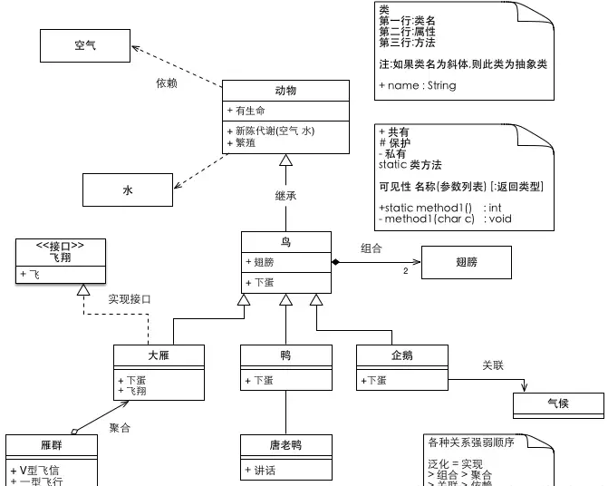
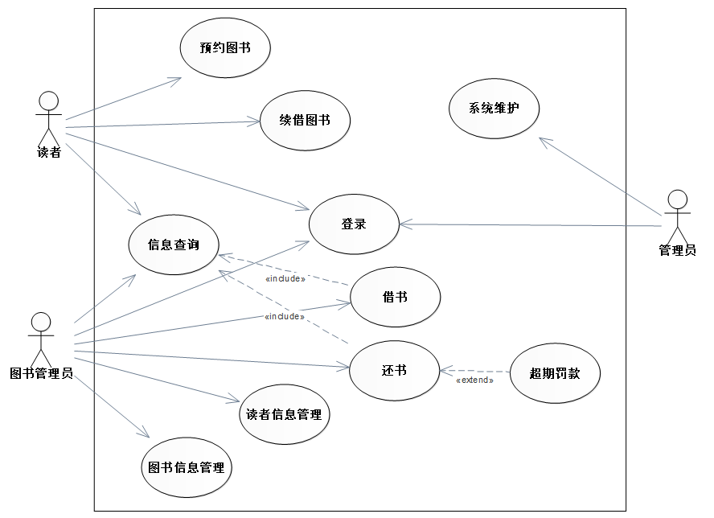
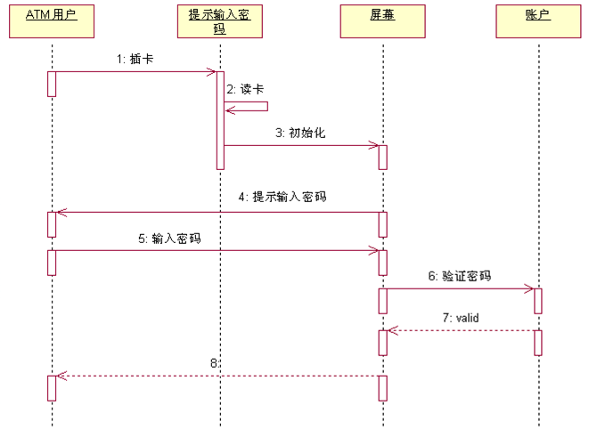

## **一、面向对象基础概念**
- **类（Class）**：具有相同属性和方法的对象的抽象模板。
- **对象（Object）**：类的实例，包含具体属性和行为。
- **继承（Inheritance）**：子类继承父类的属性和方法，实现代码复用（如`Java`中的`extends`）。
- **封装（Encapsulation）**：隐藏内部细节，通过接口访问对象（如私有属性+公有方法）。
- **多态（Polymorphism）**：同一方法在不同对象中有不同实现（通过重写和接口实现）。
- **抽象（Abstraction）**：提取关键特征，忽略非本质细节（如抽象类、接口）。

## **二、面向对象设计原则（SOLID原则）**
1. **单一职责原则（SRP）**：一个类只负责一个功能领域的变化。
2. **开闭原则（OCP）**：对扩展开放，对修改关闭（通过抽象和继承实现）。
3. **里氏替换原则（LSP）**：子类必须能替换父类，且不影响程序正确性。
4. **接口隔离原则（ISP）**：客户端不应依赖不需要的接口，拆分臃肿接口。
5. **依赖倒置原则（DIP）**：高层模块不依赖低层模块，二者依赖抽象（如面向接口编程）。

## **三、设计模式**
- 创建型模式：用于对象创建的过程
   - 单例模式、工厂方法模式、抽象工厂模式、建造者模式(生成器模式)、原型模式
- 结构型模式：用于把类或对象通过某种形式结合在一起，构成某种复杂或合理的结构
   - 适配器模式、装饰者模式、代理模式、外观模式、桥接模式、组合模式、享元模式(过滤器/标准模式)
- 行为型模式：用于解决类或对象之间的交互，更合理的优化类或对象之间的关系
  - 责任链模式、命令模式、迭代子模式(迭代器模式)、观察者模式、中介者模式、解析器模式、状态模式、空对象模式、策略模式、模板模式、访问者模式、备忘录模式、
- 常用设计模式及应用场景：
    | **模式类型** | **模式名称**       | **核心思想**                                 | **典型应用场景**               |
    |--------------|--------------------|---------------------------------------------|-------------------------------|
    | 创建型       | **工厂方法**       | 由子类决定实例化哪个类                      | 动态创建对象                   |
    |              | **抽象工厂**       | 创建相关对象家族                            | 跨平台UI组件库                 |
    |              | **单例（Singleton）** | 确保一个类只有一个实例                      | 数据库连接池、配置管理器       |
    | 结构型       | **适配器（Adapter）** | 转换接口使不兼容的类协同工作                | 旧系统接口适配新需求           |
    |              | **装饰器（Decorator）** | 动态添加职责                                | Java I/O流、GUI组件增强        |
    | 行为型       | **观察者（Observer）** | 对象间一对多的依赖关系                      | 事件处理系统（如消息通知）     |
    |              | **策略（Strategy）**  | 封装算法，使其可互换                        | 排序算法、支付方式选择         |

## **四、UML建模技术**
UML（Unified Modeling Language，统一建模语言）是面向对象系统分析与设计的标准化建模工具。
1. **UML图类型与核心用途**
   | **UML图类型**       | **核心用途**                                                                 | **考试高频场景**                     |
   |----------------------|-----------------------------------------------------------------------------|-------------------------------------|
   | **类图（Class Diagram）**      | 描述系统静态结构，包括类、接口、属性、方法及类间关系（继承、关联、依赖等）。           | 设计模式结构、数据库表结构映射       |
   | **用例图（Use Case Diagram）** | 描述系统功能需求与用户（参与者）的交互，明确系统边界。                               | 需求分析阶段的功能定义               |
   | **序列图（Sequence Diagram）** | 也叫时序图，展示对象间消息传递的**时间顺序**，强调交互流程。                         | 业务流程实现、方法调用逻辑           |
   | **活动图（Activity Diagram）** | 描述业务流程或算法的**控制流**，类似流程图，支持并行、分支、合并。                   | 复杂业务逻辑建模                     |
   | **状态图（State Diagram）**    | 描述对象在其生命周期内的**状态变迁**及触发事件（如订单状态变化）。                   | 状态驱动型系统（如工控系统）         |
   | **组件图（Component Diagram）**| 展示系统物理模块（组件）的依赖关系，用于系统架构设计。                             | 软件架构设计、模块划分               |
   | **部署图（Deployment Diagram）**| 描述系统硬件节点的物理部署及组件分布（如服务器、客户端）。                         | 分布式系统架构设计                   |
2. **类图（Class Diagram）**
    - **类表示**：`+` 公有（public），`-` 私有（private），`#` 保护（protected），`~` 包内可见（package）。
    - **继承（泛化）**：空心三角形箭头（子类—▷父类）
    - **实现**：虚线空心三角形箭头（实现类┄▷接口）
    - **关联**：实线箭头（可双向-→）
    - **依赖**：虚线箭头（使用方┄→被依赖方）
    - **聚合**：空心菱形箭头（集合◇—→个体）
    - **组合**：实心菱形箭头（整体◆—→部分）
    - 示例：

3. **用例图（Use Case Diagram）**
    - **参与者（Actor）**：小人图标，表示系统外部交互角色（如用户、外部系统）。
    - **用例（Use Case）**：椭圆，表示系统功能单元。
    - **关系**：
        - **包含（Include）**：虚线箭头 + `<<include>>`，表示用例A必须执行用例B（如“支付”包含“验证密码”）。
        - **扩展（Extend）**：虚线箭头 + `<<extend>>`，表示用例A在特定条件下扩展用例B（如“订单提交”扩展“使用优惠券”）。
    - 示例：

4. **序列图（Sequence Diagram）**
    - **对象（Object）**：矩形框，显示对象名（如`:User`）。
    - **生命线（Lifeline）**：垂直虚线，表示对象存在时间。
    - **消息（Message）**：带箭头实线，表示方法调用（同步消息为实心箭头，异步消息为开放箭头）。
    - **激活条（Activation Bar）**：矩形条，表示方法执行时间段。
    - 示例：

## **五、面向对象分析与设计（OOAD）**
1. **分析阶段**：OOA(面向对象分析)
   - **用例驱动**：通过用例图明确系统功能需求。
   - **领域建模**：提取关键实体（类）、属性及关系（ER模型→类图）。
2. **设计阶段**：OOD(面向对象设计)
   - **架构设计**：分层模型（表现层、业务层、数据层）。
   - **详细设计**：类的方法实现、设计模式应用、接口定义。
3. **OOP(面向对象编程)**

## **六、高频考点与易错点**
1. **多态的实现**
   - **重写（Override）**：子类重写父类方法（运行时多态）。
   - **重载（Overload）**：同一类中方法名相同、参数不同（编译时多态）。
2. **组合 vs 继承**
   - 优先使用组合（灵活性高），继承易导致耦合。
3. **接口 vs 抽象类**
   - **接口**：定义行为契约（无实现，多继承）。
   - **抽象类**：包含部分实现，单继承。

#### **七、典型例题解析**
**题目**：某系统需要支持多种文件格式解析，且未来可能新增格式。如何设计？  
**答案**：
1. 采用**策略模式**，定义解析接口`FileParser`，每种格式实现该接口。
2. 使用**工厂方法模式**动态创建具体解析器。
3. 符合**开闭原则**（新增格式无需修改原有代码）。

