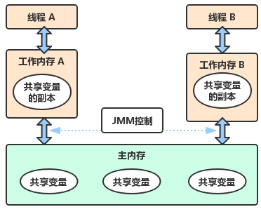

### Java 内存模型(Java Memory Model)

Java Memory Model(JMM)描述了 Java 程序中各种变量(线程共享变量)的访问规则，以及在 JVM 中将变量存储到内存中和从内存中读取变量这样的底层细节(可见性,有序性,原子性)。

- 所有的变量都存储在主内存中
- 每个线程都有自己的独立的工作内存，里面保存该线程使用到的变量的副本(来自主内存的拷贝)
- JMM 规定： + 线程对共享变量的所有操作都必须在自己的工作内存中进行，不能直接从主内存中读写。 + 不同线程之间无法直接访问其他线程工作内存中的变量，线程间变量值的传递需要通过主内存来完成。
<!-- more -->



### 1. JMM-同步八种操作

JMM 模型下,线程间通信必须要经过主内存。
JMM 数据原子操作:`lock -> read -> load -> use -> assign -> store -> write -> unlock`

1. **lock**（锁定）：将**主内存**变量加锁，标识为线程独占状态
2. **read**（读取）：从**主内存**读取数据到工作内存
3. **load**（载入）：将读取的数据写入**工作内存**
4. **use**（使用）：将**工作内存**数据传递给执行引擎来计算
5. **assign**（赋值）：将计算好的值赋值给**工作内存**的变量
6. **store**（存储）：把**工作内存**数据存储到主内存
7. **write**（写入）：把 store 过来的变量值赋值给**主内存**的变量
8. **unlock**（解锁）：将**主内存**变量解锁，释放后的变量才可以被其他线程锁定。

在执行上述八种基本操作时，必须满足如下规则：

1. 从主复制到工作,必须按顺序执行`read->load`操作; 从工作同步到主内存,必须按顺序执行`store->write`操作; 但不保证必须是连续执行
2. 不允许`read->load`、`store->write`操作之一单独出现
3. assign 操作改变数据后必须同步到主内存,不允许把没有发生过 assign 操作的数据同步到主内存
4. 一个新的变量只能在主内存中诞生，不允许在工作内存中直接使用一个未被初始化（load 或 assign）的变量
5. 一个变量在同一时刻只允许一条线程对其进行 lock 操作,lock 和 unlock 必须成对出现
6. lock 操作会清空工作内存中此变量的值，执行引擎使用前需要重新执行 load 或 assign 操作初始化变量的值
7. 不允许去 unlock 一个未被锁定 或 被其他线程锁定的变量
8. unlock 之前，必须先同步到主内存中（执行 store 和 write 操作）

### 2. JMM-原子性

和数据库事务中的原子性一样，满足原子性特性的操作是不可中断的，要么全部执行成功要么全部执行失败。
Synchronized 能够实现：**原子性**(同步) 和 可见性

- JMM 关于 synchronized 的两条规定：
    1. 线程解锁前，必须把共享变量的最新值刷新到主内存中
    2. 线程加锁时，将清空工作内存中共享变量的值，从而使用共享变量时需要从内存中重新读取最新的值（注意：加锁与解锁需要是同一把锁）
- 线程执行互斥代码的过程：
    1. 获得互斥锁
    2. 清空工作内存
    3. 从主内存拷贝变量的最新副本到工作内存
    4. 执行代码
    5. 将更改后的共享变量的值刷新到主内存
    6. 释放互斥锁

### 2. JMM-可见性

多个线程访问同一个共享变量时，其中一个线程对这个共享变量值的修改，其他线程能够立刻获得修改以后的值。
volatile 能够实现**可见性**，但不保证原子性

- 深入来说：通过加入内存屏障和禁止重排序优化来实现的。
    - 对 volatile 变量执行写操作时，会在写操作后加入一条 store 屏蔽指令
    - 对 volatile 变量执行读操作时，会在读操作前加入一条 load 屏蔽指令
- 通俗地讲：volatile 变量在每次被线程访问时，都强迫从主内存中重读该变量的值，而当该变量发生变化时，又会强迫线程将最新的值刷新到主内存。这样任何时刻，不同的线程总能看到该变量的最新值。

- 线程写 volatile 变量的过程：
    1. 改变线程工作内存中 volatile 变量副本的值
    2. 将改变后的副本的值从工作内存刷新到主内存
- 线程读 volatile 变量的过程：
    1. 从主内存中读取 volatile 变量的最新值到线程的工作内存中
    2. 从工作内存中读取 volatile 变量的副本

#### 2.1 happens-before 规则

在 JMM 中，如果一个操作执行的结果需要对另一个操作可见，那么这 2 个操作之间必须要存在 happens-before 关系。

- 定义: 如果一个操作在另一个操作之前发生(happens-before),那么第一个操作的执行结果将对第二个操作可见, 而且第一个操作的执行顺序排在第二个操作之前。
- 两个操作之间存在 happens-before 关系，并不意味着一定要按照 happens-before 原则制定的顺序来执行。如果重排序之后的执行结果与按照 happens-before 关系来执行的结果一致，那么这种重排序并不非法。

* happens-before 规则：
    1. 程序次序规则：在一个线程内一段代码的执行结果是有序的。就是还会指令重排，但是随便它怎么排，结果是按照我们代码的顺序生成的不会变！
    2. 锁定规则：一个 unLock 操作先行发生于后面对同一个锁的 lock 操作；论是单线程还是多线程，必须要先释放锁，然后其他线程才能进行 lock 操作
    3. volatile 变量规则：就是如果一个线程先去写一个 volatile 变量，然后一个线程去读这个变量，那么这个写操作的结果一定对读的这个线程可见。
    4. 传递规则：如果操作 A 先行发生于操作 B，而操作 B 又先行发生于操作 C，则可以得出操作 A 先行发生于操作 C
    5. 线程启动规则：在主线程 A 执行过程中，启动子线程 B，那么线程 A 在启动子线程 B 之前对共享变量的修改结果对线程 B 可见
    6. 线程终止规则：在主线程 A 执行过程中，子线程 B 终止，那么线程 B 在终止之前对共享变量的修改结果在线程 A 中可见。
    7. 线程中断规则：对线程 interrupt()方法的调用先行发生于被中断线程代码检测到中断事件的发生，可以通过 Thread.interrupted()检测到是否发生中断
    8. 对象终结规则：这个也简单的，就是一个对象的初始化的完成，也就是构造函数执行的结束一定 happens-before 它的 finalize()方法。

### 3. JMM-有序性

编译器和处理器为了优化程序性能而对指令序列进行重排序，也就是你编写的代码顺序和最终执行的指令顺序是不一致的，重排序可能会导致多线程程序出现内存可见性问题。

- 我们编写的源代码到最终执行的指令，会经过三种重排序:
    - 源代码-->**编译器优化重排序**-->**指令级并行重排序**-->**内存系统重排序**-->最终执行的指令

#### 3.1 as-if-serial 语义

as-if-serial 语义：不管怎么重排序(编译器和处理器为了提高并行度做的优化),(单线程)程序的执行结果不会改变。编译器、runtime 和处理器都必须遵守 as-if-serial 语义。
多线程中程序交错执行时, 重排序可能造成内存可见性问题, 可能会改变程序的执行结果。

- 有序性规则表现在以下两种场景: 线程内和线程间

    1. 线程内: 指令会按照一种“串行”(as-if-serial)的方式执行，此种方式已经应用于顺序编程语言。
    2. 线程间: 一个线程“观察”到其他线程并发地执行非同步的代码时，任何代码都有可能交叉执行。唯一起作用的约束是：对于同步方法，同步块以及 volatile 字段的操作仍维持相对有序。

- As-if-serial 只是保障单线程不会出问题，所以有序性保障，可以理解为把 As-if-serial 扩展到多线程，那么在多线程中也不会出现问题
    - 从底层的角度来看，是借助于处理器提供的相关指令内存屏障来实现的
    - 对于 Java 语言本身来说，Java 已经帮我们与底层打交道，我们不会直接接触内存屏障指令，java 提供的关键字 synchronized 和 volatile，可以达到这个效果，保障有序性（借助于显式锁 Lock 也是一样的，Lock 逻辑与 synchronized 一致）

#### 3.2 著名的双检锁(double-checked locking)模式实现单例

```java
public class Singleton {
    // volatile保证happens-before规则,重排序被禁止
    private volatile static Singleton INSTANCE = null;
    private Singleton() {}
    public Singleton getInstance() {
        // 实例没创建,才进入内部的synchronized代码块
        if (null == INSTANCE) {
            synchronized (Singleton.class) {
                // 判断其他线程是否已经创建实例
                if (null == INSTANCE) {
                    INSTANCE = new Singleton();
                }
            }
        }
        return INSTANCE;
    }
}
```

> 如果不用 volatile 修饰 INSTANCE,可能造成访问的是一个初始化未完成的对象; 使用了 volatile 关键字后，重排序被禁止，所有的写（write）操作都将发生在读（read）操作之前。

### 4. 锁机制

- 锁的状态总共有四种：无锁状态、偏向锁、轻量级锁和重量级锁。随着锁的竞争，锁可以从偏向锁升级到轻量级锁，再升级的重量级锁（但是**锁的升级是单向的**，也就是说只能从低到高升级，不会出现锁的降级）。
- 锁的状态是通过对象监视器在**对象头**中的字段来表明的。 四种状态会随着竞争的情况逐渐升级，而且是不可逆的过程，即不可降级。 这四种状态都不是 Java 语言中的锁，而是 Jvm 为了提高锁的获取与释放效率而做的优化(**使用 synchronized 时**)。

#### 4.1 对象头 Mark

- Mark Word,对象头的标记,32 位: 描述对象的 hash,锁信息,垃圾回收标记,分代年龄
    - 指向锁记录的指针
    - 指向 monitor 的指针
    - GC 标记
    - 偏向锁线程 ID

#### 4.2 偏向锁

Java 偏向锁(Biased Locking)是 Java6 引入的一项多线程优化

- 大部分情况锁是没有竞争的,所以可以通过偏向锁来提高性能;
- 所谓偏向,就是偏心,即锁会偏向于当前已经占有锁的线程,总是由同一线程多次获得;
- 会在对象头和栈帧中的锁记录里存储锁偏向的线程 ID
- 只要没有竞争,获得偏向锁的线程,在将来进入同步块,不需要做同步
- 当其他线程请求相同的锁时,偏向模式结束
- -XX:+UseBiasedLocking(默认开启)
- 在竞争激烈的场合,偏向锁会增加系统负担

#### 4.3 轻量级锁

轻量级锁是指当锁是偏向锁的时候，被另一个线程所访问，偏向锁就会升级为轻量级锁，其他线程会通过自旋的形式尝试获取锁，不会阻塞，提高性能。

- 普通的锁处理性能不够理想,轻量级锁是一种快速的锁定方法.
- 过程: 如果对象没有被锁定:
    1. 将对象头的 Mark 指针保存到锁对象中
    2. 将对象头设置为指向锁的指针(在线程栈空间中)
- 如果轻量级锁失败,表示存在竞争,升级为重量级锁(常规锁)
- 在没有锁竞争的情况下,减少传统锁使用 OS 互斥量产生的性能损耗
- 在竞争激烈的场合,轻量级锁会多做很多额外操作,导致性能下降

#### 4.4 自旋锁

自旋锁是指尝试获取锁的线程不会立即阻塞，而是采用循环的方式去尝试获取锁，这样的好处是减少线程上下文切换的消耗，缺点是循环会消耗 CPU。

- 当竞争存在时,如果线程可以很快获得锁,那么可以不在 OS 层挂起线程,让线程做几个空操作(自旋)
- 如果同步块很长,自旋失败,会降低系统性能
- 如果同步块很短,自旋成功,节省线程挂起切换时间,提升系统性能

#### 4.5 重量级锁

重量级锁是指当锁为轻量级锁的时候，另一个线程虽然是自旋，但自旋不会一直持续下去，当自旋一定次数的时候，还没有获取到锁，就会进入阻塞，该锁膨胀为重量级锁。重量级锁会让其他申请的线程进入阻塞，性能降低。

#### 4.6 synchronized 的执行过程：

1. 检测 Mark Word 里面是不是当前线程的 ID，如果是，表示当前线程处于偏向锁
2. 如果不是，则使用 CAS 将当前线程的 ID 替换 Mard Word，如果成功则表示当前线程获得偏向锁，置偏向标志位 1
3. 如果失败，则说明发生竞争，撤销偏向锁，进而升级为轻量级锁。
4. 当前线程使用 CAS 将对象头的 Mark Word 替换为锁记录指针，如果成功，当前线程获得锁
5. 如果失败，表示其他线程竞争锁，当前线程便尝试使用自旋来获取锁。
6. 如果自旋成功则依然处于轻量级状态。
7. 如果自旋失败，则升级为重量级锁。

> 以上几种锁都是 JVM 自己内部实现，当我们执行 synchronized 同步块的时候 jvm 会根据启用的锁和当前线程的争用情况，决定如何执行同步操作；

### 5. Java 语言层面对锁的优化

1. **减少锁持有时间**
    - 不需要同步执行的代码，能不放在同步快里面执行就不要放在同步快内，可以让锁尽快释放；
2. **减少锁的粒度**
    - 它的思想是将物理上的一个锁，拆成逻辑上的多个锁，增加并行度，从而降低锁竞争。它的思想也是用空间来换时间；
    - java 中很多数据结构都是采用这种方法提高并发操作的效率：
        - ConcurrentHashMap: 使用 Segment 数组,Segment 继承自 ReenTrantLock，所以每个 Segment 就是个可重入锁，每个 Segment 有一个 HashEntry< K,V >数组用来存放数据，put 操作时，先确定往哪个 Segment 放数据，只需要锁定这个 Segment，执行 put，其它的 Segment 不会被锁定；所以数组中有多少个 Segment 就允许同一时刻多少个线程存放数据，这样增加了并发能力。
        - LongAdder:实现思路也类似 ConcurrentHashMap，LongAdder 有一个根据当前并发状况动态改变的 Cell 数组，Cell 对象里面有一个 long 类型的 value 用来存储值;开始没有并发争用的时候或者是 cells 数组正在初始化的时候，会使用 cas 来将值累加到成员变量的 base 上，在并发争用的情况下，LongAdder 会初始化 cells 数组，在 Cell 数组中选定一个 Cell 加锁，数组有多少个 cell，就允许同时有多少线程进行修改，最后将数组中每个 Cell 中的 value 相加，在加上 base 的值，就是最终的值；cell 数组还能根据当前线程争用情况进行扩容，初始长度为 2，每次扩容会增长一倍，直到扩容到大于等于 cpu 数量就不再扩容，这也就是为什么 LongAdder 比 cas 和 AtomicInteger 效率要高的原因，后面两者都是 volatile+cas 实现的，他们的竞争维度是 1，LongAdder 的竞争维度为“Cell 个数+1”为什么要+1？因为它还有一个 base，如果竞争不到锁还会尝试将数值加到 base 上；
    - 拆锁的粒度不能无限拆，最多可以将一个锁拆为当前 CPU 数量即可；
3. **锁粗化**
    - 大部分情况下我们是要让锁的粒度最小化，锁的粗化则是要增大锁的粒度(如:循环内的操作);
4. **锁分离**
    - 使用读写锁: ReentrantReadWriteLock 是一个读写锁，读操作加读锁，可以并发读，写操作使用写锁，只能单线程写；
    - 读写分离: CopyOnWriteArrayList 、CopyOnWriteArraySet
        - CopyOnWrite 容器即写时复制的容器。通俗的理解是当我们往一个容器添加元素的时候，不直接往当前容器添加，而是先将当前容器进行 Copy，复制出一个新的容器，然后新的容器里添加元素，添加完元素之后，再将原容器的引用指向新的容器。这样做的好处是我们可以对 CopyOnWrite 容器进行并发的读，而不需要加锁，因为当前容器不会添加任何元素。所以 CopyOnWrite 容器也是一种读写分离的思想，读和写不同的容器
        - CopyOnWrite 并发容器用于读多写少的并发场景，因为，读的时候没有锁，但是对其进行更改的时候是会加锁的，否则会导致多个线程同时复制出多个副本，各自修改各自的；
    - LinkedBlockingQueue: LinkedBlockingQueue 也体现了这样的思想，在队列头入队，在队列尾出队，入队和出队使用不同的锁，相对于 LinkedBlockingArray 只有一个锁效率要高；
5. **锁消除**
    - 在即时编译时,如果发现不可能被共享的对象,则可以消除对象的锁操作
6. **无锁**(如 CAS)
    - 如果需要同步的操作执行速度非常快，并且线程竞争并不激烈，这时候使用 CAS 效率会更高，因为加锁会导致线程的上下文切换，如果上下文切换的耗时比同步操作本身更耗时，且线程对资源的竞争不激烈，使用 volatiled+CAS 操作会是非常高效的选择；
7. 消除缓存行的伪共享
    - 除了我们在代码中使用的同步锁和 jvm 自己内置的同步锁外，还有一种隐藏的锁就是缓存行，它也被称为性能杀手。在多核 cup 的处理器中，每个 cup 都有自己独占的一级缓存、二级缓存，甚至还有一个共享的三级缓存，为了提高性能，cpu 读写数据是以缓存行为最小单元读写的；32 位的 cpu 缓存行为 32 字节，64 位 cup 的缓存行为 64 字节，这就导致了一些问题。

### 6. CAS 与原子类

CAS 即`Compare and Swap`翻译过来就是比较并替换, 它体现了一种乐观锁的思想 (synchronized 为悲观锁思想);

- 结合 CAS 和 volatile 可以实现**无锁并发**(非阻塞同步),适用于竞争不激烈,多核 CPU 的场景下(竞争激烈,重试频繁发生会影响效率);
- CAS 算法涉及到三个操作数: 内存值 V, 旧值 A, 新值 B; 当且仅当 V==A 时，CAS 用新值 B 来更新 V，否则不会执行任何操作（比较和替换是一个原子操作）。一般情况下是一个自旋操作，即不断的重试。
- CAS 底层依赖一个 Unsafe 类来直接调用操作系统底层的 CAS 指令;

#### 6.1 Unsafe 类

java 中 CAS 操作依赖于 Unsafe 类，Unsafe 类所有方法都是 native 的，直接调用操作系统底层资源执行相应任务，它可以像 C 一样操作内存指针，是非线程安全的。

- Unsafe 里的 CAS 操作相关实现: compareAndSwapObject,compareAndSwapInt,compareAndSwapLong

```java
//第一个参数o为给定对象，offset为对象内存的偏移量，通过这个偏移量迅速定位字段并设置或获取该字段的值，
//expected表示期望值，x表示要设置的值，下面3个方法都通过CAS原子指令执行操作。
public final native boolean compareAndSwapObject(Object o, long offset,Object expected, Object x);
public final native boolean compareAndSwapInt(Object o, long offset,int expected,int x);
public final native boolean compareAndSwapLong(Object o, long offset,long expected,long x);
```

#### 6.2 原子操作类

并发包 JUC(java.util.concurrent)中的原子操作类(Atomic 系列),底层是基于`CAS + volatile`实现的.

- AtomicBoolean：原子更新布尔类型
- AtomicInteger：原子更新整型
- AtomicLong：原子更新长整型

下面看 AtomicInteger 类的部分源码：

```java
public class AtomicInteger extends Number implements java.io.Serializable{
    //获取指针类Unsafe
    private static final Unsafe unsafe = Unsafe.getUnsafe();
    //省略...获取内存偏移量等
    //如果当前值为expect，则设置为update(当前值指的是value变量)
    public final boolean compareAndSet(int expect, int update) {
        return unsafe.compareAndSwapInt(this, valueOffset, expect, update);
    }
    //当前值加1返回旧值，底层CAS操作
    public final int getAndIncrement() {
        return unsafe.getAndAddInt(this, valueOffset, 1);
    }
    //省略...其他方法
}
```

AtomicInteger 基本是基于 Unsafe 类中 CAS 相关操作实现的，是无锁操作。
再看 Unsafe 类中的 getAndAddInt()方法，该方法执行一个 CAS 操作，保证线程安全。

```java
//Unsafe类中的getAndAddInt方法(JDK8)
public final int getAndAddInt(Object o, long offset, int delta) {
    int v;
    do {
        v = getIntVolatile(o, offset);
    } while (!compareAndSwapInt(o, offset, v, v + delta));
    return v;
}
```

可看出 getAndAddInt 通过一个 while 循环不断的重试更新要设置的值，直到成功为止，调用的是 Unsafe 类中的 compareAndSwapInt 方法，是一个 CAS 操作方法。

#### 6.3 CAS 操作中可能会带来的 ABA 问题

ABA 问题是指在 CAS 操作时，其他线程将变量值 A 改为了 B，但是又被改回了 A，等到本线程使用期望值 A 与当前变量进行比较时，发现变量 A 没有变，于是 CAS 就将 A 值进行了交换操作，但是实际上该值已经被其他线程改变过，这与乐观锁的设计思想不符合。

- **无法正确判断这个变量是否已被修改过**，一般称这种情况为 ABA 问题。
- ABA 问题一般不会有太大影响，产生几率也比较小。但是并不排除极特殊场景下会造成影响，因此需要解决方法：
    - AtomicStampedReference 类
    - AtomicMarkableReference 类
- **AtomicStampedReference 类**: 一个带有时间戳的对象引用，每次修改时，不但会设置新的值，还会记录修改时间。在下一次更新时，不但会对比当前值和期望值，还会对比当前时间和期望值对应的修改时间，只有二者都相同，才会做出更新。解决了反复读写时，无法预知值是否已被修改的窘境。
    - 底层实现为：一个键值对 Pair 存储数据和时间戳，并构造 volatile 修饰的私有实例；两者都符合预期才会调用 Unsafe 的 compareAndSwapObject 方法执行数值和时间戳替换。
- AtomicMarkableReference 类: 一个 boolean 值的标识，true 和 false 两种切换状态表示是否被修改。不靠谱。
