用了八天时间从哈尔滨骑行到北极村1255.2KM；从漠河坐火车回哈尔滨时，看着窗外熟悉的风景和沿路洒下的汗水，心里真的有一种说不出的感觉~
### 【2014-06-23，哈尔滨，晴】
准备启程骑行去中国最北的北极村，因为现在所有课都结了，坐等七月初的期末考试，希望利用这段时间去实现一个小小的梦(去看传说中的北极光)，大体路线是先从最短距离到漠河北极村，如果临近考试就从漠河坐火车回去，时间充裕就南下到呼伦贝尔；准备24号就出发。
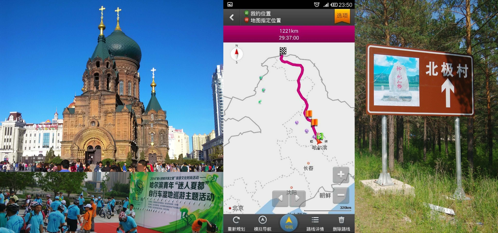

### 【2014-06-24，拜泉县202国道，晴】
#### 第一天：骑行194.82km
早上6：40出发，晚上7：20左右到这儿，骑行194.82km，我在过明水县25公里国道202路边的一个小旅馆，本来是想尝试搭帐篷的，可是突然下雨了，今天运动量有点大，肌肉现在有点痛...
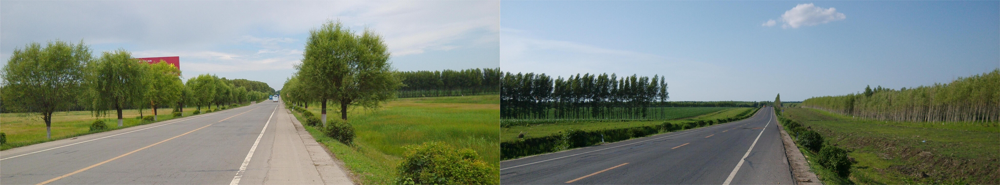

### 【2014-06-25，五大连池市鹤嫩公路，雨】
#### 第二天：骑行146.97km
骑行146.97km，现在在五大连池市，早上六点四十出发，晚上七点半左右到目的地，今天骑得有点崩溃，几乎一大半都是连续的起伏坡道，晚上距目的地还有十公里时遭遇特大雷阵雨，下的都看不清路，虽然穿着雨衣，还是被淋成了落汤鸡，希望刚洗的衣服明天能干，希望明天屁股就不痛了…
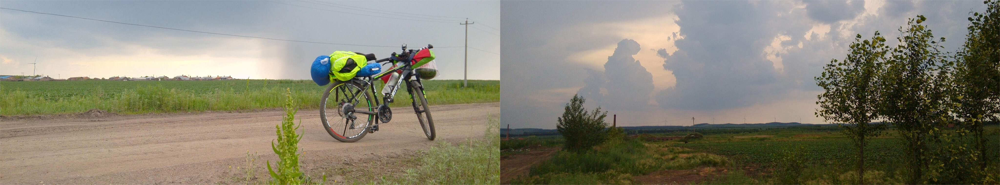

### 【2014-06-26，前嫩公路，雨】
#### 第三天：骑行85.41km
今天只骑了85.41km,我也不知道在哪，只知在S303公路的一个桥洞下面(第一次体验住帐篷睡袋，一是因为天黑了，二是太累了)，今天早上起来晚了，快十点才从五大连池市出发，还没到景区就下雨了，这一下也没怎么停过，到景区也只是去药泉山顶拜了一下佛，其他收费景区都没去，路过格球山时好心的修景区大门的师傅(由于下雨不能干活)带我登了山看了天池。
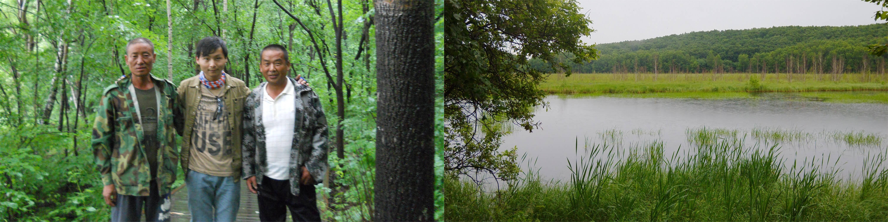
到五点半左右天气转好，一路狂奔还是没有到达计划的目的地(嫩江)，现在的位置在五大连池景区与嫩江的中间......
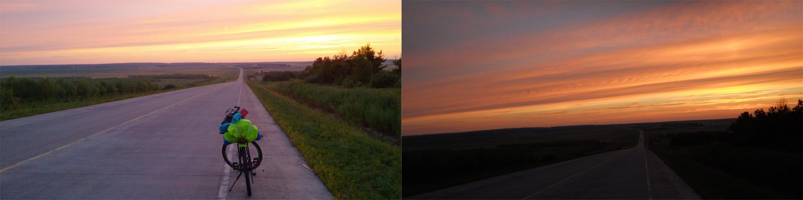

### 【2014-06-27，黑河111国道，晴】
#### 第四天：骑行185.27km
今天骑了185.27km。到嫩江就上了111国道进入内蒙境内，可全是山路，上一个几公里的缓坡在下一个几公里的坡，还好路况很好，下坡不用怎么减速，但是这国道好像是新修的，两边都没有食物和水补给补给的地方，谢谢修路的师傅给我灌了一瓶子水，也谢谢善良的村民大伯给我倒了满满一瓶开水...
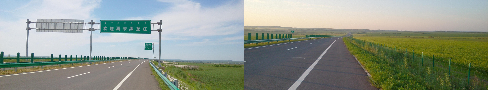
由于到加格达奇还有60公里天已经黑了，现在又出不去这国道，去两边村子里打听有没有商店(其实我想借宿)，一个老太太把我当成怪人，一直纠着问我是干什么的，我也没做过多解释答两句就走了，还好没走几公里就发现了一个休息区，是用干砂铺的停车场，四周还挖了沟用作排水，我现在就睡在这片砂上的帐篷里，星星很美，手机却拍不到...
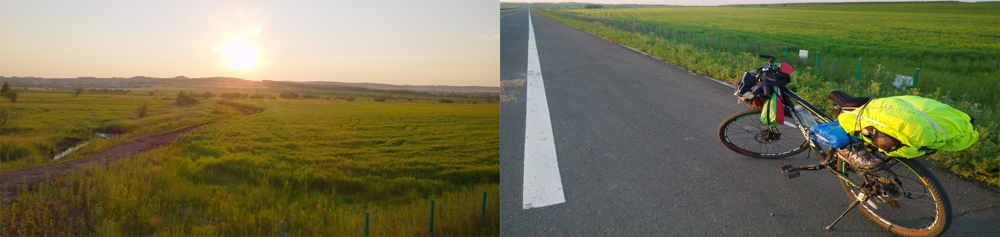

### 【2014-06-28，呼伦贝尔·大兴安岭劲松站，晴】
#### 第五天：骑行152.5km
早上7：30吃了一块巧克力就出发了，现在到了纳尔克气乡，不过这儿没有饭店，还好有商店，买了点吃的补充体力，稍作休息继续上路.....
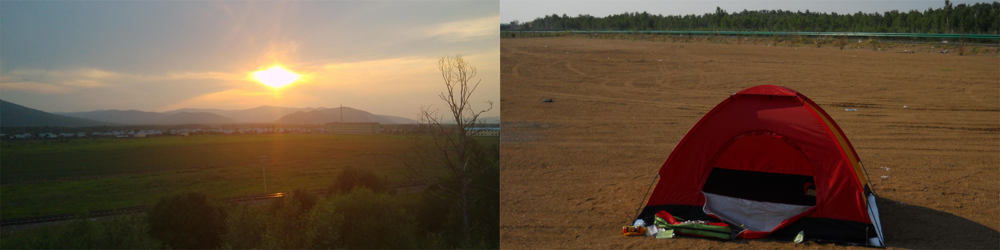
今天骑行152.5km，终于在天黑之前在劲松镇住了下来，本来想多骑几十公里在塔源镇住的，但中午吃饭在加格达奇停留太久了，还去山上拜了佛，怕又到不了塔源在半路住帐篷。连续两天住了帐篷，今天总算洗了澡洗了衣服，期待明早起来衣服就干吧...

### 【2014-06-29，大兴安岭地区·中国石油塔河加油站，晴】
#### 第六天：骑行178.1km
千言万语：山路难行，逆风吃力，骑行不易…
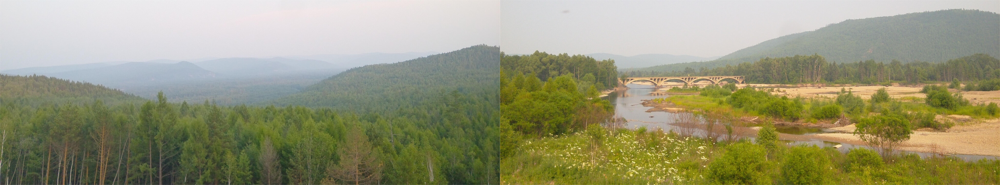

### 【2014-06-30，大兴安岭地区·蓝莓广场，晴】
#### 第七天：骑行168.5km
今天骑行168.5km，从塔河县出发过了瓦拉干镇，新修的国道111就到头了，不得不走以前老省道207,一上去就感觉吃力，路窄坑多，而且还有一段路是几公里居然全是上坡，上完坡本来很累，眼看到头了但转一个弯又是坡，再转还是，都不给点下坡缓冲。明天终于要到终点北极村了，今天本来想骑点夜路到漠河的，但到了阿木尔连续扎了两次胎，没办法老天要让我在这天8停留一夜，听说这儿两三点天就亮了，明儿天亮就出发，早点到达目的地而不耽搁四号的期末考试…
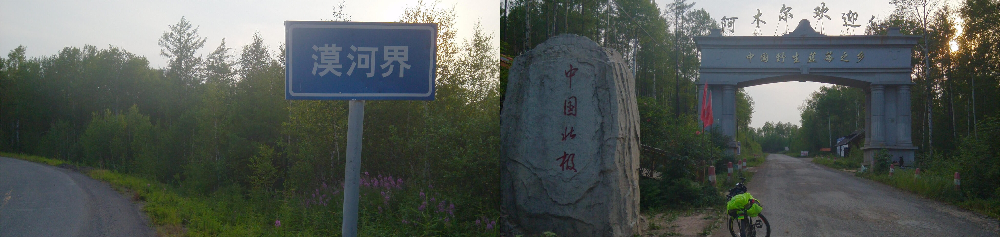

### 【2014-07-01，大兴安岭地区·北极村驴友之家，雨转晴】
#### 第八天：骑行143.6千米
今天骑行143.6千米，早上两点半被闹钟叫醒，发现天就亮了，三点半起床，四点半启程。
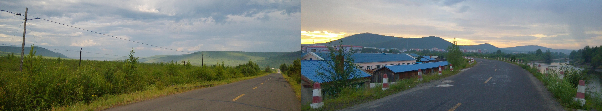
今天经历了四种天气，先是阴天，然后小雨，然后大太阳，然后太阳雨，然后又大太阳，翻了一座又一座的山终于经过漠河在下午三点多到达终点北极村。
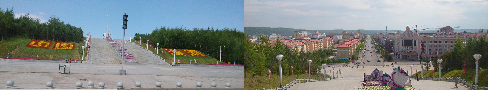
刚刚收拾规矩洗了个澡，买了明早回漠河的班车票，准备补会儿觉再出来溜达，这边要晚上九十点才天黑，运气好还能碰上极昼…
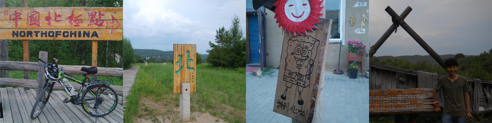
小睡了会儿出去溜达了下，因为是淡季，村子人并不多；本来想看夕阳的，可是天气不好，跑到中国最北的黑龙江边眺望了下俄罗斯，算是有点欣慰吧，至少挑战了自己，完成了一个小小的梦，虽然没有见到北极光和极昼，但享受了路上的骑行时光也无遗憾了…
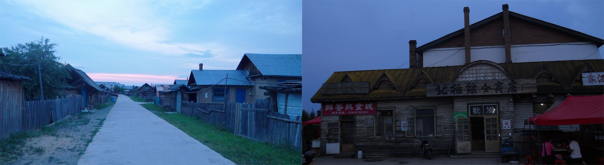

### 【2014-07-02，大兴安岭地区·漠河站，晴】
#### 第九天：返回漠河
今天坐了班车返回漠河，准备从漠河坐火车回哈尔滨考试。在漠河买了点当地的野果吃手就变这样了，当地人叫‘羊奶子’说是比蓝莓要好吃点，本来想尝尝蓝莓的，但这个季节还没出。
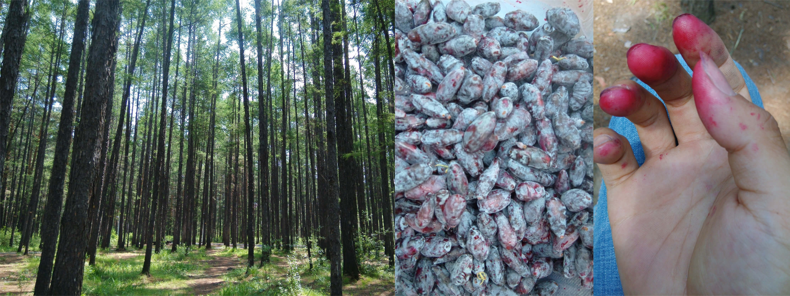
自行车已打包好，准备提上火车回程，实际骑行八天，1255.2km，比计划多骑了34.2km。虽然脸上痘痘变多了点然后脸变黑了点，额头晒黑那边又被刘海反过去挡了，总体来说还算能见人，只是腿上被弄得有点不堪入目（就只有一天没穿腿套的结果），看来这段时间不敢穿短裤了…
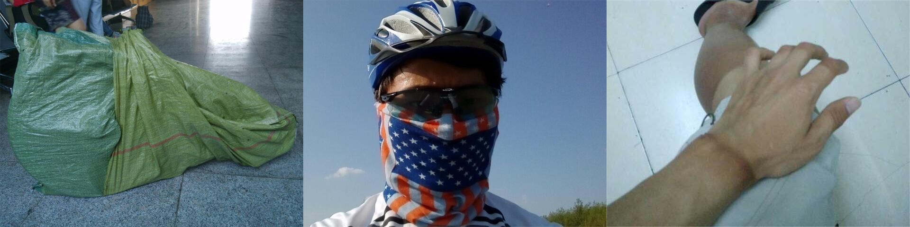

### 后记
感谢路上对向而来的骑友相互鼓励，感谢卡车司机鸣笛并竖起的大拇指，感谢朋友们的关注，更谢谢你们因我没发动态而打来的关心的电话…也希望你们心中去做你们想做的事，只有是你们心中真正喜欢的事才会有动力去做，即使再艰难再辛苦自己也是心甘情愿的……
