福州站设计路线，是一条难度与美景并进，地理与人文共存的赛道路线。赛道经过中国鼓岭风景名胜区、贵安温泉旅游区、美丽的霍口畲族乡、著名的寿山石发源地寿山乡、壮阔的皇帝洞峡谷景区、飞云峡风景区、以及本次赛道的终点福州国家森林公园。

### 赛道信息
- 比赛时间：比赛时间：2016-06-19 06:30 至 2016-06-19 18:00。
- 赛道路线：鼓岭山脚（起点） → 世贸云上鼓岭 → 宦溪镇 → 贵安 → 山仔水库 → 溪东乡 → 飞竹镇 → 霍口畲族乡 → 日溪乡 → 寿山乡  → 岭头乡 → 福州国家森林公园（终点）。
- 行者路书编号：**602603**；总里程：**159公里**；总爬升：**3000米**（最高海拔659米）。
-  爬坡路段：
  * 0公里处开始一段约约6公里爬坡，6公里爬升约580米
  * 42公里处开始一段约8公里爬坡，8公里爬升约454米
  * 62公里处开始一段约4公里爬坡，4公里爬升约291米
  * 82公里处开始一段约5公里爬坡，5公里爬升约430米
  * 105公里处开始一段约5公里的HC坡，5公里爬升约530米
- 赛段地形特点：全程需经过5个大坡，途中还会经过数十个起伏路段，坡度较缓，可快速通过。

### 提前探路：2016-06-10
和骑友绕赛道线路走了一圈，爬坡巨多，探路探得想吐，比赛时间还那么短，感觉在规定的时间根本都走不完～

|     骑行记录(2016-06-10)      |                           赛道路线沿途风景                           |
|:---------------:|:------------------------------------------------------------:|
| 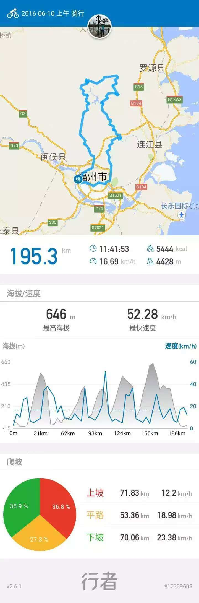 | 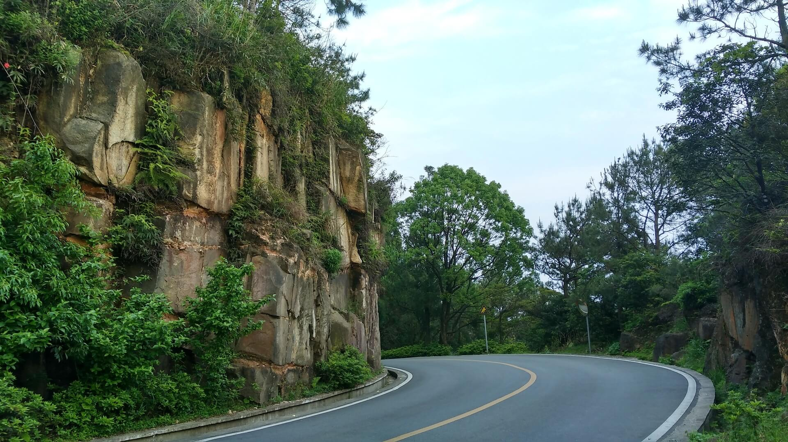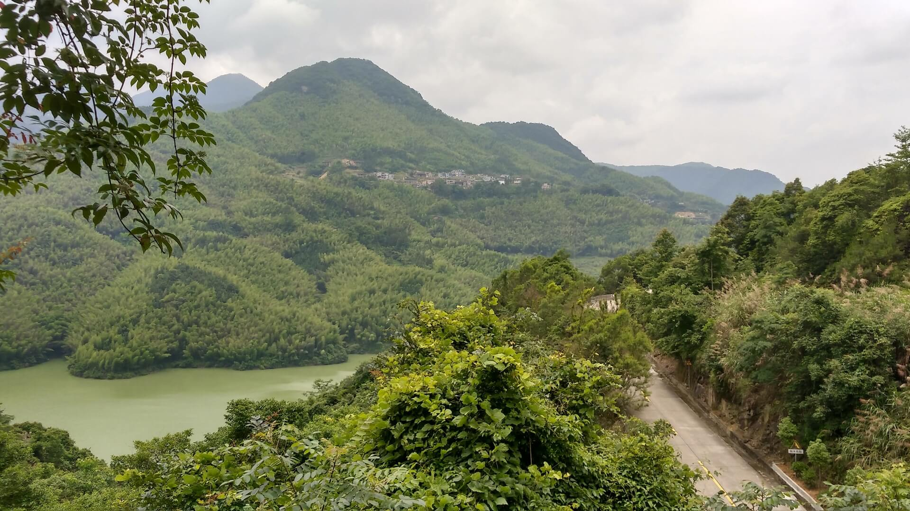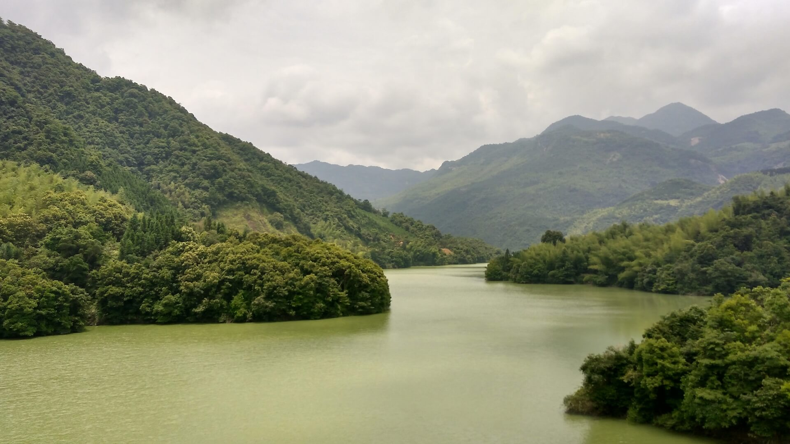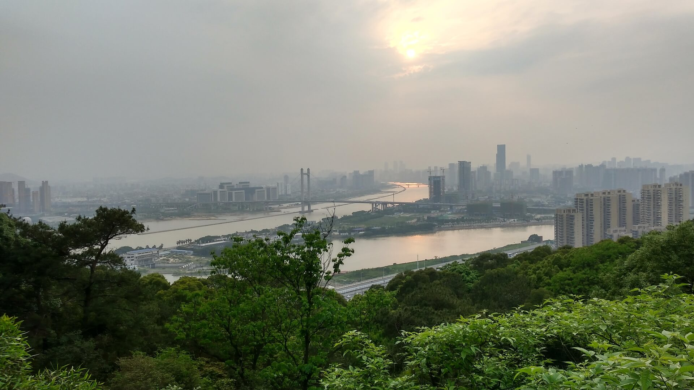 |

### 正式比赛：2016-06-19
#### 06:30 签到、验车
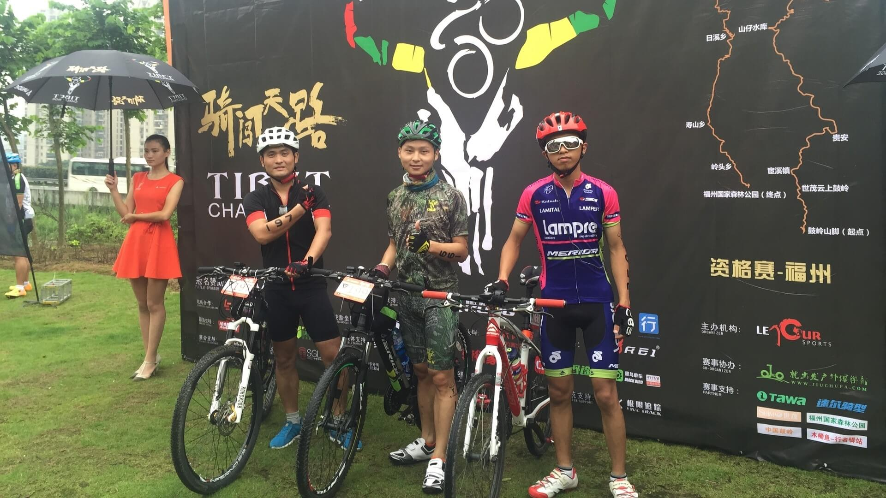

#### 08:00 发车
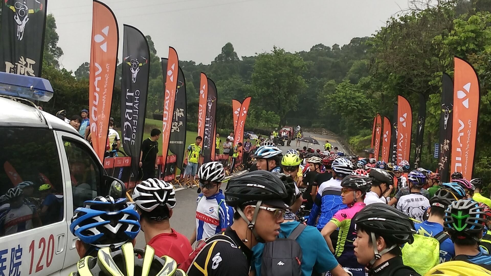

#### 17:40 完赛
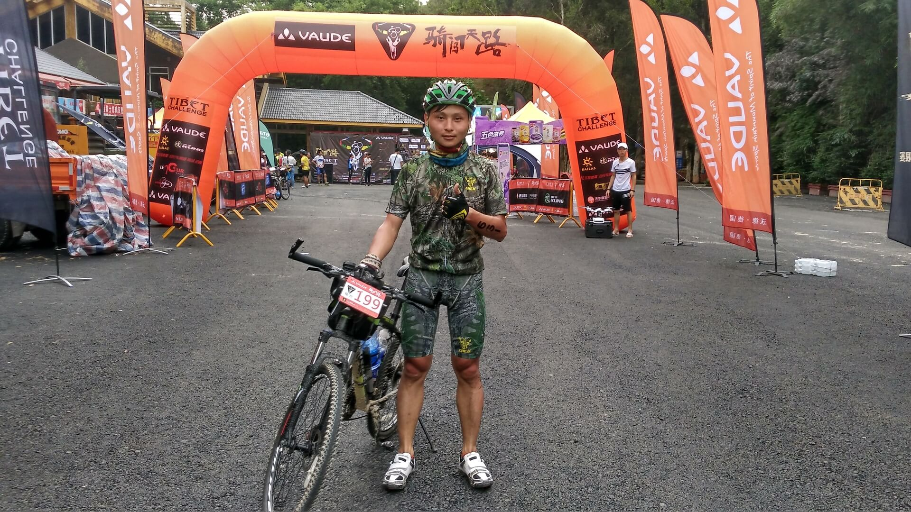

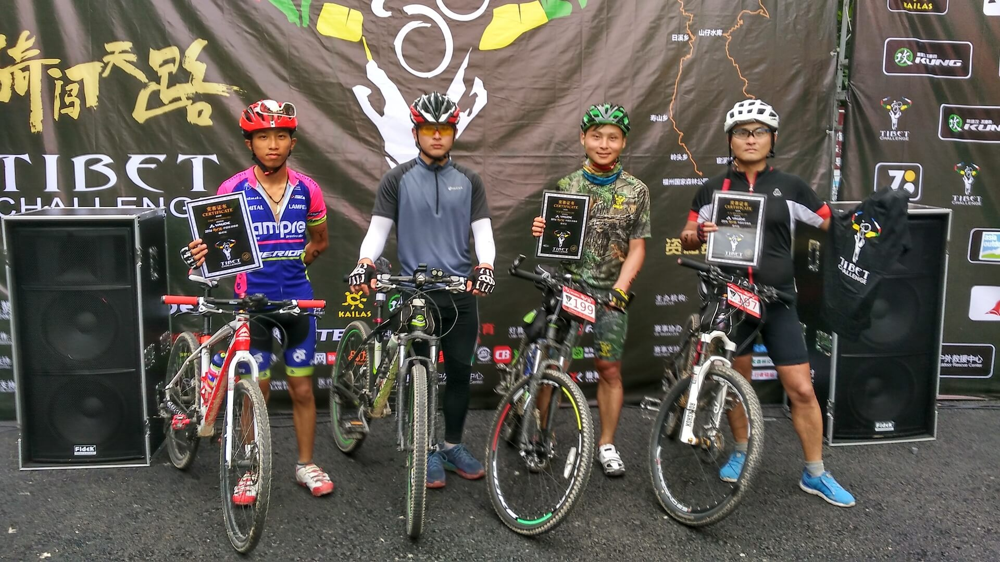

### 比赛成绩

| 骑行记录(2016-06-19) |         比赛结果（第115名，用时9时23分46秒）          |
|:----------------:|:-----------------------------:|
|  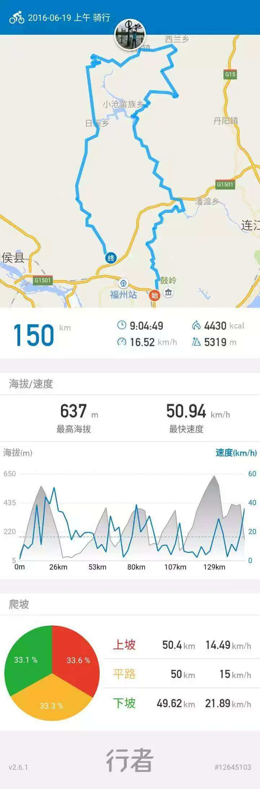  | 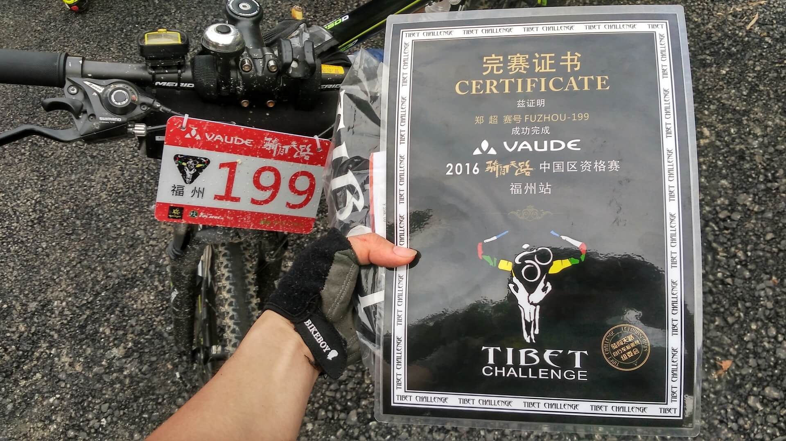 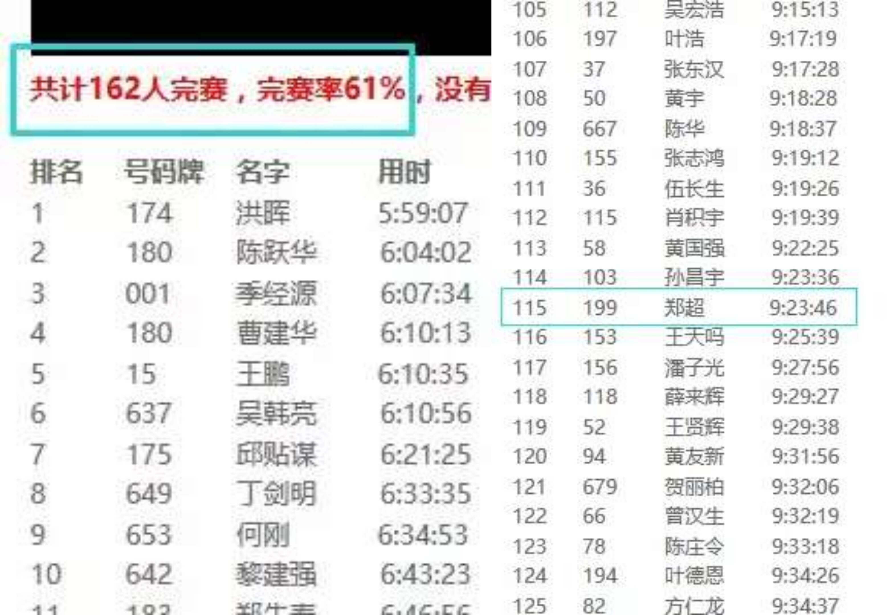 |

完赛发的T恤真心不错，不过没有做防护措施，手和腿都被晒脱皮，撕掉贴在手和小腿上的参赛号码贴后就被烈日刻了字~
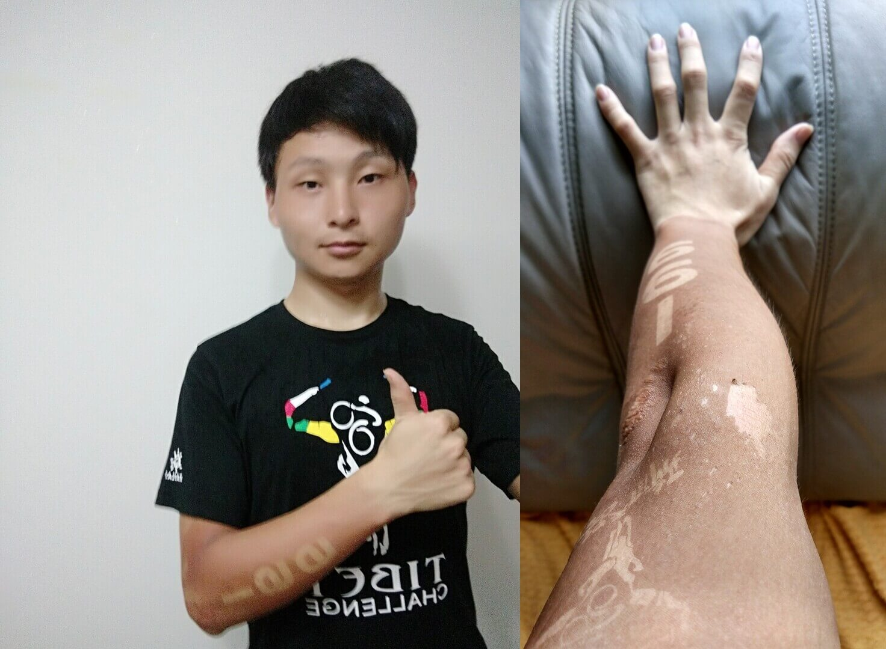
