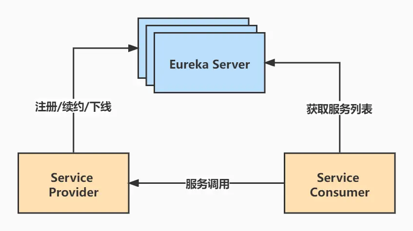

### 1. Eureka简介
Eureka是一种RESTful服务，主要用于AWS云中间层服务器的发现、负载平衡和故障转移。

Eureka包含两个组件：服务注册中心Eureka Server 和 服务客户端Eureka Client。<!-- more -->

#### 1.1 注册中心 Eureka Server
Eureka Server提供注册服务，各个节点启动后，会在Eureka Server中进行注册，这样Eureka Server中的服务注册表中将会存储所有可用服务节点的信息。

Eureka Server通过Register、Get、Renew等接口提供服务的注册、发现和心跳检测等服务。

#### 1.2 服务客户端 Eureka Client
Eureka Client是一个java客户端，用于简化与Eureka Server的交互，客户端同时也具备一个内置的、使用轮询(round-robin)负载算法的负载均衡器。

在应用启动后，将会向Eureka Server发送心跳,默认周期为30秒，如果Eureka Server在多个心跳周期内没有收到某个节点的心跳，Eureka Server将会从服务注册表中把这个服务节点移除(默认90秒)。

Eureka Client分为两个角色，分别是：Service Provider（服务提供方）和Service Consumer（服务消费方）。

### 2. Eureka基础架构原理


- `Eureka Server`：提供服务注册和发现，多个Eureka Server之间会同步数据，做到状态一致（最终一致性）
- `Service Provider`：服务提供方，将自身服务注册到Eureka。
- `Service Consumer`：服务消费方，通过Eureka Server发现服务，并消费。

#### 2.1 Eureka自我保护机制
微服务在Eureka上注册后，会每30秒发送心跳包，Eureka通过心跳来判断服务时候健康，默认90s没有得到客户端的心跳，则注销该实例。

导致Eureka Server收不到心跳包的可能：一是微服务自身故障，二是微服务与Eureka之间的网络故障。
通常微服务的自身的故障只会导致个别服务出现故障，而网络故障通常会导致大面积服务出现故障。

Eureka设置了一个阀值，当判断挂掉的服务的数量超过阀值（心跳失败比例在15分钟之内低于85%）时，Eureka Server认为很大程度上出现了网络故障，将不再删除心跳过期的服务，这种服务保护算法叫做Eureka Server的服务保护模式。

当网络故障恢复后，Eureka Server会退出"自我保护模式"。

Eureka还有客户端缓存功能(也就是微服务的缓存功能)。即便Eureka Server集群中所有节点都宕机失效，微服务的Provider和Consumer都能正常通信。
只要Consumer不关闭，缓存始终有效，直到一个应用下的所有Provider访问都无效的时候，才会访问Eureka Server重新获取服务列表。

``` ymal
eureka:
  server:
    enable-self-preservation: false # 是否开启服务的自我保护: true开启，false关闭
    eviction:
      interval-timer-in-ms: 60000   # 清理无效节点的频率，默认 60000 毫秒（60 秒）
```


### 3. Eureka注册中心搭建
1. 在Spring Cloud父工程中创建module
2. 导入依赖

``` xml
<!-- 引入SpringCloud Eureka server的依赖 -->
<dependency>
    <groupId>org.springframework.cloud</groupId>
    <artifactId>spring-cloud-starter-netflix-eureka-server</artifactId>
</dependency>
```

3. 启动类上加注解`@EnableEurekaServer`

``` java
// 声明当前项目为Eureka Server
@EnableEurekaServer
@SpringBootApplication
public class EurekaServerApplication {
    public static void main(String[] args) {
        SpringApplication.run(EurekaServerApplication.class, args);
    }
}
```

4. 配置文件

``` ymal
server:
  port: 18000

eureka:
  client:
    # 由于该应用为注册中心，所以设置为false，代表不向注册中心注册自己
    registerWithEureka: false
    # 不主动发现别人
    fetchRegistry: false
    # 声明注册中心的地址
    serviceUrl:
      defaultZone: http://localhost:18000/eureka/
```

5. 启动注册中心 访问注册中心的监控页面`http://localhost:18000`


### 4. Eureka客户端搭建
1. 创建项目
2. 导入依赖

``` xml
<!-- 引入SpringCloud Eureka client的依赖 -->
<dependency>
    <groupId>org.springframework.cloud</groupId>
    <artifactId>spring-cloud-starter-netflix-eureka-client</artifactId>
</dependency>
```

3. 启动类上加注解`@EnableDiscoveryClient`

``` java
// @EnableEurekaClient: 声明一个Eureka客户端，只能注册到Eureka Server
// @EnableDiscoveryClient: 声明一个可以被发现的客户端，可以是其他注册中心
@EnableDiscoveryClient
@SpringBootApplication
public class UserApplication {
    public static void main(String[] args) {
        SpringApplication.run(UserApplication.class, args);
    }
}
```

4. 配置文件

``` ymal
server:
  port: 18001

# 指定当前服务的名称，这个名称会注册到注册中心
spring:
  application:
    name: @artifactId@

# 指定服务注册中心的地址
eureka:
  client:
    serviceUrl:
      defaultZone: http://localhost:18000/eureka
```

通过以上四步 就完成了一个 Eureka客户端的搭建，直接启动项目， 访问Eureka的注册中心`http://localhost:18000`查看当前服务。


### 5. CAP定理
- 分布式系统有三个指标：
    * Consistency 一致性；
    * Availability 可用性；
    * Partition tolerance 分区容错性；
- 这三个指标不可能同时做到。这个结论就叫做 CAP 定理。

| 指标 | 描述 |
| :----: | :---- |
|**数据一致性** (Consistency) | 也叫做数据原子性系统在执行某项操作后仍然处于一致的状态。在分布式系统中，更新操作执行成功后所有的用户都应该读到最新的值，这样的系统被认为是具有强一致性的。等同于所有节点访问同一份最新的数据副本。 **优点**： 数据一致，没有数据错误可能。 **缺点**： 相对效率降低。|
|**服务可用性** (Availablity) | 每一个操作总是能够在一定的时间内返回结果，这里需要注意的是"一定时间内"和"返回结果"。一定时间内指的是，在可以容忍的范围内返回结果，结果可以是成功或者是失败。|
|**分区容错性** (Partition-torlerance) |在网络分区的情况下，被分隔的节点仍能正常对外提供服务(分布式集群，数据被分布存储在不同的服务器上，无论什么情况，服务器都能正常被访问)|

CAP由Eric Brewer在2000年PODC会议上提出。该猜想在提出两年后被证明成立，成为我们熟知的CAP定理。

一般来说，分区容错无法避免，因此可以认为 CAP 的 P 总是成立。CAP 定理告诉我们，剩下的 C 和 A 无法同时做到。 因为可能通信失败（即出现分区容错），所以，对于分布式系统，我们只能能考虑当发生分区错误时，如何选择一致性和可用性。

> 需要强调的是：C 和 A 的抉择是发生在有分区问题的时候，正常情况下系统就应该有完美的数据一致性和可用性。

而根据一致性和可用性的选择不同，开源的分布式系统往往又被分为 CP 系统和 AP 系统。
当一套系统在发生分区故障后，客户端的任何请求都被卡死或者超时，但是，系统的每个节点总是会返回一致的数据，则这套系统就是 CP 系统，经典的比如 Zookeeper。
如果一套系统发生分区故障后，客户端依然可以访问系统，但是获取的数据有的是新的数据，有的还是老数据，那么这套系统就是 AP 系统，经典的比如 Eureka。

很多时候一致性和可用性并不是二选一的问题，大部分的时候，系统设计会尽可能的实现两点，在二者之间做出妥协，当强调一致性的时候，并不表示可用性是完全不可用的状态，比如，Zookeeper 只是在 master 出现问题的时候，才可能出现几十秒的不可用状态，而别的时候，都会以各种方式保证系统的可用性。而强调可用性的时候，也往往会采用一些技术手段，去保证数据最终是一致的。

