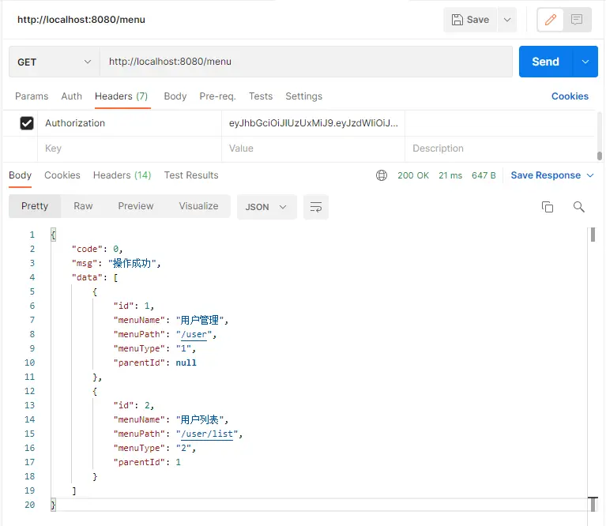
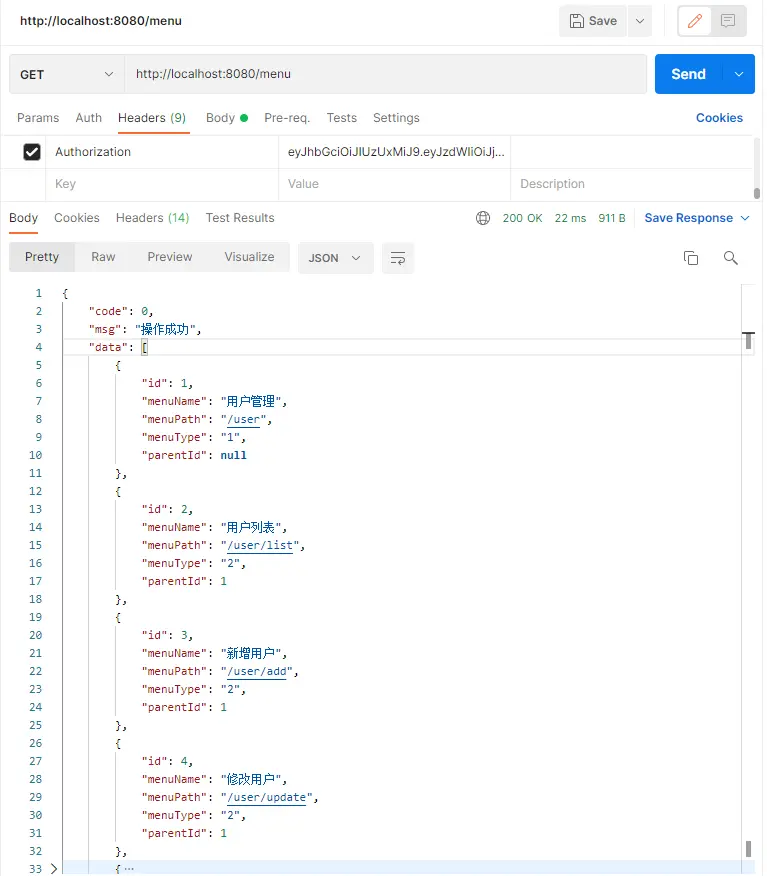

### 1. RBAC权限控制模型
RBAC（Role-based access control）是一种以角色为基础的访问控制（Role-based access control，RBAC），它是一种较新且广为使用的权限控制机制，这种机制不是直接给用户赋予权限，而是将权限赋予角色。

RBAC 权限模型将用户按角色进行归类，通过用户的角色来确定用户对某项资源是否具备操作权限。RBAC 简化了用户与权限的管理，它将用户与角色关联、角色与权限关联、权限与资源关联，这种模式使得用户的授权管理变得非常简单和易于维护。

### 2. 数据库设计


```sql
-- 用户表
DROP TABLE IF EXISTS `sys_user`;
CREATE TABLE `sys_user` (
  `id` BIGINT NOT NULL AUTO_INCREMENT COMMENT '用户ID',
  `username` VARCHAR(255) DEFAULT NULL COMMENT '用户名',
  `password` VARCHAR(255) DEFAULT NULL COMMENT '密码',
  PRIMARY KEY (`id`)
) ENGINE=InnoDB DEFAULT CHARSET=utf8 COMMENT='用户表';

-- 角色表
DROP TABLE IF EXISTS `sys_role`;
CREATE TABLE `sys_role` (
  `id` BIGINT NOT NULL AUTO_INCREMENT COMMENT '角色ID',
  `role_name` VARCHAR(50) DEFAULT NULL COMMENT '角色名称',
  `role_desc` VARCHAR(255) DEFAULT NULL COMMENT '描述',
  PRIMARY KEY (`id`)
) ENGINE=InnoDB DEFAULT CHARSET=utf8 COMMENT='角色表';

-- 菜单表
DROP TABLE IF EXISTS `sys_menu`;
CREATE TABLE `sys_menu` (
  `id` BIGINT NOT NULL AUTO_INCREMENT COMMENT '菜单ID',
  `menu_name` VARCHAR(100) DEFAULT NULL COMMENT '菜单名称',
  `menu_path` VARCHAR(255) DEFAULT NULL COMMENT '菜单路径',
  `menu_type` char DEFAULT NULL COMMENT '菜单类型(1:一级菜单，2:子菜单，3:按钮)',
  `menu_parent_id` BIGINT DEFAULT NULL COMMENT '父级菜单Id',
  PRIMARY KEY (`id`)
) ENGINE=InnoDB DEFAULT CHARSET=utf8 COMMENT='菜单表';

-- 用户&角色 关联表
DROP TABLE IF EXISTS `sys_role_user`;
CREATE TABLE `sys_role_user` (
  `id` BIGINT NOT NULL AUTO_INCREMENT,
  `role_id` BIGINT DEFAULT NULL COMMENT '角色ID',
  `user_id` BIGINT DEFAULT NULL COMMENT '用户ID',
  PRIMARY KEY (`id`)
) ENGINE=INNODB DEFAULT CHARSET=UTF8MB4 COMMENT='系统用户角色关联表';

-- 菜单&角色 关联表
DROP TABLE IF EXISTS `sys_role_menu`;
CREATE TABLE `sys_role_menu` (
  `id` BIGINT NOT NULL AUTO_INCREMENT,
  `role_id` BIGINT DEFAULT NULL COMMENT '角色ID',
  `menu_id` BIGINT DEFAULT NULL COMMENT '菜单ID',
  PRIMARY KEY (`id`)
) ENGINE=INNODB DEFAULT CHARSET=UTF8MB4 COMMENT='系统角色菜单关联表';

-- 初始数据：
-- 管理员拥有所有菜单权限
-- 普通用户拥有查看权限
INSERT INTO `sys_role`(`id`, `role_name`, `role_desc`) VALUES (1, 'admin', '管理员'),(2, 'user', '普通用户');
INSERT INTO `sys_menu`(`id`, `menu_name`,`menu_path`,`menu_type`,`menu_parent_id`)
    VALUES  (1, '用户管理', '/user', 1, null),
            (2, '用户列表', '/user/list', 2, 1),
            (3, '新增用户', '/user/add', 2, 1),
            (4, '修改用户', '/user/update', 2, 1),
            (5, '删除用户', '/user/delete', 3, 1);
INSERT INTO `sys_role_user`(`user_id`, `role_id`) VALUES (1, 1);
INSERT INTO `sys_role_menu`(`role_id`, `menu_id`)
    VALUES  (1, 1),(1, 2),(1, 3),(1, 4),(1, 5),
            (2, 1),(2, 2);
```

### 3. 代码进化
1. 修改注册逻辑，注册时添加用户权限

```java
public ResponseJson<SysUser> register(SysUser sysUser) {
    if (StringUtils.hasLength(sysUser.getUsername()) && StringUtils.hasLength(sysUser.getPassword())) {
        // 密码加密
        String encodePassword = passwordEncoder.encode(sysUser.getPassword());
        sysUser.setPassword(encodePassword);
        // 新增用户
        sysUserDao.insertSysUser(sysUser);
        // 角色Ids，用","隔开
        String roleIds = sysUser.getRoleIds();
        if (StringUtils.hasLength(roleIds)) {
            // 设置用户角色
            String[] split = roleIds.split(",");
            for (String s : split) {
                if (StringUtils.hasLength(s)) {
                    // 保存用户角色关系
                    sysUserDao.insertUserRoleRelation(sysUser.getId(), Long.valueOf(s));
                }
            }
        }
        return ResponseJson.success("注册成功", sysUser);
    }
    return ResponseJson.error("用户名或密码不能为空", null);
}
```

2. 封装JWT服务工具类

```java
@Slf4j
@Service
public class JwtService {
    @Resource
    private RedisService redisService;
    /**
     * 生成token
     * @param username 用户名
     * @param roleList 角色列表
     */
    public String createToken(String username, List<String> roleList) {
        Calendar calendar = Calendar.getInstance();
        // 设置签发时间
        calendar.setTime(new Date());
        Date now = calendar.getTime();
        // 设置过期时间
        calendar.add(Calendar.MINUTE, ConstantKey.TOKEN_EXPIRE);
        Date time = calendar.getTime();
        String token = Jwts.builder()
                .setSubject(username + "-" + roleList)
                // 签发时间
                .setIssuedAt(now)
                // 过期时间
                .setExpiration(time)
                // 自定义算法与签名：这里算法采用HS512，常量中定义签名key
                .signWith(SignatureAlgorithm.HS512, ConstantKey.SIGNING_KEY)
                .compact();
        // 将token存入redis,并设置超时时间为token过期时间
        long expire = time.getTime() - now.getTime();
        redisService.set(token, token, expire);
        return token;
    }

    /**
     * 解析Token
     */
    public String parseToken(HttpServletRequest request) {
        String userinfo = null;
        String token = request.getHeader(ConstantKey.TOKEN_NAME);
        if (StringUtils.hasLength(token)) {
            String cacheToken = String.valueOf(redisService.get(token));
            if (StringUtils.hasLength(cacheToken) && !"null".equals(cacheToken)) {
                try {
                    Claims claims = Jwts.parser()
                            // 设置生成token的签名key
                            .setSigningKey(ConstantKey.SIGNING_KEY)
                            // 解析token
                            .parseClaimsJws(cacheToken).getBody();
                    // 取出用户信息
                    userinfo = claims.getSubject();
                    // 重设Redis超时时间
                    resetRedisExpire(token, claims);
                } catch (ExpiredJwtException e) {
                    log.info("Token过期续签，ExpiredJwtException={}", e.getMessage());
                    Claims claims = e.getClaims();
                    // 取出用户信息
                    userinfo = claims.getSubject();
                    // 刷新Token
                    refreshToken(token, claims);
                } catch (UnsupportedJwtException e) {
                    log.warn("访问[{}]失败，UnsupportedJwtException={}", request.getRequestURI(), e.getMessage());
                } catch (MalformedJwtException e) {
                    log.warn("访问[{}]失败，MalformedJwtException={}", request.getRequestURI(), e.getMessage());
                } catch (SignatureException e) {
                    log.warn("访问[{}]失败，SignatureException={}", request.getRequestURI(), e.getMessage());
                } catch (IllegalArgumentException e) {
                    log.warn("访问[{}]失败，IllegalArgumentException={}", request.getRequestURI(), e.getMessage());
                }
            }
        }
        return userinfo;
    }

    /**
     * 解析Token,取出用户名（Token过期仍取出用户名）
     */
    public String getUsername(HttpServletRequest request){
        String username = null;
        String token = request.getHeader(ConstantKey.TOKEN_NAME);
        if (StringUtils.hasLength(token)) {
            String userinfo = null;
            try {
                Claims claims = Jwts.parser()
                        // 设置生成token的签名key
                        .setSigningKey(ConstantKey.SIGNING_KEY)
                        // 解析token
                        .parseClaimsJws(token).getBody();
                // 取出用户信息
                userinfo = claims.getSubject();
            } catch (ExpiredJwtException e) {
                Claims claims = e.getClaims();
                // 取出用户信息
                userinfo = claims.getSubject();
            } catch (Exception ignored){}
            if (StringUtils.hasLength(userinfo)){
                username = userinfo.split("-")[0];
            }
        }
        return username;
    }


    /**
     * 重设Redis超时时间
     * 当前时间 + (`cacheToken`过期时间 - `cacheToken`签发时间)
     */
    private void resetRedisExpire(String token, Claims claims) {
        // 当前时间
        long current = System.currentTimeMillis();
        // token签发时间
        long issuedAt = claims.getIssuedAt().getTime();
        // token过期时间
        long expiration = claims.getExpiration().getTime();
        // 当前时间 + (`cacheToken`过期时间 - `cacheToken`签发时间)
        long expireAt = current + (expiration - issuedAt);
        // 重设Redis超时时间
        redisService.expire(token, expireAt);
    }

    /**
     * 刷新Token
     * 刷新Token的时机： 当cacheToken已过期 并且Redis在有效期内
     * 重新生成Token并覆盖Redis的v值(这时候k、v值不一样了)，然后设置Redis过期时间为：新Token过期时间
     */
    private void refreshToken(String token, Claims claims) {
        // 当前时间
        long current = System.currentTimeMillis();
        /*
         * 重新生成token
         */
        Calendar calendar = Calendar.getInstance();
        // 设置签发时间
        calendar.setTime(new Date());
        Date now = calendar.getTime();
        // 设置过期时间: TOKEN_EXPIRE分钟
        calendar.add(Calendar.MINUTE, ConstantKey.TOKEN_EXPIRE);
        Date time = calendar.getTime();
        String refreshToken = Jwts.builder()
                .setSubject(claims.getSubject())
                // 签发时间
                .setIssuedAt(now)
                // 过期时间
                .setExpiration(time)
                // 算法与签名(同生成token)：这里算法采用HS512，常量中定义签名key
                .signWith(SignatureAlgorithm.HS512, ConstantKey.SIGNING_KEY)
                .compact();
        // 将refreshToken覆盖Redis的v值,并设置超时时间为refreshToken过期时间
        long expire = time.getTime() - now.getTime();
        redisService.set(token, token, expire);
        // 打印日志
        log.info("刷新token执行时间: {}", (System.currentTimeMillis() - current) + " 毫秒");
    }
}
```


3. 编写获取用户可访问菜单接口（用户登录后，携带Token去获取用户角色，根据角色计算出用户可访问菜单）

```java
@GetMapping("/menu")
public ResponseJson<List<SysMenu>> menuList(HttpServletRequest request) {
    String username = jwtService.getUsername(request);
    return sysUserService.menuList(username);
}
```

``` java
public ResponseJson<List<SysMenu>> menuList(String username) {
    if (!StringUtils.hasLength(username)) {
        return ResponseJson.error("用户信息异常", null);
    }
    // 获取用户角色Id
    List<Long> roleIds = sysUserDao.getRoleIdsByUserId(username);
    List<SysMenu> menus = null;
    if (!CollectionUtils.isEmpty(roleIds)) {
        // 根据角色Id获取菜单列表
        menus = sysUserDao.getMenuListByRoleIds(roleIds);
    }
    return ResponseJson.success(menus);
}
```

``` xml
<select id="getRoleIdsByUserId" resultType="java.lang.Long">
    SELECT DISTINCT ru.role_id FROM sys_role_user ru
    LEFT JOIN sys_user u ON ru.user_id = u.id
    WHERE u.username=#{username}
</select>
<select id="getMenuListByRoleIds" resultType="com.example.jwt.entity.SysMenu">
    SELECT m.id, m.menu_name AS menuName, m.menu_path AS menuPath, m.menu_type AS menuType, m.menu_parent_id AS parentId
    FROM sys_menu m
             LEFT JOIN sys_role_menu rm ON m.id = rm.menu_id
    WHERE rm.role_id IN
    <foreach item="roleId" collection="roleIds" open="(" separator="," close=")">
        #{roleId}
    </foreach>
</select>
```


### 4.测试
1. 普通用户可访问菜单：



2. 管理员可访问菜单：



> 源码地址：[https://github.com/chaooo/spring-security-jwt.git](https://github.com/chaooo/spring-security-jwt.git),
> 这里我将本文的前后端分离后台菜单权限控制放在github源码tag的V3.0中，防止后续修改后代码对不上。

